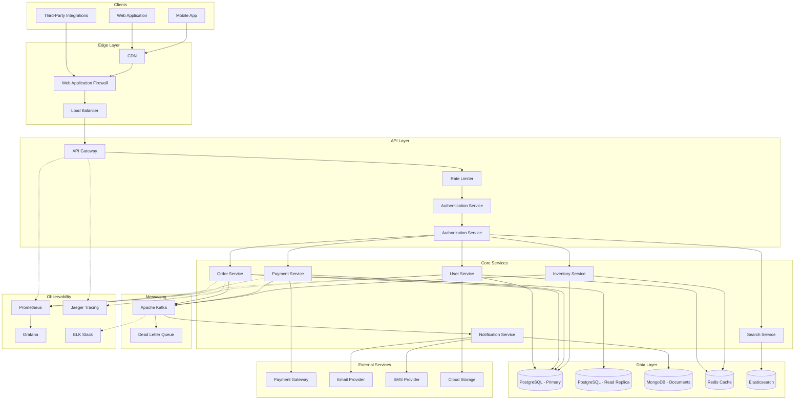

# Overall System Architecture

## Architecture Components

### Edge Layer
- **CDN**: Caches static assets and reduces latency for global users
- **WAF**: Protects against common web exploits and DDoS attacks
- **Load Balancer**: Distributes traffic across multiple API Gateway instances

### API Layer
- **API Gateway**: Single entry point for all client requests, handles routing
- **Rate Limiter**: Prevents abuse and ensures fair resource allocation
- **Authentication Service**: Validates user identity (JWT, OAuth2)
- **Authorization Service**: Enforces access control policies (RBAC/ABAC)

### Core Services
- **User Service**: Manages user profiles, preferences, and account data
- **Order Service**: Handles order lifecycle and processing
- **Payment Service**: Processes transactions and manages payment methods
- **Notification Service**: Sends emails, SMS, and push notifications
- **Search Service**: Provides full-text search capabilities
- **Inventory Service**: Tracks stock levels and availability

### Data Layer
- **PostgreSQL Primary**: Main transactional database with ACID compliance
- **PostgreSQL Read Replica**: Offloads read queries for better performance
- **MongoDB**: Stores unstructured data like notifications and logs
- **Redis**: Caching layer for sessions, frequently accessed data
- **Elasticsearch**: Powers search functionality with full-text indexing

### Messaging
- **Apache Kafka**: Event streaming for async communication between services
- **Dead Letter Queue**: Captures failed messages for retry/analysis

### Observability
- **Prometheus + Grafana**: Metrics collection and visualization
- **Jaeger**: Distributed tracing for request flow analysis
- **ELK Stack**: Centralized logging and log analysis