# OpenShift Multicluster with Nutanix - Complete Documentation

## Table of Contents
1. [Architecture Overview](#architecture-overview)
2. [Design Phase](#design-phase)
3. [Implementation Phase](#implementation-phase)
4. [Operations Phase](#operations-phase)
5. [Day-to-Day Activities](#day-to-day-activities)
6. [Security & Compliance](#security-compliance)
7. [Disaster Recovery](#disaster-recovery)

---

## Architecture Overview

### High-Level Architecture

```mermaid
graph TB
    subgraph "Hub Cluster - Management Layer"
        ACM[Red Hat ACM<br/>Advanced Cluster Management]
        ACS[Red Hat ACS<br/>Advanced Cluster Security]
        GitOps[ArgoCD/OpenShift GitOps]
        OPA[OPA Gatekeeper<br/>via ACM Policy]
        Observability[ACM Observability]
    end
    
    subgraph "Nutanix Infrastructure"
        subgraph "Production Cluster 1"
            OCP1[OpenShift Cluster 1]
            Prism1[Nutanix Prism]
        end
        
        subgraph "Production Cluster 2"
            OCP2[OpenShift Cluster 2]
            Prism2[Nutanix Prism]
        end
        
        subgraph "Development Cluster"
            OCP3[OpenShift Dev Cluster]
            Prism3[Nutanix Prism]
        end
        
        subgraph "Staging Cluster"
            OCP4[OpenShift Staging Cluster]
            Prism4[Nutanix Prism]
        end
    end
    
    ACM -->|Manages| OCP1
    ACM -->|Manages| OCP2
    ACM -->|Manages| OCP3
    ACM -->|Manages| OCP4
    
    ACS -->|Secures| OCP1
    ACS -->|Secures| OCP2
    ACS -->|Secures| OCP3
    ACS -->|Secures| OCP4
    
    GitOps -->|Deploys to| OCP1
    GitOps -->|Deploys to| OCP2
    GitOps -->|Deploys to| OCP3
    GitOps -->|Deploys to| OCP4
    
    OPA -->|Enforces Policies| OCP1
    OPA -->|Enforces Policies| OCP2
    OPA -->|Enforces Policies| OCP3
    OPA -->|Enforces Policies| OCP4
    
    Observability -->|Monitors| OCP1
    Observability -->|Monitors| OCP2
    Observability -->|Monitors| OCP3
    Observability -->|Monitors| OCP4
```

### Component Architecture

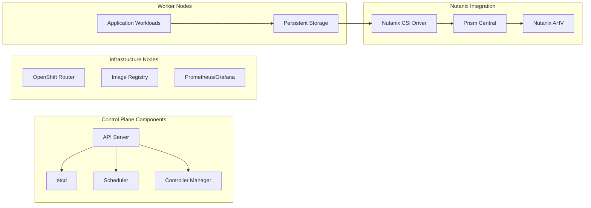

---

## Design Phase

### Phase 1: Requirements Gathering

#### Tasks and Activities

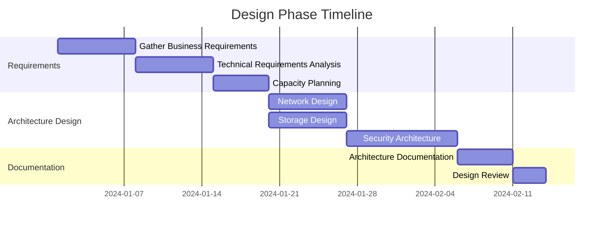

#### Requirements Checklist

| Category | Requirement | Priority | Status |
|----------|-------------|----------|--------|
| Infrastructure | Nutanix cluster sizing | High | ✓ |
| Networking | VLAN/Subnet planning | High | ✓ |
| Storage | Storage classes definition | High | ✓ |
| Security | Certificate management | High | ✓ |
| Compliance | Policy requirements | Medium | ✓ |
| Disaster Recovery | RPO/RTO objectives | High | ✓ |

### Network Architecture Design

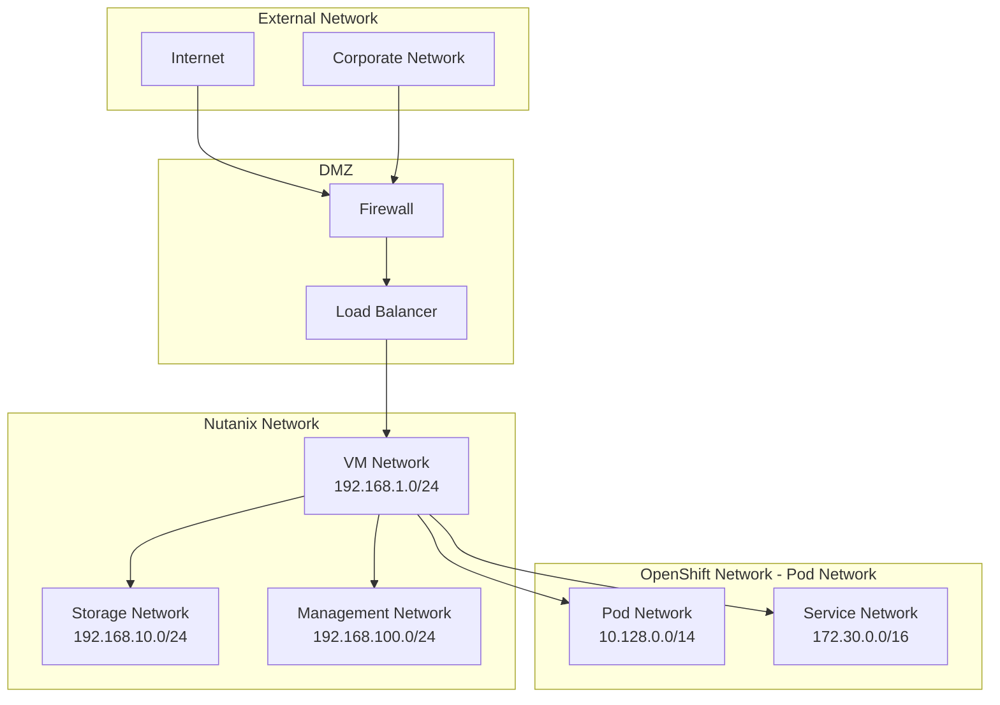

### Storage Architecture

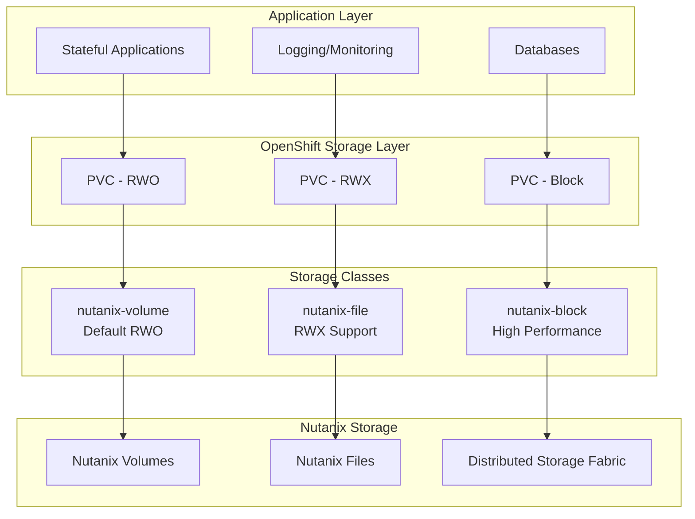

---

## Implementation Phase

### Phase 2: Infrastructure Setup

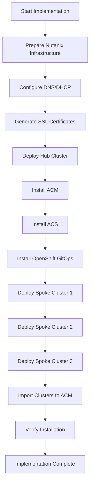

### Stage 1: Hub Cluster Installation

#### Tasks

1. **Prepare Nutanix Environment**
   - Create VM templates
   - Configure networks
   - Allocate resources

2. **Install Hub Cluster**
   ```bash
   # Create installation directory
   mkdir ~/ocp-hub-install
   cd ~/ocp-hub-install
   
   # Create install-config.yaml
   openshift-install create install-config
   
   # Backup config
   cp install-config.yaml install-config.yaml.backup
   
   # Create manifests
   openshift-install create manifests
   
   # Create cluster
   openshift-install create cluster --log-level=info
   ```

3. **Post-Installation Configuration**
   - Configure authentication (LDAP/OAuth)
   - Set up ingress certificates
   - Configure monitoring

### Stage 2: ACM Installation and Configuration

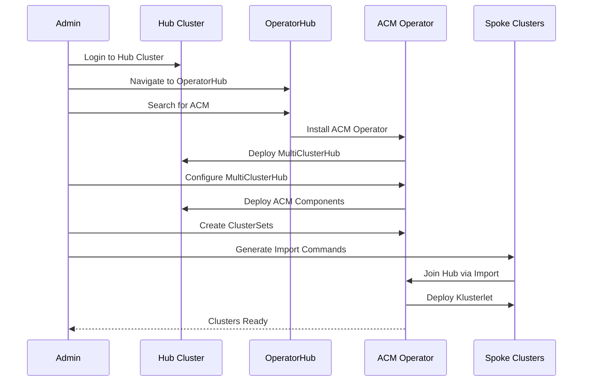

#### ACM Installation Steps

```yaml
# 1. Create namespace
apiVersion: v1
kind: Namespace
metadata:
  name: open-cluster-management

---
# 2. Create OperatorGroup
apiVersion: operators.coreos.com/v1
kind: OperatorGroup
metadata:
  name: acm-operator-group
  namespace: open-cluster-management
spec:
  targetNamespaces:
  - open-cluster-management

---
# 3. Create Subscription
apiVersion: operators.coreos.com/v1alpha1
kind: Subscription
metadata:
  name: advanced-cluster-management
  namespace: open-cluster-management
spec:
  channel: release-2.11
  name: advanced-cluster-management
  source: redhat-operators
  sourceNamespace: openshift-marketplace

---
# 4. Create MultiClusterHub
apiVersion: operator.open-cluster-management.io/v1
kind: MultiClusterHub
metadata:
  name: multiclusterhub
  namespace: open-cluster-management
spec:
  availabilityConfig: High
  enableClusterBackup: true
  imagePullSecret: multiclusterhub-operator-pull-secret
```

### Stage 3: ACS Installation

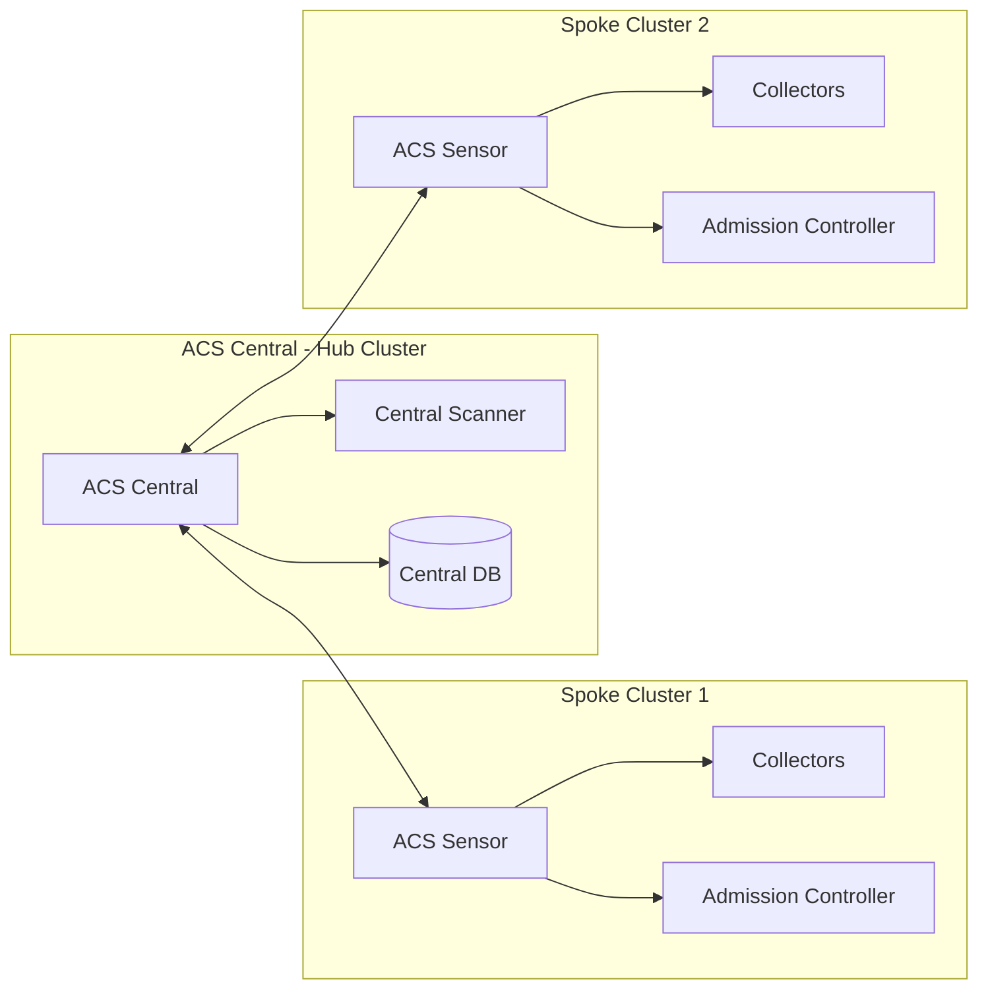

#### ACS Installation Commands

```yaml
# 1. Install ACS Operator on Hub
apiVersion: operators.coreos.com/v1alpha1
kind: Subscription
metadata:
  name: rhacs-operator
  namespace: rhacs-operator
spec:
  channel: stable
  name: rhacs-operator
  source: redhat-operators
  sourceNamespace: openshift-marketplace

---
# 2. Create Central instance
apiVersion: platform.stackrox.io/v1alpha1
kind: Central
metadata:
  name: stackrox-central-services
  namespace: stackrox
spec:
  central:
    exposure:
      loadBalancer:
        enabled: true
        port: 443
    persistence:
      persistentVolumeClaim:
        claimName: central-db
        size: 100Gi
  egress:
    connectivityPolicy: Online
  scanner:
    analyzer:
      scaling:
        autoScaling: Enabled
        maxReplicas: 5
        minReplicas: 2
        replicas: 3
    scannerComponent: Enabled
```

### Stage 4: OpenShift GitOps Installation

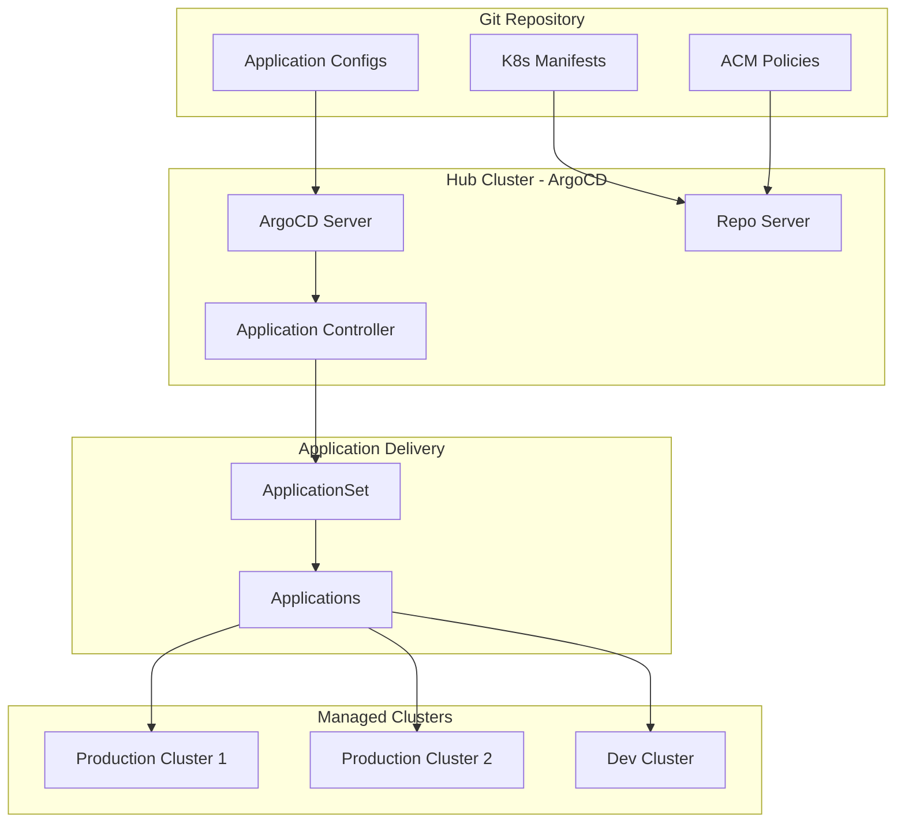

### Stage 5: Spoke Cluster Deployment

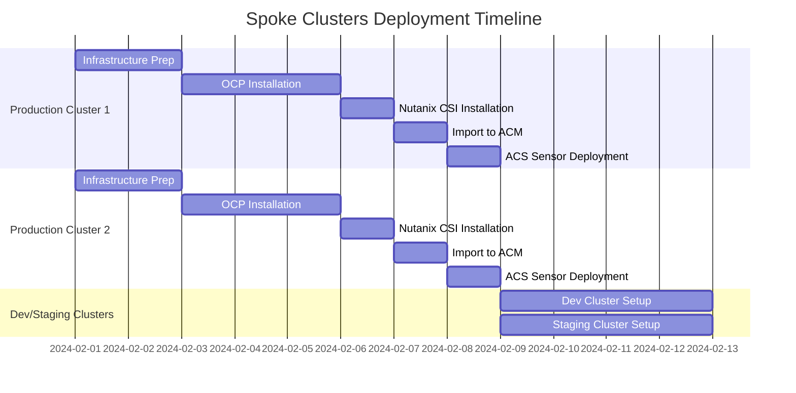

---

## Operations Phase

### ACM Policy Framework

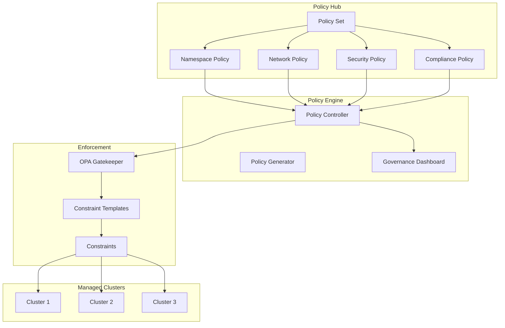

### ACM Policy Examples

#### 1. Namespace Policy with OPA

```yaml
apiVersion: policy.open-cluster-management.io/v1
kind: Policy
metadata:
  name: policy-namespace-standards
  namespace: open-cluster-management-policies
  annotations:
    policy.open-cluster-management.io/standards: NIST-CSF
    policy.open-cluster-management.io/categories: PR.IP Information Protection
    policy.open-cluster-management.io/controls: PR.IP-1 Baseline Configuration
spec:
  remediationAction: enforce
  disabled: false
  policy-templates:
    - objectDefinition:
        apiVersion: policy.open-cluster-management.io/v1
        kind: ConfigurationPolicy
        metadata:
          name: policy-namespace-labels
        spec:
          remediationAction: enforce
          severity: medium
          object-templates:
            - complianceType: musthave
              objectDefinition:
                apiVersion: v1
                kind: Namespace
                metadata:
                  labels:
                    environment: "{{ .ManagedClusterLabels.environment }}"
                    owner: "{{ .ManagedClusterLabels.owner }}"
                    compliance: "required"
---
apiVersion: policy.open-cluster-management.io/v1
kind: PlacementBinding
metadata:
  name: binding-namespace-policy
  namespace: open-cluster-management-policies
placementRef:
  name: placement-all-clusters
  kind: PlacementRule
  apiGroup: apps.open-cluster-management.io
subjects:
  - name: policy-namespace-standards
    kind: Policy
    apiGroup: policy.open-cluster-management.io
---
apiVersion: apps.open-cluster-management.io/v1
kind: PlacementRule
metadata:
  name: placement-all-clusters
  namespace: open-cluster-management-policies
spec:
  clusterSelector:
    matchExpressions:
      - key: environment
        operator: In
        values:
          - production
          - staging
```

#### 2. OPA Gatekeeper Policy via ACM

```yaml
apiVersion: policy.open-cluster-management.io/v1
kind: Policy
metadata:
  name: policy-gatekeeper-container-limits
  namespace: open-cluster-management-policies
spec:
  remediationAction: enforce
  disabled: false
  policy-templates:
    - objectDefinition:
        apiVersion: policy.open-cluster-management.io/v1
        kind: ConfigurationPolicy
        metadata:
          name: gatekeeper-constraint-template
        spec:
          remediationAction: inform
          severity: high
          object-templates:
            - complianceType: musthave
              objectDefinition:
                apiVersion: templates.gatekeeper.sh/v1beta1
                kind: ConstraintTemplate
                metadata:
                  name: k8scontainerlimits
                spec:
                  crd:
                    spec:
                      names:
                        kind: K8sContainerLimits
                      validation:
                        openAPIV3Schema:
                          properties:
                            cpu:
                              type: string
                            memory:
                              type: string
                  targets:
                    - target: admission.k8s.gatekeeper.sh
                      rego: |
                        package k8scontainerlimits
                        
                        violation[{"msg": msg}] {
                          container := input.review.object.spec.containers[_]
                          not container.resources.limits.cpu
                          msg := sprintf("Container %v has no CPU limit", [container.name])
                        }
                        
                        violation[{"msg": msg}] {
                          container := input.review.object.spec.containers[_]
                          not container.resources.limits.memory
                          msg := sprintf("Container %v has no memory limit", [container.name])
                        }
    - objectDefinition:
        apiVersion: policy.open-cluster-management.io/v1
        kind: ConfigurationPolicy
        metadata:
          name: gatekeeper-constraint
        spec:
          remediationAction: enforce
          severity: high
          object-templates:
            - complianceType: musthave
              objectDefinition:
                apiVersion: constraints.gatekeeper.sh/v1beta1
                kind: K8sContainerLimits
                metadata:
                  name: container-must-have-limits
                spec:
                  match:
                    kinds:
                      - apiGroups: [""]
                        kinds: ["Pod"]
                    namespaces:
                      - production
                      - staging
```

#### 3. Security & Compliance Policy

```yaml
apiVersion: policy.open-cluster-management.io/v1
kind: Policy
metadata:
  name: policy-security-baseline
  namespace: open-cluster-management-policies
  annotations:
    policy.open-cluster-management.io/standards: NIST SP 800-53
    policy.open-cluster-management.io/categories: SC System and Communications Protection
    policy.open-cluster-management.io/controls: SC-7 Boundary Protection
spec:
  remediationAction: enforce
  disabled: false
  policy-templates:
    # Network Policy
    - objectDefinition:
        apiVersion: policy.open-cluster-management.io/v1
        kind: ConfigurationPolicy
        metadata:
          name: default-network-policy
        spec:
          remediationAction: enforce
          severity: high
          namespaceSelector:
            exclude:
              - kube-*
              - openshift-*
            include:
              - "*"
          object-templates:
            - complianceType: musthave
              objectDefinition:
                apiVersion: networking.k8s.io/v1
                kind: NetworkPolicy
                metadata:
                  name: deny-all-ingress
                spec:
                  podSelector: {}
                  policyTypes:
                    - Ingress
    
    # Pod Security Policy
    - objectDefinition:
        apiVersion: policy.open-cluster-management.io/v1
        kind: ConfigurationPolicy
        metadata:
          name: restricted-pod-security
        spec:
          remediationAction: enforce
          severity: high
          object-templates:
            - complianceType: musthave
              objectDefinition:
                apiVersion: security.openshift.io/v1
                kind: SecurityContextConstraints
                metadata:
                  name: restricted-scc
                allowHostDirVolumePlugin: false
                allowHostIPC: false
                allowHostNetwork: false
                allowHostPID: false
                allowHostPorts: false
                allowPrivilegeEscalation: false
                allowPrivilegedContainer: false
                readOnlyRootFilesystem: true
                runAsUser:
                  type: MustRunAsRange
                seLinuxContext:
                  type: MustRunAs
                volumes:
                  - configMap
                  - downwardAPI
                  - emptyDir
                  - persistentVolumeClaim
                  - projected
                  - secret
```

#### 4. Certificate Management Policy

```yaml
apiVersion: policy.open-cluster-management.io/v1
kind: Policy
metadata:
  name: policy-certificate-expiration
  namespace: open-cluster-management-policies
spec:
  remediationAction: inform
  disabled: false
  policy-templates:
    - objectDefinition:
        apiVersion: policy.open-cluster-management.io/v1
        kind: CertificatePolicy
        metadata:
          name: certificate-expiration-check
        spec:
          namespaceSelector:
            include:
              - "*"
            exclude:
              - kube-*
          remediationAction: inform
          severity: low
          minimumDuration: 720h  # 30 days
```

### GitOps Deployment Workflow

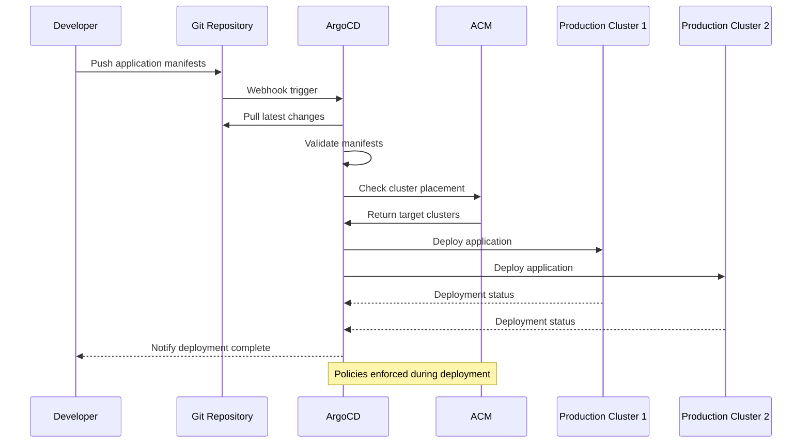

### ApplicationSet for Multi-Cluster Deployment

```yaml
apiVersion: argoproj.io/v1alpha1
kind: ApplicationSet
metadata:
  name: multicluster-app
  namespace: openshift-gitops
spec:
  generators:
    - clusterDecisionResource:
        configMapRef: acm-placement
        labelSelector:
          matchLabels:
            cluster.open-cluster-management.io/placement: production-placement
        requeueAfterSeconds: 180
  template:
    metadata:
      name: 'app-{{name}}'
      labels:
        environment: '{{metadata.labels.environment}}'
    spec:
      project: default
      source:
        repoURL: https://github.com/your-org/applications
        targetRevision: HEAD
        path: 'apps/{{metadata.labels.environment}}'
      destination:
        server: '{{server}}'
        namespace: application
      syncPolicy:
        automated:
          prune: true
          selfHeal: true
        syncOptions:
          - CreateNamespace=true
        retry:
          limit: 5
          backoff:
            duration: 5s
            factor: 2
            maxDuration: 3m
---
apiVersion: cluster.open-cluster-management.io/v1beta1
kind: Placement
metadata:
  name: production-placement
  namespace: openshift-gitops
spec:
  clusterSets:
    - production-clusterset
  predicates:
    - requiredClusterSelector:
        labelSelector:
          matchLabels:
            environment: production
        claimSelector:
          matchExpressions:
            - key: platform.nutanix.com/ready
              operator: In
              values:
                - "true"
  numberOfClusters: 2
```

---

## Day-to-Day Activities

### Daily Operations Workflow

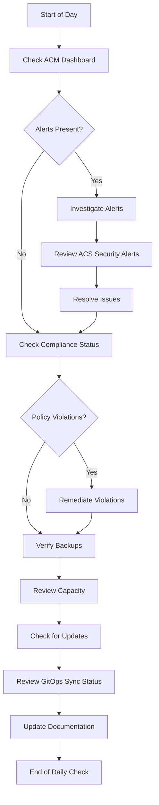

### Daily Tasks Checklist

#### Morning Routine (30-45 minutes)

| Task | Tool | Frequency | Priority |
|------|------|-----------|----------|
| Review cluster health | ACM Dashboard | Daily | High |
| Check policy compliance | ACM Governance | Daily | High |
| Review security alerts | ACS Dashboard | Daily | Critical |
| Verify backup status | Velero/OADP | Daily | High |
| Check resource utilization | ACM Observability | Daily | Medium |
| Review GitOps sync status | ArgoCD UI | Daily | Medium |
| Check certificate expiration | ACM Policies | Daily | Medium |

#### Monitoring Dashboard Views

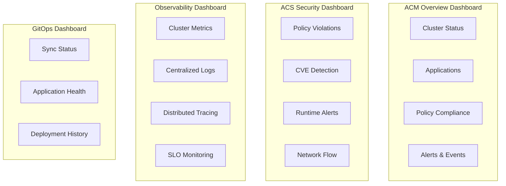

### Weekly Operations

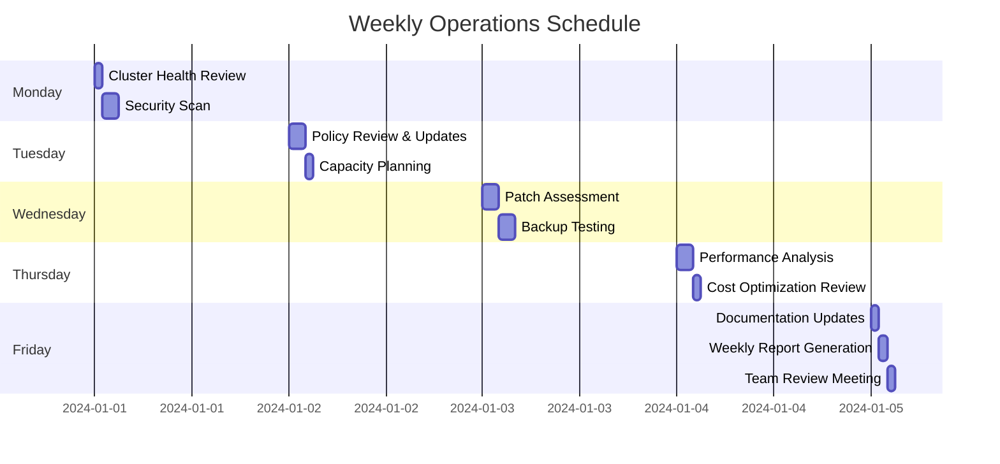

### Monthly Operations

#### Patch Management Workflow

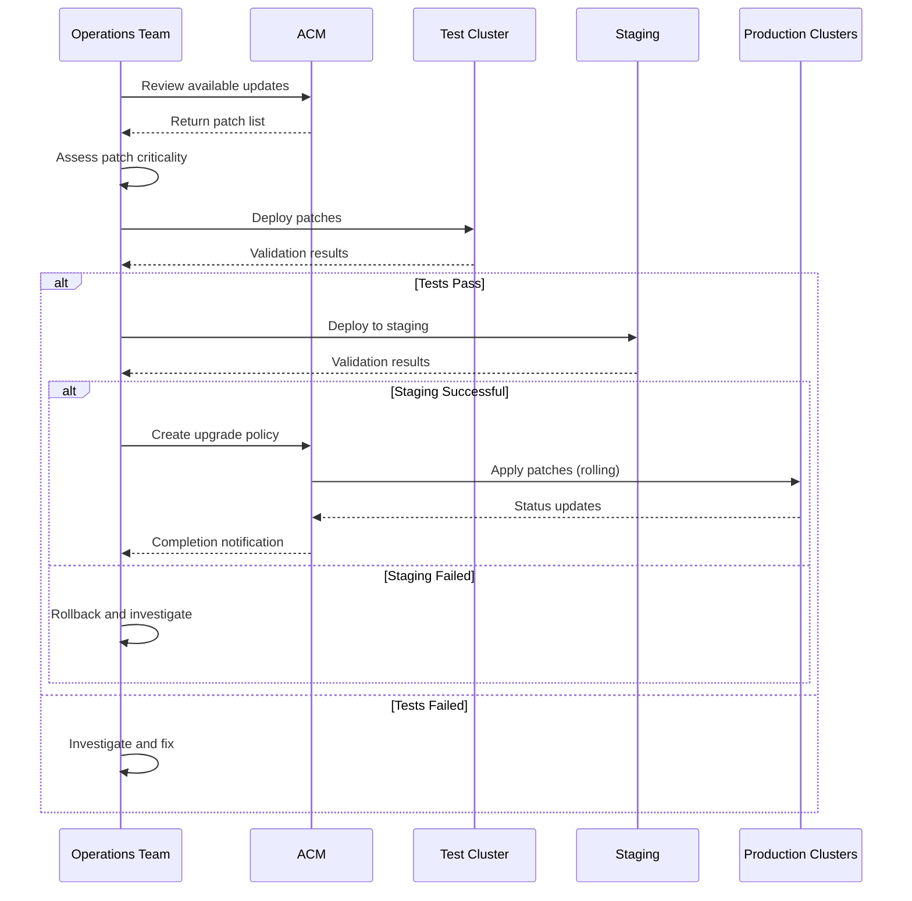

### Application Deployment Process

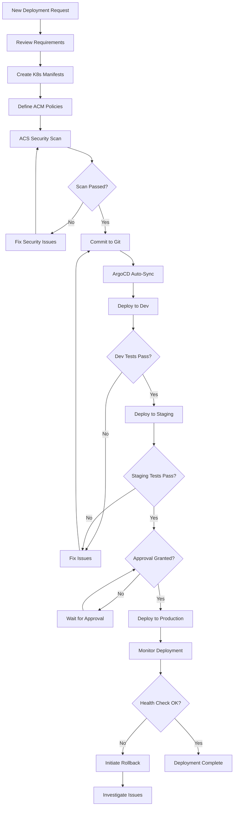

### Incident Response Workflow

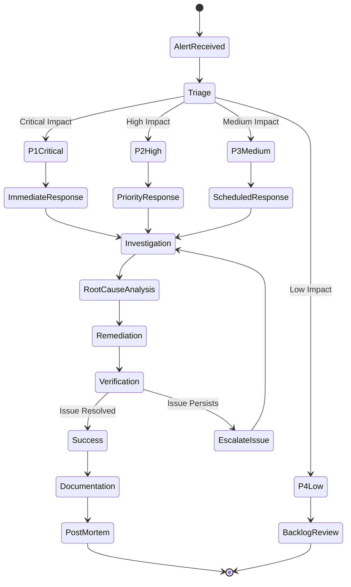

---

## Security & Compliance

### Security Architecture

```mermaid
graph TB
    subgraph "Security Layers"
        subgraph "Network Security"
            NetworkPolicies[Network Policies]
            Firewall[Firewall Rules]
            Ingress[Ingress Controllers]
        end
        
        subgraph "Identity & Access"
            RBAC[RBAC Policies]
            OAuth[OAuth/OIDC]
            ServiceAccounts[Service Accounts]
        end
        
        subgraph "Runtime Security"
            ACS[ACS Runtime Protection]
            AdmissionControl[Admission Controllers]
            OPA[OPA/Gatekeeper]
        end
        
        subgraph "Data Security"
            Encryption[Encryption at Rest]
            Secrets[Secrets Management]
            KeyVault[External Key Vault]
        end
        
        subgraph "Compliance"
            Scanning[Image Scanning]
            Auditing[Audit Logging]
            Compliance[Compliance Reporting]
        end
    end
    
    NetworkPolicies --> ACS
    RBAC --> AdmissionControl
    ACS --> Scanning
    OPA --> AdmissionControl
    Secrets --> KeyVault
```

### ACS Security Policies

```yaml
# Runtime Policy - Prevent Privileged Containers
apiVersion: policy.open-cluster-management.io/v1
kind: Policy
metadata:
  name: acs-runtime-prevent-privileged
  namespace: rhacs-operator
spec:
  disabled: false
  policy-templates:
    - objectDefinition:
        apiVersion: policy.open-cluster-management.io/v1
        kind: ConfigurationPolicy
        metadata:
          name: acs-policy-privileged-containers
        spec:
          remediationAction: enforce
          severity: high
          object-templates:
            - complianceType: musthave
              objectDefinition:
                apiVersion: v1
                kind: ConfigMap
                metadata:
                  name: acs-runtime-policy
                  namespace: stackrox
                data:
                  policy: |
                    {
                      "name": "Prevent Privileged Containers",
                      "description": "Alert and prevent deployment of privileged containers",
                      "severity": "CRITICAL_SEVERITY",
                      "lifecycleStages": ["DEPLOY", "RUNTIME"],
                      "eventSource": "DEPLOYMENT_EVENT",
                      "exclusions": [],
                      "scope": [],
                      "categories": ["Security Best Practices"],
                      "enforcement": {
                        "enforcement": "SCALE_TO_ZERO_ENFORCEMENT"
                      },
                      "policyVersion": "1.1",
                      "policySections": [
                        {
                          "sectionName": "Policy Section 1",
                          "policyGroups": [
                            {
                              "fieldName": "Privileged Container",
                              "values": [
                                {
                                  "value": "true"
                                }
                              ]
                            }
                          ]
                        }
                      ]
                    }
```

### Compliance Monitoring

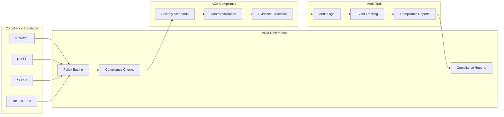

---

## Disaster Recovery

### Backup Strategy

```mermaid
graph TB
    subgraph "Backup Components"
        ETCD[etcd Backups]
        PV[Persistent Volume Backups]
        Config[Configuration Backups]
        ACMBackup[ACM Hub Backup]
    end
    
    subgraph "Backup Tools"
        Velero[Velero/OADP]
        Native[Native Tools]
        Scripts[Custom Scripts]
    end
    
    subgraph "Storage Targets"
        S3[S3 Compatible Storage]
        NutanixFiles[Nutanix Files]
        Remote[Remote Site]
    end
    
    subgraph "Backup Schedule"
        Hourly[Hourly - etcd]
        Daily[Daily - Full Backup]
        Weekly[Weekly - Archive]
    end
    
    ETCD --> Native
    PV --> Velero
    Config --> Scripts
    ACMBackup --> Velero
    
    Native --> S3
    Velero --> NutanixFiles
    Scripts --> Remote
    
    Hourly --> ETCD
    Daily --> PV
    Daily --> Config
    Weekly --> ACMBackup
```

### DR Configuration

```yaml
# OADP (Velero) Configuration
apiVersion: oadp.openshift.io/v1alpha1
kind: DataProtectionApplication
metadata:
  name: dpa-instance
  namespace: openshift-adp
spec:
  backupLocations:
    - velero:
        provider: aws
        default: true
        credential:
          name: cloud-credentials
          key: cloud
        objectStorage:
          bucket: ocp-backup-bucket
          prefix: cluster-backups
        config:
          region: us-east-1
          s3ForcePathStyle: "true"
          s3Url: https://nutanix-objects.example.com
  snapshotLocations:
    - velero:
        provider: csi
  configuration:
    velero:
      defaultPlugins:
        - openshift
        - aws
        - csi
      podConfig:
        resourceAllocations:
          limits:
            cpu: "1"
            memory: 512Mi
          requests:
            cpu: 500m
            memory: 256Mi
    restic:
      enable: true
      podConfig:
        resourceAllocations:
          limits:
            cpu: "1"
            memory: 1Gi
          requests:
            cpu: 500m
            memory: 512Mi
---
# Backup Schedule
apiVersion: velero.io/v1
kind: Schedule
metadata:
  name: daily-full-backup
  namespace: openshift-adp
spec:
  schedule: "0 2 * * *"  # 2 AM daily
  template:
    includedNamespaces:
      - "*"
    excludedNamespaces:
      - kube-system
      - kube-public
      - openshift-*
    includedResources:
      - "*"
    excludedResources:
      - events
      - events.events.k8s.io
    snapshotVolumes: true
    ttl: 720h  # 30 days
    storageLocation: default
```

### Recovery Workflow

```mermaid
sequenceDiagram
    participant Incident as Disaster Event
    participant Ops as Operations Team
    participant DR as DR Site
    participant Backup as Backup Storage
    participant New as New Cluster
    participant Verify as Verification
    
    Incident->>Ops: Cluster Failure Detected
    Ops->>Ops: Assess Impact
    Ops->>DR: Activate DR Plan
    
    DR->>Backup: Retrieve Latest Backups
    Backup-->>DR: Return Backup Data
    
    DR->>New: Provision New Cluster
    New-->>DR: Cluster Ready
    
    DR->>New: Restore etcd
    DR->>New: Restore Configurations
    DR->>New: Restore PVs
    DR->>New: Restore Applications
    
    New->>Verify: Initiate Health Checks
    Verify-->>Ops: Status Report
    
    alt Recovery Successful
        Ops->>New: Update DNS/Routes
        Ops->>New: Resume Operations
    else Recovery Failed
        Ops->>DR: Investigate Issues
        DR->>New: Retry Recovery
    end
```

---

## Monitoring & Observability

### ACM Observability Setup

```yaml
apiVersion: observability.open-cluster-management.io/v1beta2
kind: MultiClusterObservability
metadata:
  name: observability
spec:
  observabilityAddonSpec:
    enableMetrics: true
    interval: 30
    resources:
      limits:
        memory: 1000Mi
      requests:
        memory: 100Mi
  storageConfig:
    metricObjectStorage:
      name: thanos-object-storage
      key: thanos.yaml
    statefulSetSize: 100Gi
    statefulSetStorageClass: nutanix-volume
  advanced:
    retentionConfig:
      blockDuration: 2h
      deleteDelay: 48h
      retentionInLocal: 24h
      retentionResolutionRaw: 30d
      retentionResolution5m: 180d
      retentionResolution1h: 0d
---
apiVersion: v1
kind: Secret
metadata:
  name: thanos-object-storage
  namespace: open-cluster-management-observability
type: Opaque
stringData:
  thanos.yaml: |
    type: s3
    config:
      bucket: acm-observability
      endpoint: nutanix-objects.example.com:443
      insecure: false
      access_key: <access-key>
      secret_key: <secret-key>
```

### Monitoring Dashboard

```mermaid
graph TB
    subgraph "Data Sources"
        Prometheus[Prometheus]
        Thanos[Thanos]
        Loki[Loki]
        Jaeger[Jaeger]
    end
    
    subgraph "ACM Observability"
        MetricsCollector[Metrics Collector]
        LogCollector[Log Aggregator]
        TraceCollector[Trace Collector]
    end
    
    subgraph "Visualization"
        Grafana[Grafana Dashboards]
        ACMConsole[ACM Console]
        Alerts[Alert Manager]
    end
    
    subgraph "Managed Clusters"
        Cluster1Metrics[Cluster 1 Metrics]
        Cluster2Metrics[Cluster 2 Metrics]
        Cluster3Metrics[Cluster 3 Metrics]
    end
    
    Cluster1Metrics --> MetricsCollector
    Cluster2Metrics --> MetricsCollector
    Cluster3Metrics --> MetricsCollector
    
    MetricsCollector --> Thanos
    LogCollector --> Loki
    TraceCollector --> Jaeger
    
    Thanos --> Grafana
    Loki --> Grafana
    Jaeger --> Grafana
    
    Thanos --> ACMConsole
    Thanos --> Alerts
```

---

## Troubleshooting Guide

### Common Issues and Resolution

```mermaid
flowchart TD
    Issue[Issue Detected] --> Type{Issue Type?}
    
    Type -->|Cluster Not Responding| ClusterIssue
    Type -->|Application Down| AppIssue
    Type -->|Policy Violation| PolicyIssue
    Type -->|Storage Issue| StorageIssue
    
    ClusterIssue --> CheckNodes[Check Node Status]
    CheckNodes --> NodeDown{Nodes Down?}
    NodeDown -->|Yes| RestartNodes[Restart Nodes]
    NodeDown -->|No| CheckAPIServer[Check API Server]
    
    AppIssue --> CheckPods[Check Pod Status]
    CheckPods --> PodIssue{Pod Error?}
    PodIssue -->|ImagePull| CheckRegistry[Check Registry]
    PodIssue -->|CrashLoop| CheckLogs[Check Logs]
    PodIssue -->|Pending| CheckResources[Check Resources]
    
    PolicyIssue --> ReviewPolicy[Review Policy Details]
    ReviewPolicy --> Remediate[Apply Remediation]
    
    StorageIssue --> CheckPVC[Check PVC Status]
    CheckPVC --> CheckCSI[Check CSI Driver]
    CheckCSI --> ContactNutanix[Contact Nutanix Support]
```

### Performance Tuning

#### etcd Optimization

```yaml
# etcd Performance Tuning
apiVersion: machineconfiguration.openshift.io/v1
kind: MachineConfig
metadata:
  labels:
    machineconfiguration.openshift.io/role: master
  name: 99-master-etcd-tuning
spec:
  config:
    ignition:
      version: 3.2.0
    systemd:
      units:
        - name: etcd-tuning.service
          enabled: true
          contents: |
            [Unit]
            Description=etcd Performance Tuning
            Before=kubelet.service
            
            [Service]
            Type=oneshot
            ExecStart=/bin/bash -c 'echo 8192 > /proc/sys/fs/inotify/max_user_watches'
            ExecStart=/bin/bash -c 'echo 524288 > /proc/sys/fs/inotify/max_user_instances'
            
            [Install]
            WantedBy=multi-user.target
```

---

## Summary Tables

### Tool Responsibilities Matrix

| Component | Primary Function | Managed By | Day-to-Day Use |
|-----------|-----------------|------------|----------------|
| Red Hat ACM | Multi-cluster management | Platform Team | High |
| Red Hat ACS | Security & compliance | Security Team | High |
| ArgoCD/GitOps | Application delivery | DevOps Team | High |
| OPA Gatekeeper | Policy enforcement | Platform Team | Medium |
| Nutanix CSI | Storage provisioning | Infrastructure Team | Low |
| Velero/OADP | Backup & DR | Operations Team | Daily |
| Prometheus/Grafana | Monitoring | SRE Team | High |

### Maintenance Windows

| Activity | Frequency | Duration | Impact | Best Time |
|----------|-----------|----------|--------|-----------|
| Cluster Patching | Monthly | 4-6 hours | Rolling update | Weekend |
| etcd Backup | Hourly | 5-10 min | None | Continuous |
| Security Scanning | Daily | 30 min | None | Off-hours |
| Policy Updates | Weekly | 1 hour | Low | Business hours |
| DR Testing | Quarterly | 4 hours | Isolated | Weekend |
| Capacity Review | Monthly | 2 hours | None | Business hours |

### Escalation Matrix

| Level | Role | Response Time | Contact Method |
|-------|------|---------------|----------------|
| L1 | Operations Team | 15 minutes | Slack/PagerDuty |
| L2 | Platform Engineers | 30 minutes | PagerDuty/Phone |
| L3 | Senior Architects | 1 hour | Phone/Email |
| L4 | Red Hat Support | 2 hours | Support Portal |
| L5 | Nutanix Support | 4 hours | Support Portal |

---

## Appendix

### Useful Commands

```bash
# ACM Commands
oc get managedclusters
oc get clusterset
oc get policy -A
oc get placement -A

# ACS Commands
roxctl central whoami
roxctl deployment check --endpoint=<central>
roxctl image scan --image=<image-name>

# GitOps Commands
argocd app list
argocd app sync <app-name>
argocd app get <app-name>

# Nutanix CSI Commands
oc get sc
oc get pv
oc get pvc -A

# Backup Commands
velero backup create <backup-name>
velero backup get
velero restore create --from-backup <backup-name>

# Monitoring
oc get prometheus -A
oc get alertmanager -A
```

### Reference Links

- [Red Hat ACM Documentation](https://access.redhat.com/documentation/en-us/red_hat_advanced_cluster_management_for_kubernetes/)
- [Red Hat ACS Documentation](https://access.redhat.com/documentation/en-us/red_hat_advanced_cluster_security_for_kubernetes/)
- [OpenShift GitOps Documentation](https://docs.openshift.com/container-platform/latest/cicd/gitops/understanding-openshift-gitops.html)
- [Nutanix CSI Documentation](https://portal.nutanix.com/page/documents/details?targetId=CSI-Volume-Driver-v2_6:CSI-Volume-Driver-v2_6)
- [OPA Gatekeeper Documentation](https://open-policy-agent.github.io/gatekeeper/)

