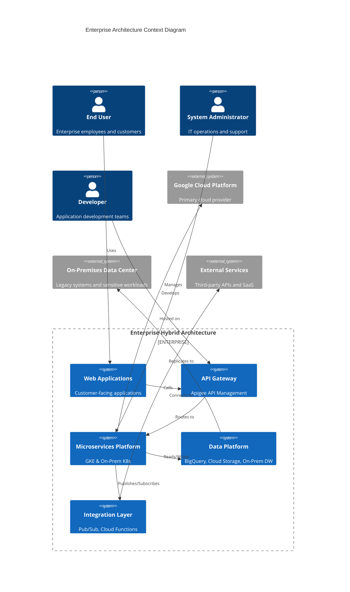

# Enterprise Hybrid Architecture Documentation

## TOGAF ADM Framework for Multi-Cloud & On-Premises Architecture

This repository contains comprehensive architecture documentation following the TOGAF Architecture Development Method (ADM) for an enterprise hybrid architecture spanning on-premises and multi-cloud environments with Google Cloud Platform (GCP) focus.

## Enterprise Context Overview

## Navigation

### TOGAF ADM Phases

| Phase | Description | Documentation |
|-------|-------------|---------------|
| **Phase A** | Architecture Vision | [📁 phase-a-architecture-vision](docs/phase-a-architecture-vision/README.md) |
| **Phase B** | Business Architecture | [📁 phase-b-business-architecture](docs/phase-b-business-architecture/README.md) |
| **Phase C** | Information Systems Architecture | [📁 phase-c-information-systems](docs/phase-c-information-systems/README.md) |
| **Phase D** | Technology Architecture | [📁 phase-d-technology-architecture](docs/phase-d-technology-architecture/README.md) |
| **Phase E** | Opportunities & Solutions | [📁 phase-e-opportunities-solutions](docs/phase-e-opportunities-solutions/README.md) |
| **Phase F** | Migration Planning | [📁 phase-f-migration-planning](docs/phase-f-migration-planning/README.md) |
| **Phase G** | Implementation Governance | [📁 phase-g-implementation-governance](docs/phase-g-implementation-governance/README.md) |
| **Phase H** | Architecture Change Management | [📁 phase-h-change-management](docs/phase-h-change-management/README.md) |

### Cross-Cutting Concerns

| Topic | Documentation |
|-------|---------------|
| Integration Patterns | [📄 integration-patterns.md](docs/cross-cutting/integration-patterns.md) |
| Disaster Recovery | [📄 disaster-recovery.md](docs/cross-cutting/disaster-recovery.md) |
| Cost Management | [📄 cost-management.md](docs/cross-cutting/cost-management.md) |

### Templates

| Template | Description |
|----------|-------------|
| [Architecture Decision Record](templates/architecture-decision-record.md) | Template for documenting architecture decisions |
| [Change Request](templates/change-request-template.md) | Template for submitting change requests |

## Quick Links

- [Contributing Guidelines](CONTRIBUTING.md)
- [Existing Documentation](DOC/)
  - [Overall System Architecture](DOC/overall-system-architecture.md)
  - [Database Schema](DOC/database-schema.md)

## Architecture Artifacts Summary

| Artifact | Phase | Description |
|----------|-------|-------------|
| Business Context Mindmap | A | Business drivers and strategic goals |
| Stakeholder Analysis | A | Stakeholder influence/interest mapping |
| Business Capability Map | B | Strategic, Core, Support capabilities |
| Business Process Flows | B | Customer journey and operations |
| Data Architecture Flow | C | Data sources to consumption pipeline |
| Application Architecture | C | Layered application patterns |
| Infrastructure Architecture | D | Multi-cloud and on-premises setup |
| Network Architecture | D | VPC and connectivity topology |
| Security Architecture | D | Security layers and controls |
| Solution Roadmap | E | 2024-2025 transformation timeline |
| Migration Strategy | E | 6Rs migration distribution |
| Work Package Dependencies | F | Implementation dependencies |
| Governance Structure | G | ARB, CAB, and policies |
| CI/CD Pipeline | G | DevOps pipeline architecture |
| Change Management Process | H | Change request workflow |
| Integration Patterns | Cross | Event-driven and API architecture |
| Disaster Recovery | Cross | DR architecture and RTO/RPO |
| Cost Management | Cross | FinOps and cost governance |

## Getting Started

1. Start with [Phase A - Architecture Vision](docs/phase-a-architecture-vision/README.md) to understand the business context
2. Review the [Business Architecture](docs/phase-b-business-architecture/README.md) for capability mapping
3. Explore [Information Systems](docs/phase-c-information-systems/README.md) for data and application architecture
4. Dive into [Technology Architecture](docs/phase-d-technology-architecture/README.md) for infrastructure details
5. Review [Cross-Cutting Concerns](docs/cross-cutting/) for integration, DR, and cost management

## Technology Stack

- **Cloud Platform**: Google Cloud Platform (GCP)
- **Container Orchestration**: Google Kubernetes Engine (GKE), Anthos
- **API Management**: Apigee
- **Data Platform**: BigQuery, Cloud Storage, Cloud SQL
- **Integration**: Pub/Sub, Cloud Functions
- **Security**: Cloud IAM, VPC Service Controls, Cloud Armor
- **Monitoring**: Cloud Monitoring, Cloud Logging

---

*This documentation follows the TOGAF ADM framework and is maintained by the Enterprise Architecture team.*
