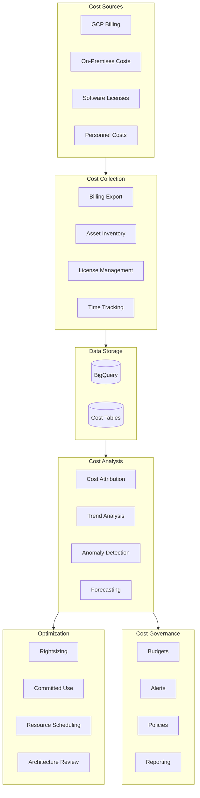
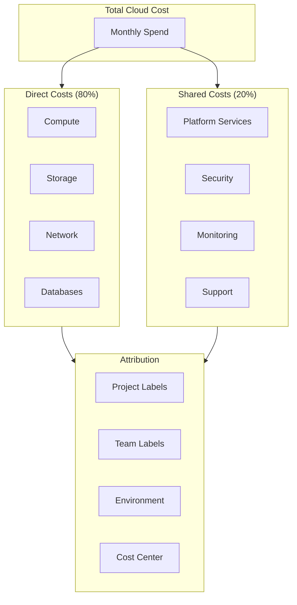
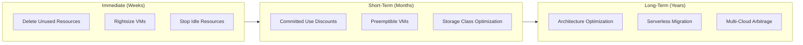
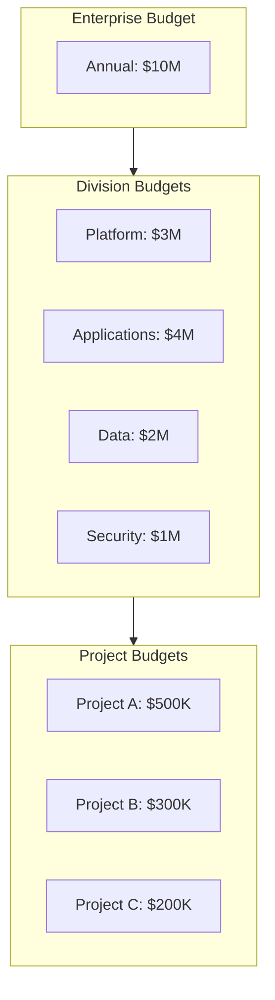
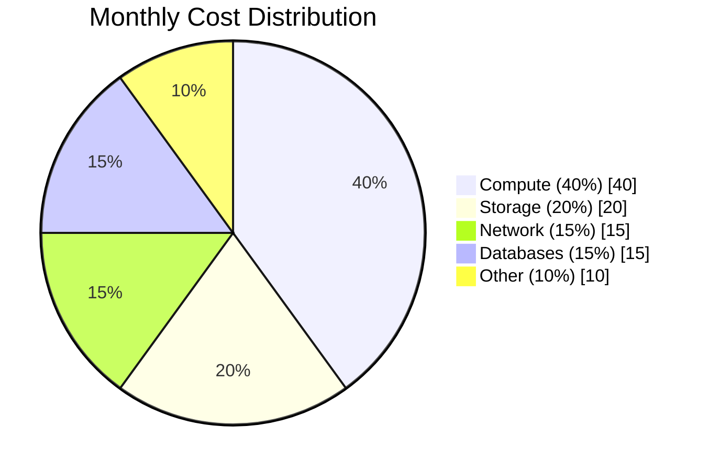
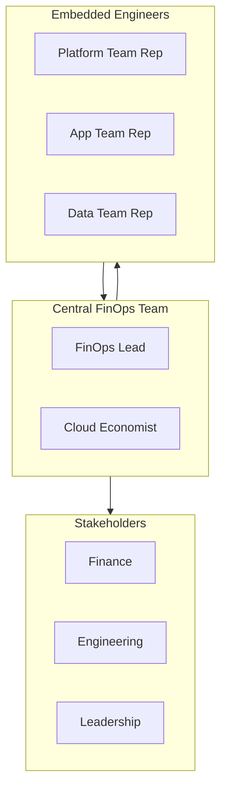

# Cost Management Architecture

## Overview

This document defines the cost management and FinOps architecture for the enterprise hybrid cloud environment, including cost governance, optimization strategies, and financial reporting.

## Cost Management Architecture

## FinOps Framework

### FinOps Principles

| Principle | Description |
|-----------|-------------|
| **Teams Collaborate** | Finance, technology, and business work together |
| **Everyone Takes Ownership** | Decentralized cost responsibility |
| **Cloud is Variable** | Embrace variable spend model |
| **Decisions are Data-Driven** | Real-time cost visibility |
| **Value Trumps Cost** | Focus on business value, not just savings |
| **Continuous Improvement** | Iterative optimization |

### FinOps Maturity Model

| Stage | Characteristics | Focus |
|-------|-----------------|-------|
| **Crawl** | Basic visibility, manual processes | Awareness |
| **Walk** | Automated reporting, basic optimization | Efficiency |
| **Run** | Predictive analytics, advanced optimization | Innovation |

## Cost Allocation

### Cost Attribution Model

### Labeling Strategy

| Label | Values | Purpose |
|-------|--------|---------|
| `environment` | prod, nonprod, dev | Environment allocation |
| `team` | platform, app-a, app-b | Team attribution |
| `cost-center` | CC001, CC002 | Finance allocation |
| `application` | app-name | Application tracking |
| `owner` | email | Accountability |

### Chargeback Model

| Cost Type | Allocation Method | Frequency |
|-----------|------------------|-----------|
| **Compute** | Direct to project | Monthly |
| **Storage** | Direct to project | Monthly |
| **Network** | Usage-based split | Monthly |
| **Shared Services** | Headcount ratio | Monthly |
| **Support** | Revenue ratio | Quarterly |

## Cost Optimization

### Optimization Strategies

### Committed Use Discounts

| Resource Type | Term | Discount | Coverage Target |
|---------------|------|----------|-----------------|
| Compute | 1 year | 37% | 70% of baseline |
| Compute | 3 years | 57% | 50% of baseline |
| Cloud SQL | 1 year | 37% | 80% of instances |
| Cloud SQL | 3 years | 57% | 60% of instances |

### Rightsizing Recommendations

| Check | Threshold | Action |
|-------|-----------|--------|
| CPU Utilization | < 30% average | Downsize |
| Memory Utilization | < 30% average | Downsize |
| Disk IOPS | < 20% capacity | Change disk type |
| Network | < 10% capacity | Review architecture |

## Cost Governance

### Budget Structure

### Budget Alerts

| Alert Level | Threshold | Action |
|-------------|-----------|--------|
| **Info** | 50% | Notification to owner |
| **Warning** | 75% | Notification to manager |
| **Critical** | 90% | Escalation to finance |
| **Overspend** | 100% | Executive notification |

### Cost Policies

| Policy | Description | Enforcement |
|--------|-------------|-------------|
| Resource Labels | All resources must have required labels | Organization Policy |
| Budget Required | Projects must have budget before provisioning | Manual |
| CUD Coverage | Maintain 60%+ CUD coverage | Automated review |
| Unused Resources | Delete resources idle > 30 days | Automated |
| Dev Shutdown | Non-prod resources off nights/weekends | Scheduled |

## Reporting

### Cost Dashboard

| Report | Audience | Frequency |
|--------|----------|-----------|
| Executive Summary | C-Suite | Monthly |
| Division Report | VPs | Weekly |
| Team Report | Managers | Weekly |
| Project Report | Project Leads | Daily |
| Anomaly Report | FinOps Team | Real-time |

### Key Metrics

| Metric | Target | Current | Trend |
|--------|--------|---------|-------|
| Monthly Spend | $800K | $750K | ↓ |
| CUD Coverage | 70% | 65% | ↑ |
| Waste Ratio | < 5% | 8% | ↓ |
| Cost/Transaction | $0.05 | $0.06 | ↓ |
| Forecast Accuracy | > 95% | 92% | ↑ |

### Cost Breakdown

## FinOps Team Structure

### Roles and Responsibilities

| Role | Responsibility |
|------|---------------|
| **FinOps Lead** | Strategy, governance, stakeholder management |
| **Cloud Economist** | Cost analysis, forecasting, optimization |
| **Platform Engineer** | Automation, tooling, implementation |
| **Finance Analyst** | Budgeting, chargeback, reporting |

### Operating Model

---

[← Back to Main Documentation](../../README.md)
