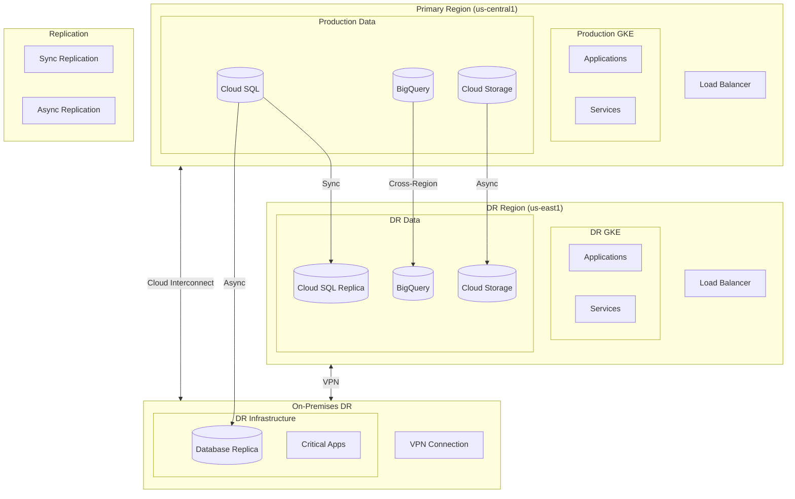
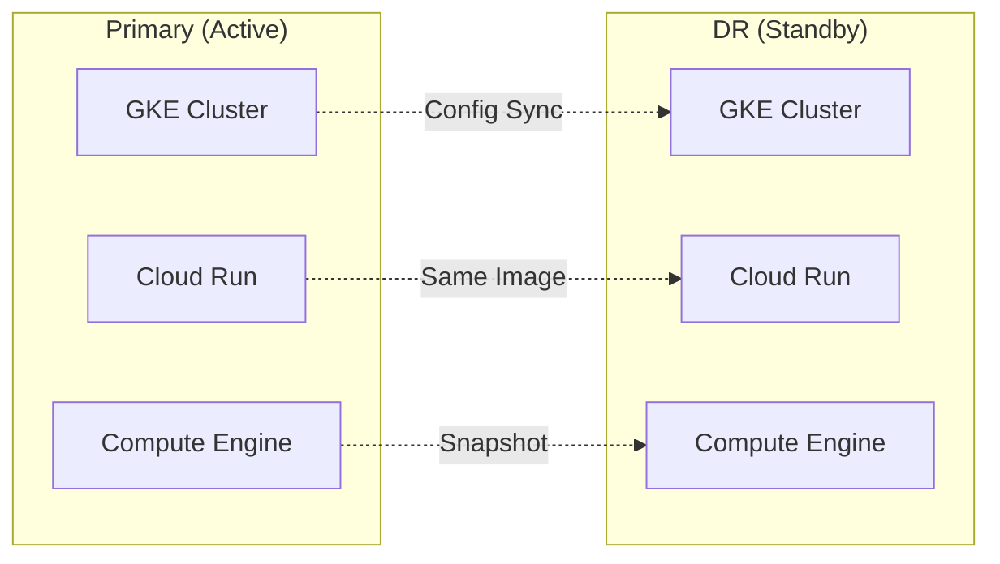
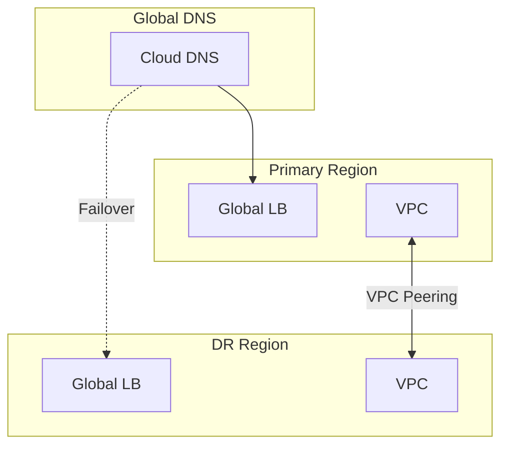
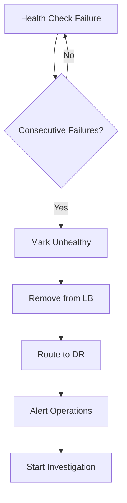
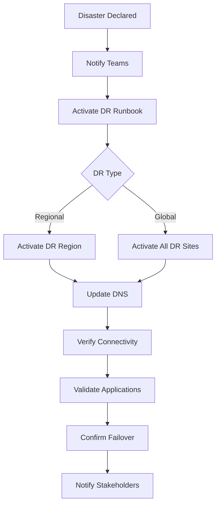

# Disaster Recovery Architecture

## Overview

This document defines the disaster recovery (DR) architecture for the enterprise hybrid cloud environment, including recovery strategies, RTO/RPO targets, and failover procedures.

## Disaster Recovery Architecture

## Recovery Objectives

### RTO/RPO Targets

| Tier | Description | RTO | RPO | Examples |
|------|-------------|-----|-----|----------|
| **Tier 1** | Mission Critical | 15 min | 0 min | Payment Processing, Core APIs |
| **Tier 2** | Business Critical | 1 hour | 15 min | Customer Portal, Order Management |
| **Tier 3** | Business Important | 4 hours | 1 hour | Analytics, Reporting |
| **Tier 4** | Business Support | 24 hours | 4 hours | Development, Testing |

### Recovery Strategies

| Strategy | RTO | Cost | Use Case |
|----------|-----|------|----------|
| **Hot Standby** | Minutes | High | Tier 1 systems |
| **Warm Standby** | 1-4 hours | Medium | Tier 2-3 systems |
| **Cold Standby** | 24+ hours | Low | Tier 4 systems |
| **Backup/Restore** | Days | Lowest | Archives |

## DR Components

### Compute DR

### Data DR

| Service | Replication Method | RPO | DR Location |
|---------|-------------------|-----|-------------|
| **Cloud SQL** | Synchronous replica | 0 | us-east1 |
| **Cloud Spanner** | Multi-region | 0 | Global |
| **BigQuery** | Cross-region copy | 1 hour | us-east1 |
| **Cloud Storage** | Dual-region | 0 | us-central1/us-east1 |
| **Firestore** | Multi-region | 0 | nam5 |

### Network DR

## Failover Procedures

### Automatic Failover

### Manual Failover

## DR Runbooks

### Regional Failover Runbook

| Step | Action | Owner | Time |
|------|--------|-------|------|
| 1 | Declare DR event | Incident Commander | 0 min |
| 2 | Notify DR team | On-Call Engineer | 5 min |
| 3 | Assess damage | Platform Team | 10 min |
| 4 | Promote DB replicas | DBA | 15 min |
| 5 | Update DNS records | Network Team | 20 min |
| 6 | Verify application health | App Teams | 30 min |
| 7 | Validate data integrity | Data Team | 45 min |
| 8 | Confirm DR complete | Incident Commander | 60 min |

### Failback Runbook

| Step | Action | Owner | Time |
|------|--------|-------|------|
| 1 | Confirm primary recovered | Platform Team | 0 min |
| 2 | Sync data to primary | DBA | 30 min |
| 3 | Test primary systems | App Teams | 60 min |
| 4 | Schedule failback window | Change Management | 24 hr |
| 5 | Execute failback | Platform Team | 24+ hr |
| 6 | Verify primary active | All Teams | 24+ hr |
| 7 | Restore DR standby | Platform Team | 48 hr |

## DR Testing

### Testing Schedule

| Test Type | Frequency | Duration | Scope |
|-----------|-----------|----------|-------|
| **Tabletop** | Monthly | 2 hours | Process review |
| **Component** | Quarterly | 4 hours | Individual systems |
| **Partial** | Semi-annually | 8 hours | Tier 1-2 systems |
| **Full** | Annually | 24 hours | All systems |

### Test Scenarios

| Scenario | Objective | Systems |
|----------|-----------|---------|
| Regional outage | Validate regional failover | All Tier 1-2 |
| Database failure | Test DB failover | Cloud SQL, Spanner |
| Network partition | Test hybrid connectivity | Interconnect, VPN |
| Ransomware | Test backup restore | All data systems |
| Cascading failure | Test circuit breakers | Microservices |

## Monitoring and Alerting

### DR Health Checks

| Check | Frequency | Alert Threshold |
|-------|-----------|-----------------|
| Replication lag | 1 min | > 5 minutes |
| Backup completion | Daily | Missed backup |
| DR site connectivity | 5 min | 3 failures |
| Replica health | 1 min | Unhealthy |
| DNS propagation | 5 min | Mismatch |

### DR Dashboard

| Metric | Target | Current |
|--------|--------|---------|
| Replication Status | Healthy | ✓ Healthy |
| Last Backup | < 24h | 2h ago |
| DR Site Status | Ready | ✓ Ready |
| Last DR Test | < 90 days | 45 days ago |
| Recovery Confidence | > 95% | 98% |

---

[← Back to Main Documentation](../../README.md)
