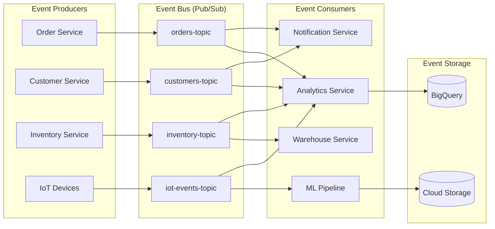
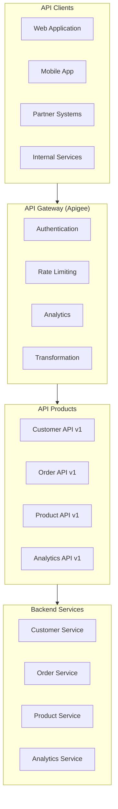
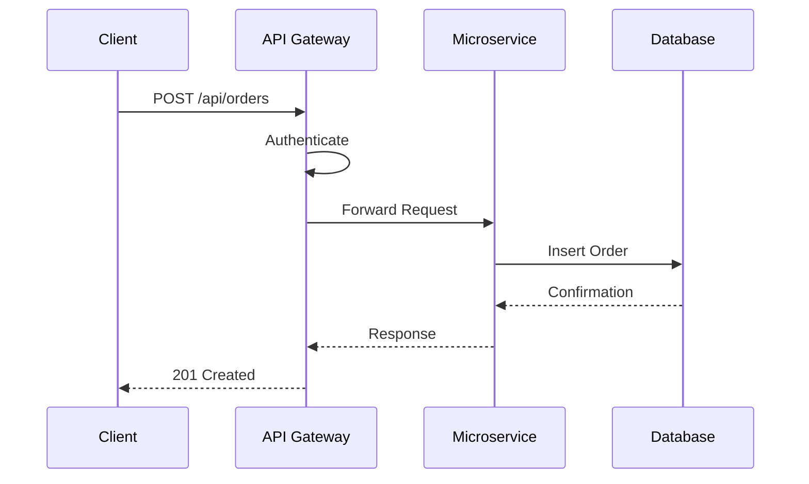
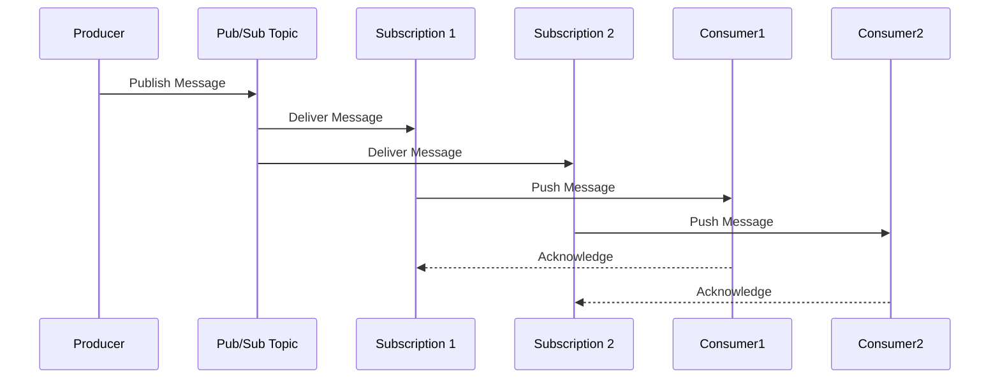
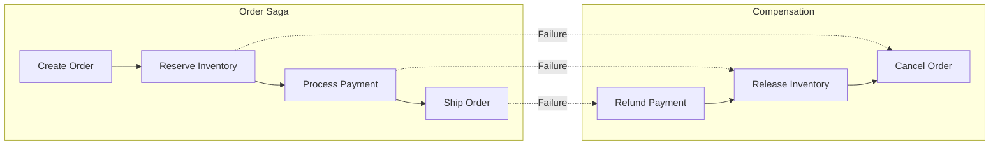
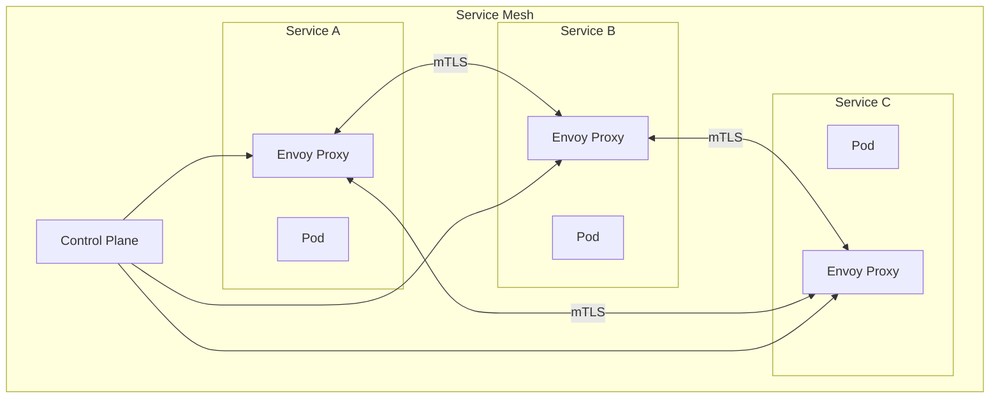

# Integration Patterns

## Overview

This document defines the integration patterns for the enterprise hybrid cloud architecture, including event-driven architecture, API architecture, and system integration approaches.

## Event-Driven Architecture



## API Architecture



## Integration Patterns

### Pattern Catalog

| Pattern | Use Case | Technology |
|---------|----------|------------|
| **Request-Response** | Synchronous operations | REST, gRPC |
| **Publish-Subscribe** | Event distribution | Pub/Sub |
| **Event Sourcing** | Audit, replay | Pub/Sub, BigQuery |
| **Saga** | Distributed transactions | Pub/Sub, Workflows |
| **CQRS** | Read/write separation | Cloud SQL, BigQuery |
| **API Gateway** | External access | Apigee |
| **Service Mesh** | Service-to-service | Anthos Service Mesh |

### Request-Response Pattern



### Publish-Subscribe Pattern



### Saga Pattern



## Event Schema Standards

### Event Envelope

```json
{
  "eventId": "uuid",
  "eventType": "order.created",
  "eventTime": "2024-01-15T10:30:00Z",
  "source": "order-service",
  "dataContentType": "application/json",
  "data": {
    "orderId": "12345",
    "customerId": "C001",
    "items": []
  },
  "metadata": {
    "correlationId": "uuid",
    "causationId": "uuid"
  }
}
```

### Event Types

| Domain | Event Type | Description |
|--------|------------|-------------|
| **Order** | order.created | New order placed |
| **Order** | order.updated | Order modified |
| **Order** | order.completed | Order fulfilled |
| **Customer** | customer.registered | New registration |
| **Customer** | customer.updated | Profile updated |
| **Inventory** | inventory.reserved | Stock reserved |
| **Inventory** | inventory.released | Stock released |
| **Payment** | payment.processed | Payment completed |
| **Payment** | payment.failed | Payment failed |

## API Standards

### REST API Guidelines

| Guideline | Example |
|-----------|---------|
| Resource naming | `/api/v1/customers/{id}` |
| HTTP methods | GET, POST, PUT, PATCH, DELETE |
| Status codes | 200, 201, 400, 401, 404, 500 |
| Versioning | URL path (`/v1/`) |
| Pagination | `?page=1&size=20` |
| Filtering | `?status=active&type=premium` |

### API Security

| Layer | Implementation |
|-------|----------------|
| **Authentication** | OAuth 2.0, API Keys |
| **Authorization** | JWT claims, Scopes |
| **Rate Limiting** | Apigee policies |
| **Input Validation** | OpenAPI schema |
| **Transport** | TLS 1.3 |

## Service Mesh Configuration

### Anthos Service Mesh



### Traffic Management

| Feature | Use Case |
|---------|----------|
| **Traffic Splitting** | Canary deployments |
| **Retries** | Transient failures |
| **Timeouts** | Failure isolation |
| **Circuit Breaking** | Cascade prevention |
| **Fault Injection** | Chaos testing |

## Integration Monitoring

### Key Metrics

| Metric | Target | Alert Threshold |
|--------|--------|-----------------|
| API Latency (p95) | < 200ms | > 500ms |
| API Error Rate | < 1% | > 5% |
| Event Processing Lag | < 1s | > 30s |
| Message Throughput | N/A | -20% from baseline |
| Dead Letter Queue | 0 | > 100 |

---

[← Back to Main Documentation](../../README.md)
