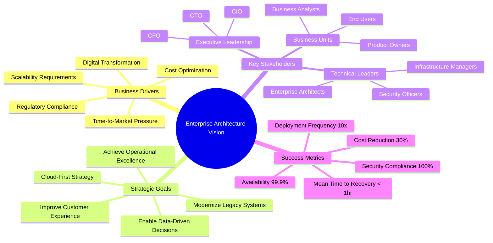

# Business Context

## Overview

This document outlines the business drivers, strategic goals, and success metrics for the enterprise hybrid cloud architecture initiative.

## Business Context Mindmap

## Business Drivers

### Primary Drivers

| Driver | Description | Impact |
|--------|-------------|--------|
| **Digital Transformation** | Need to modernize systems and processes to remain competitive | High |
| **Cost Optimization** | Reduce infrastructure costs through cloud economics | High |
| **Scalability** | Ability to scale resources dynamically based on demand | High |
| **Time-to-Market** | Faster delivery of new features and products | Medium |
| **Compliance** | Meet regulatory requirements (GDPR, SOC2, HIPAA) | High |

### Secondary Drivers

| Driver | Description | Impact |
|--------|-------------|--------|
| **Innovation** | Enable experimentation with new technologies | Medium |
| **Talent Acquisition** | Attract cloud-skilled professionals | Medium |
| **Sustainability** | Reduce carbon footprint through efficient resource use | Low |

## Strategic Goals

### Cloud-First Strategy

Prioritize cloud-native solutions for new workloads while maintaining strategic on-premises capabilities for sensitive data and legacy integrations.

**Key Initiatives:**
- Migrate 70% of workloads to GCP by 2025
- Establish hybrid connectivity for remaining on-premises systems
- Implement cloud-native development practices

### Modernization Program

Transform legacy monolithic applications into modern microservices architecture.

**Key Initiatives:**
- Decompose monolithic applications into microservices
- Containerize workloads using Docker and Kubernetes
- Implement API-first design principles

### Data Platform Excellence

Build a unified data platform spanning cloud and on-premises environments.

**Key Initiatives:**
- Establish BigQuery as the primary analytics platform
- Implement real-time data streaming with Pub/Sub
- Create unified data governance framework

## Success Metrics

### Technical Metrics

| Metric | Current | Target | Timeline |
|--------|---------|--------|----------|
| System Availability | 99.5% | 99.9% | Q4 2024 |
| Deployment Frequency | Monthly | Daily | Q2 2025 |
| Mean Time to Recovery | 4 hours | < 1 hour | Q3 2024 |
| Infrastructure Utilization | 40% | 70% | Q4 2024 |

### Business Metrics

| Metric | Current | Target | Timeline |
|--------|---------|--------|----------|
| Infrastructure Cost | $5M/year | $3.5M/year | Q4 2025 |
| Time-to-Market | 6 months | 6 weeks | Q2 2025 |
| Customer Satisfaction | 3.8/5 | 4.5/5 | Q4 2025 |
| Compliance Score | 85% | 100% | Q2 2024 |

## Constraints

### Technical Constraints

- Some legacy systems cannot be migrated due to vendor limitations
- Data residency requirements for certain regulated data
- Existing network infrastructure dependencies

### Business Constraints

- Limited budget for initial transformation ($10M over 2 years)
- Resource availability (skills gap in cloud technologies)
- Business continuity requirements during migration

### Regulatory Constraints

- GDPR compliance for EU customer data
- SOC2 Type II certification requirements
- Industry-specific regulations (if applicable)

## Assumptions

1. Executive sponsorship will remain consistent throughout the transformation
2. GCP will continue to be the preferred cloud provider
3. Existing on-premises data center contracts will be honored
4. Teams will receive necessary training for cloud technologies
5. Business operations can tolerate planned maintenance windows

## Risks

| Risk | Probability | Impact | Mitigation |
|------|-------------|--------|------------|
| Skills gap delays migration | Medium | High | Training programs, partner engagement |
| Cost overruns | Medium | Medium | Phased approach, regular reviews |
| Security incidents | Low | High | Security-first design, continuous monitoring |
| Vendor lock-in | Medium | Medium | Multi-cloud strategy, use of open standards |
| Business disruption | Low | High | Blue-green deployments, rollback procedures |

---

[← Back to Phase A](README.md) | [Next: Stakeholder Analysis →](stakeholder-analysis.md)
