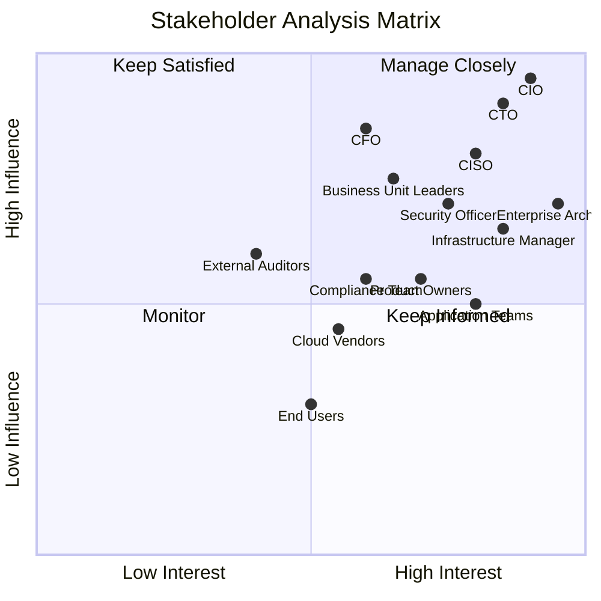
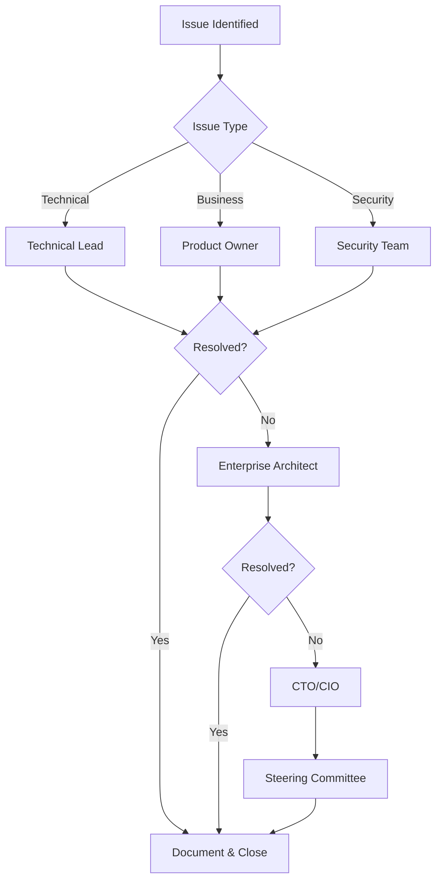

# Stakeholder Analysis

## Overview

This document identifies and analyzes key stakeholders for the enterprise hybrid cloud architecture initiative, mapping their influence, interest, and concerns.

## Stakeholder Influence-Interest Quadrant

## Stakeholder Registry

### Executive Stakeholders

| Stakeholder | Role | Interest | Influence | Engagement Strategy |
|-------------|------|----------|-----------|---------------------|
| **CIO** | Chief Information Officer | Strategic direction, ROI, risk management | Very High | Regular executive briefings, steering committee |
| **CTO** | Chief Technology Officer | Technology strategy, innovation | Very High | Architecture review boards, technical workshops |
| **CFO** | Chief Financial Officer | Cost optimization, budget allocation | High | Monthly financial reviews, business case updates |
| **CISO** | Chief Information Security Officer | Security posture, compliance | High | Security architecture reviews, risk assessments |

### Technical Stakeholders

| Stakeholder | Role | Interest | Influence | Engagement Strategy |
|-------------|------|----------|-----------|---------------------|
| **Enterprise Architects** | Architecture design and governance | Very High | High | Daily involvement, architecture decisions |
| **Infrastructure Managers** | Data center and cloud operations | High | Medium | Technical workshops, capacity planning |
| **Security Officers** | Security implementation | High | High | Security reviews, threat modeling |
| **Application Teams** | Development and deployment | High | Medium | Sprint involvement, technical guidance |
| **DevOps Engineers** | CI/CD and automation | High | Medium | Pipeline design, tooling decisions |

### Business Stakeholders

| Stakeholder | Role | Interest | Influence | Engagement Strategy |
|-------------|------|----------|-----------|---------------------|
| **Business Unit Leaders** | Business outcomes | Medium | High | Monthly business reviews |
| **Product Owners** | Feature delivery | High | Medium | Sprint planning, backlog grooming |
| **Business Analysts** | Requirements | Medium | Low | Requirements workshops |
| **End Users** | System usability | Medium | Low | User feedback sessions |

### External Stakeholders

| Stakeholder | Role | Interest | Influence | Engagement Strategy |
|-------------|------|----------|-----------|---------------------|
| **Cloud Vendors (GCP)** | Service delivery | Medium | Medium | QBRs, support escalation |
| **External Auditors** | Compliance verification | Low | Medium | Audit preparation, evidence collection |
| **Compliance Team** | Regulatory compliance | Medium | Medium | Compliance reviews |
| **Technology Partners** | Implementation support | Medium | Low | Project coordination |

## Stakeholder Concerns

### CIO Concerns

- **Strategic Alignment**: Ensure architecture supports business strategy
- **Risk Management**: Minimize operational and security risks
- **ROI**: Demonstrate clear return on investment
- **Governance**: Maintain control over IT decisions

### CTO Concerns

- **Innovation**: Enable modern technology adoption
- **Scalability**: Support business growth
- **Technical Debt**: Reduce legacy system burden
- **Talent**: Attract and retain technical talent

### CFO Concerns

- **Cost Control**: Predictable and optimized spending
- **Capital vs OpEx**: Shift from CapEx to OpEx model
- **Budget Compliance**: Stay within allocated budgets
- **Financial Reporting**: Clear cost attribution

### CISO Concerns

- **Security Posture**: Maintain strong security controls
- **Compliance**: Meet regulatory requirements
- **Threat Protection**: Protect against cyber threats
- **Data Protection**: Ensure data confidentiality and integrity

### Enterprise Architect Concerns

- **Architecture Consistency**: Maintain standards across platforms
- **Integration**: Seamless integration between systems
- **Maintainability**: Long-term supportability of solutions
- **Documentation**: Comprehensive architecture documentation

## Communication Plan

### Communication Matrix

| Stakeholder Group | Channel | Frequency | Content |
|-------------------|---------|-----------|---------|
| Executive Team | Steering Committee | Monthly | Strategic updates, risks, decisions |
| Technical Leaders | ARB Meetings | Bi-weekly | Architecture decisions, technical deep-dives |
| Project Teams | Stand-ups | Daily | Progress, blockers, coordination |
| Business Units | Business Review | Monthly | Impact assessment, timeline updates |
| All Stakeholders | Newsletter | Monthly | General updates, milestones |

### Escalation Path

## RACI Matrix

| Activity | CIO | CTO | EA | Infra | Security | Dev Teams |
|----------|-----|-----|----|----|----------|-----------|
| Architecture Strategy | A | R | R | C | C | I |
| Technology Selection | I | A | R | C | C | C |
| Security Standards | I | I | C | C | R | I |
| Cloud Migration | A | I | R | R | C | R |
| Governance Framework | A | C | R | I | C | I |
| Cost Management | C | I | C | R | I | I |

**Legend**: R = Responsible, A = Accountable, C = Consulted, I = Informed

---

[← Back to Business Context](business-context.md) | [Back to Phase A](README.md)
