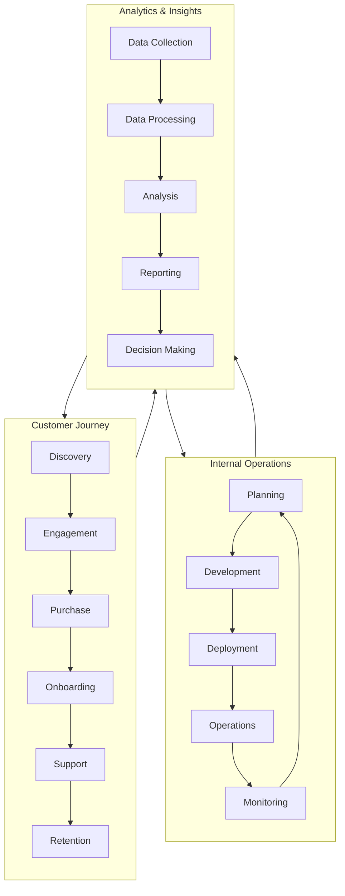
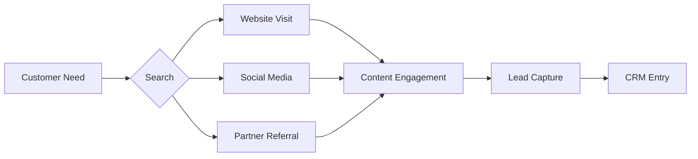
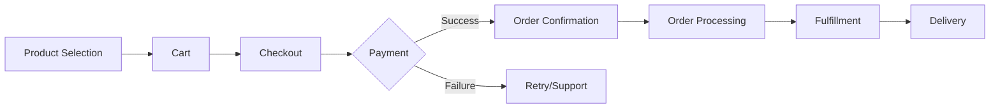
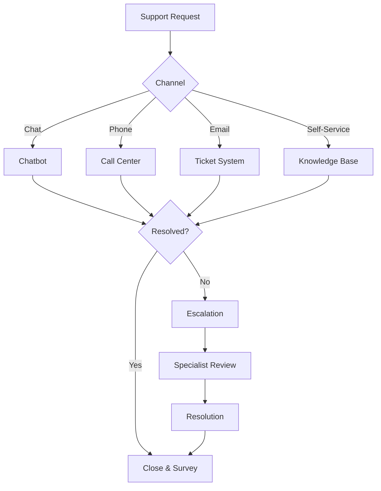
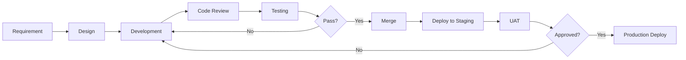
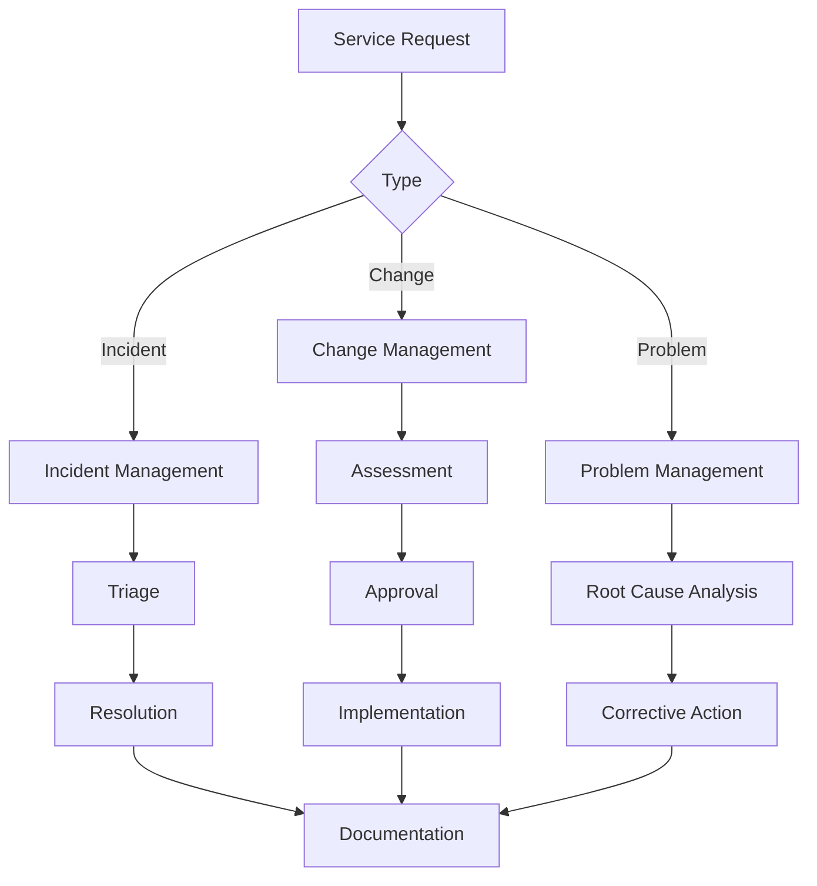
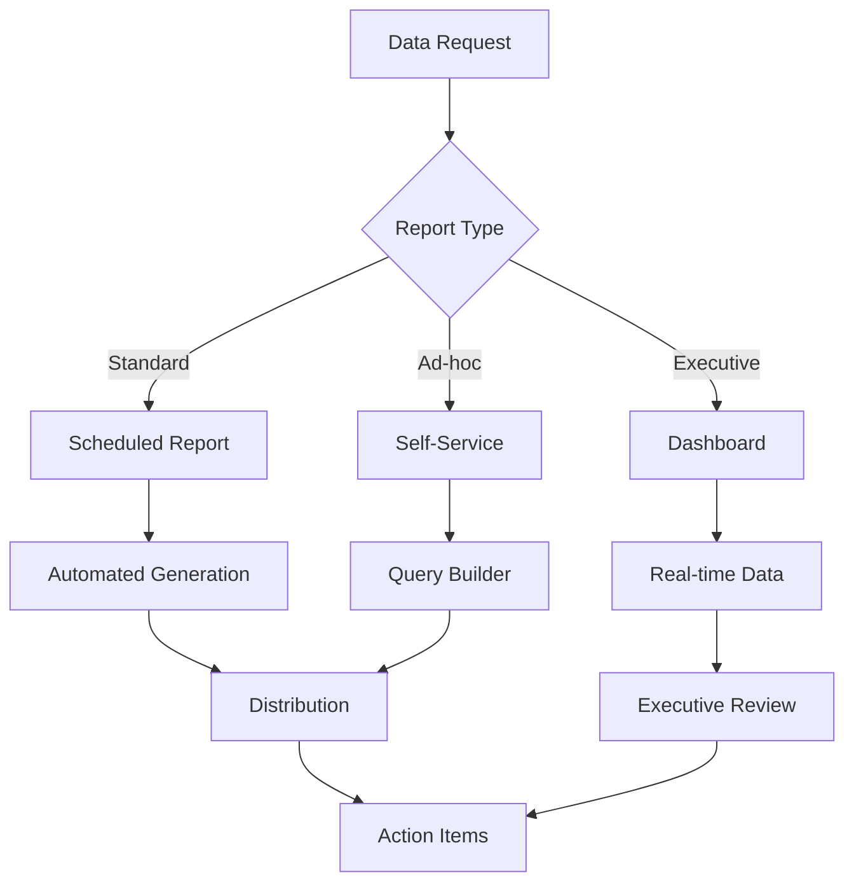

# Business Processes

## Overview

This document describes key business processes that will be impacted or enabled by the hybrid cloud architecture. Understanding these processes is essential for designing appropriate technology solutions.

## Business Process Flow

## Customer Journey Processes

### Discovery Process

**Cloud Enablement:**
- Website hosted on Cloud Run for scalability
- Analytics via BigQuery for visitor behavior analysis
- Cloud CDN for global content delivery

### Purchase Process

**Cloud Enablement:**
- E-commerce platform on GKE for auto-scaling
- Cloud Spanner for transactional consistency
- Pub/Sub for event-driven order processing

### Support Process

**Cloud Enablement:**
- Dialogflow for intelligent chatbots
- Contact Center AI for call support
- Cloud Functions for ticket automation

## Internal Operations Processes

### Development Process

**Cloud Enablement:**
- Cloud Build for CI/CD
- Artifact Registry for container images
- GKE for container orchestration

### Operations Process

**Cloud Enablement:**
- Cloud Monitoring for alerting
- Cloud Logging for centralized logs
- Cloud Operations suite for observability

## Analytics & Insights Processes

### Data Pipeline Process

```mermaid
flowchart LR
    subgraph Sources
        S1[Applications]
        S2[Databases]
        S3[IoT Devices]
        S4[External APIs]
    end
    
    subgraph Ingestion
        I1[Pub/Sub]
        I2[Dataflow]
        I3[Cloud Functions]
    end
    
    subgraph Storage
        ST1[Cloud Storage]
        ST2[BigQuery]
        ST3[Cloud SQL]
    end
    
    subgraph Processing
        P1[Dataproc]
        P2[Dataflow]
        P3[BigQuery ML]
    end
    
    subgraph Consumption
        C1[Looker]
        C2[Data Studio]
        C3[APIs]
    end
    
    Sources --> Ingestion
    Ingestion --> Storage
    Storage --> Processing
    Processing --> Consumption
```

### Reporting Process

## Process Metrics

### Key Performance Indicators

| Process | Metric | Current | Target |
|---------|--------|---------|--------|
| Customer Journey | Conversion Rate | 2.5% | 4% |
| Customer Journey | Customer Satisfaction | 3.8/5 | 4.5/5 |
| Support | First Response Time | 4 hours | 1 hour |
| Support | Resolution Time | 24 hours | 8 hours |
| Development | Lead Time | 30 days | 7 days |
| Development | Deployment Frequency | Monthly | Daily |
| Operations | Mean Time to Recovery | 4 hours | 1 hour |
| Operations | Change Success Rate | 85% | 95% |
| Analytics | Data Freshness | 24 hours | Real-time |
| Analytics | Report Generation | Manual | Automated |

## Process Improvement Opportunities

| Process Area | Current State | Target State | Enabler |
|--------------|--------------|--------------|---------|
| Customer Discovery | Reactive marketing | Personalized engagement | AI/ML on GCP |
| Order Processing | Batch processing | Real-time streaming | Pub/Sub, Dataflow |
| Support | Manual triage | AI-assisted routing | Contact Center AI |
| Development | Manual deployments | Automated CI/CD | Cloud Build, GKE |
| Analytics | Weekly reports | Real-time dashboards | BigQuery, Looker |

---

[← Back to Capability Map](capability-map.md) | [Back to Phase B](README.md)
