# Business Capability Map

## Overview

The business capability map provides a structured view of the organization's abilities to achieve business outcomes. This map serves as a foundation for aligning technology investments with business priorities.

## Business Capability Model

```mermaid
block-beta
    columns 4
    
    block:strategic:4
        columns 4
        A["🎯 STRATEGIC CAPABILITIES"]
        B["Strategic Planning"]
        C["Innovation Management"]
        D["Business Development"]
    end
    
    block:core:4
        columns 4
        E["💼 CORE CAPABILITIES"]
        F["Product Management"]
        G["Customer Management"]
        H["Service Delivery"]
    end
    
    block:support:4
        columns 4
        I["🔧 SUPPORT CAPABILITIES"]
        J["Human Resources"]
        K["Finance & Accounting"]
        L["Legal & Compliance"]
    end
    
    block:enabling:4
        columns 4
        M["⚡ ENABLING CAPABILITIES"]
        N["IT Services"]
        O["Data Management"]
        P["Security Operations"]
    end
```

## Detailed Capability Breakdown

### Strategic Capabilities

| Capability | Sub-Capabilities | Cloud Relevance |
|------------|-----------------|-----------------|
| **Strategic Planning** | Business Strategy, Portfolio Management, Performance Management | Medium |
| **Innovation Management** | R&D, Product Innovation, Technology Scouting | High |
| **Business Development** | Market Analysis, Partnership Management, M&A | Low |

### Core Capabilities

| Capability | Sub-Capabilities | Cloud Relevance |
|------------|-----------------|-----------------|
| **Product Management** | Product Development, Product Lifecycle, Pricing | High |
| **Customer Management** | Customer Acquisition, Customer Service, Customer Retention | High |
| **Service Delivery** | Order Management, Fulfillment, Support | High |

### Support Capabilities

| Capability | Sub-Capabilities | Cloud Relevance |
|------------|-----------------|-----------------|
| **Human Resources** | Talent Acquisition, Learning & Development, HR Operations | Medium |
| **Finance & Accounting** | Financial Planning, Accounting, Treasury | Medium |
| **Legal & Compliance** | Contract Management, Regulatory Compliance, Risk Management | Medium |

### Enabling Capabilities

| Capability | Sub-Capabilities | Cloud Relevance |
|------------|-----------------|-----------------|
| **IT Services** | Infrastructure Management, Application Management, Service Desk | High |
| **Data Management** | Data Governance, Analytics, Master Data Management | High |
| **Security Operations** | Identity Management, Threat Management, Compliance Monitoring | High |

## Capability Maturity Assessment

### Maturity Levels

| Level | Name | Description |
|-------|------|-------------|
| 1 | **Initial** | Ad-hoc, reactive processes |
| 2 | **Developing** | Basic processes defined |
| 3 | **Defined** | Standardized processes |
| 4 | **Managed** | Measured and controlled |
| 5 | **Optimizing** | Continuous improvement |

### Current vs Target Maturity

### Maturity Gap Analysis

| Capability | Current | Target | Gap | Priority |
|------------|---------|--------|-----|----------|
| IT Services | 2 | 4 | 2 | High |
| Data Management | 2 | 4 | 2 | High |
| Security Operations | 3 | 4 | 1 | High |
| Product Management | 3 | 4 | 1 | Medium |
| Customer Management | 2 | 4 | 2 | Medium |
| Service Delivery | 2 | 3 | 1 | Medium |

## Capability Dependencies

## Technology Mapping

| Capability | Current Technology | Target Technology |
|------------|-------------------|-------------------|
| IT Services | On-Prem VMs, Manual Provisioning | GCP Compute, Terraform, Ansible |
| Data Management | On-Prem Data Warehouse | BigQuery, Cloud Storage, Dataflow |
| Security Operations | Legacy SIEM, Manual Review | Chronicle, Security Command Center |
| Product Management | Custom Applications | Cloud-native Microservices |
| Customer Management | On-Prem CRM | Cloud CRM Integration |
| Service Delivery | Monolithic Applications | Containerized Microservices |

## Investment Prioritization

### Priority Matrix

| Capability | Business Value | Technical Complexity | Priority Score |
|------------|---------------|---------------------|----------------|
| IT Services | High | Medium | **1** |
| Data Management | High | High | **2** |
| Security Operations | High | Medium | **3** |
| Customer Management | High | Medium | **4** |
| Product Management | Medium | High | **5** |
| Service Delivery | Medium | Medium | **6** |

---

[← Back to Phase B](README.md) | [Next: Business Processes →](business-processes.md)
