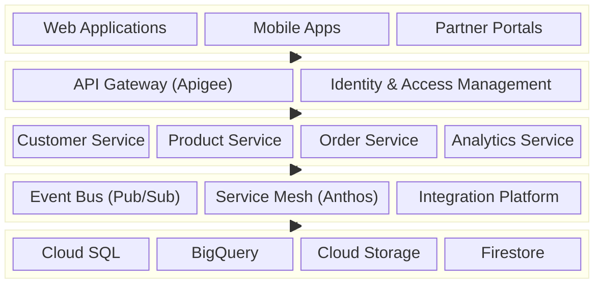
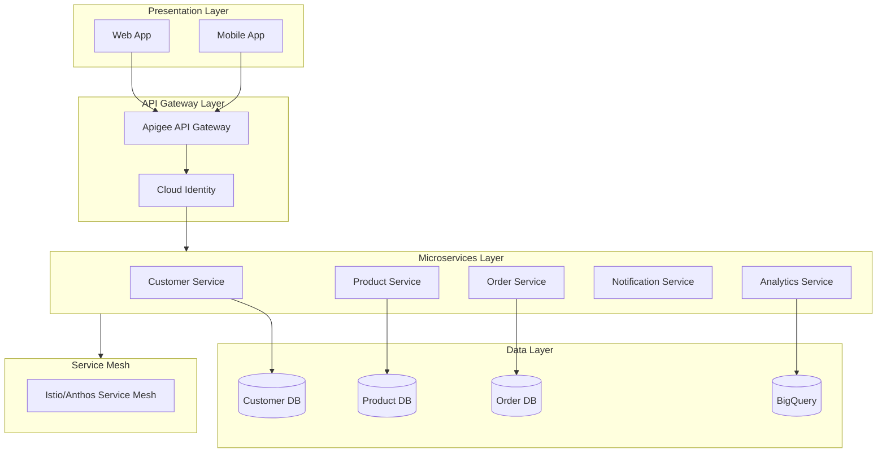
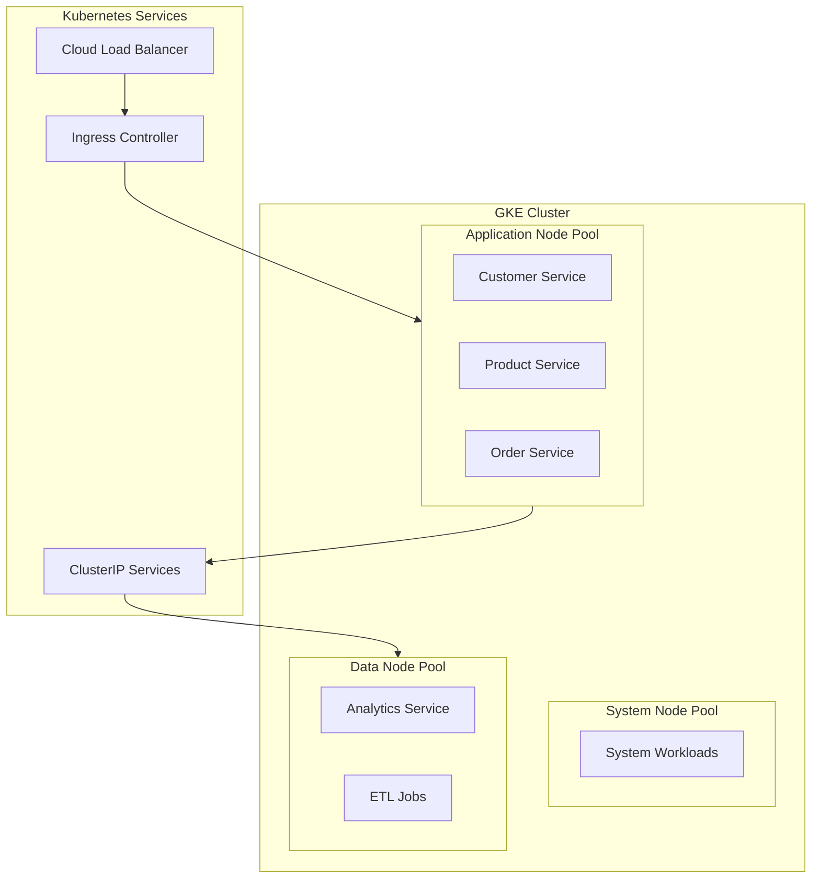
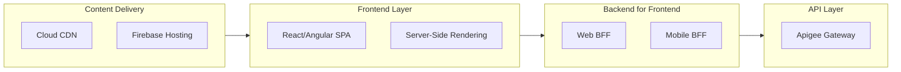
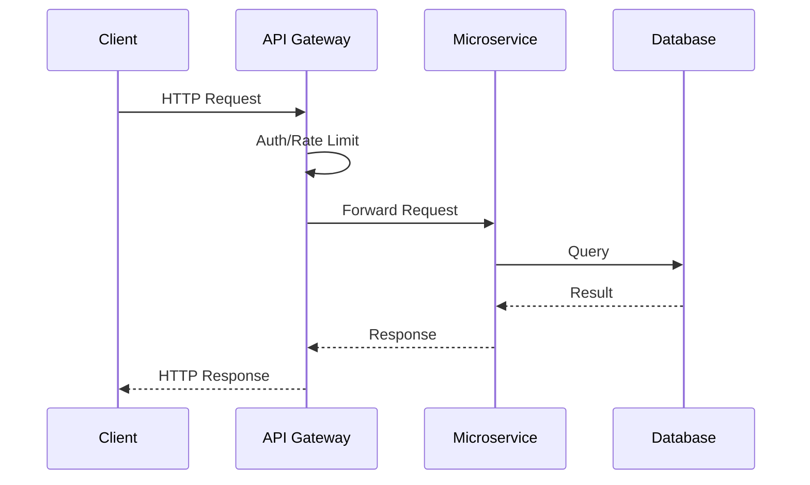
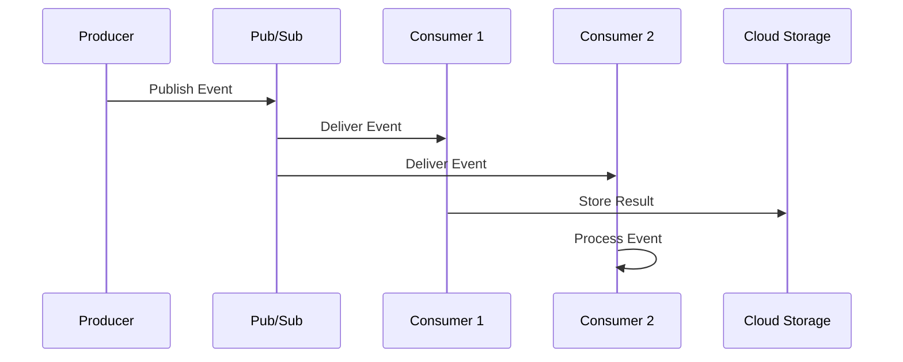
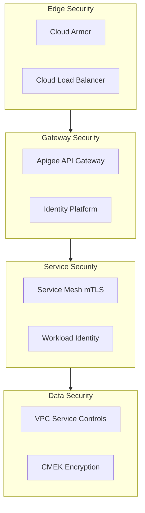

# Application Architecture

## Overview

This document defines the application architecture for the enterprise hybrid cloud environment, including application patterns, layers, and integration approaches.

## Application Architecture Layers

## Application Portfolio

### Application Classification

| Category | Description | Examples | Target Platform |
|----------|-------------|----------|-----------------|
| **Customer-Facing** | External user applications | Web portal, Mobile app | GKE, Cloud Run |
| **Internal Tools** | Employee applications | Admin dashboards, CRM | GKE, App Engine |
| **Integration** | System connectors | APIs, ETL jobs | Cloud Functions, Dataflow |
| **Analytics** | BI and reporting | Dashboards, Reports | Looker, BigQuery |
| **Legacy** | Existing on-prem systems | ERP, Mainframe | Retain on-premises |

### Application Inventory

| Application | Type | Current State | Target State | Migration Strategy |
|-------------|------|--------------|--------------|-------------------|
| Customer Portal | Web App | On-Prem VMs | GKE | Replatform |
| Mobile API | API Service | Monolith | Microservices | Refactor |
| Admin Dashboard | Internal | Legacy | Cloud Run | Repurchase |
| Data Warehouse | Analytics | On-Prem | BigQuery | Replatform |
| ERP System | Enterprise | On-Prem | Hybrid | Retain |

## Microservices Architecture

### Service Design

### Service Specifications

| Service | Responsibility | API Type | Data Store | Scale |
|---------|---------------|----------|------------|-------|
| **Customer Service** | Customer profiles, preferences | REST/gRPC | Cloud SQL | High |
| **Product Service** | Product catalog, inventory | REST | Firestore | High |
| **Order Service** | Order management, payments | REST/gRPC | Cloud Spanner | High |
| **Notification Service** | Email, SMS, push notifications | Async | Pub/Sub | Medium |
| **Analytics Service** | Metrics, reporting | REST | BigQuery | Low |

## API Architecture

### API Design Patterns

```mermaid
flowchart LR
    subgraph Clients["API Consumers"]
        C1[Web App]
        C2[Mobile App]
        C3[Partners]
        C4[Internal Services]
    end
    
    subgraph Gateway["Apigee API Gateway"]
        G1[Rate Limiting]
        G2[Authentication]
        G3[Transformation]
        G4[Analytics]
    end
    
    subgraph Products["API Products"]
        P1[Customer API v1]
        P2[Product API v1]
        P3[Order API v1]
        P4[Internal API v1]
    end
    
    subgraph Backend["Backend Services"]
        B1[Customer Service]
        B2[Product Service]
        B3[Order Service]
        B4[Legacy Adapter]
    end
    
    Clients --> Gateway
    Gateway --> Products
    Products --> Backend
```

### API Standards

| Standard | Description |
|----------|-------------|
| **REST** | Primary API style for external APIs |
| **gRPC** | Service-to-service communication |
| **GraphQL** | Complex query requirements |
| **OpenAPI 3.0** | API specification format |
| **OAuth 2.0** | Authentication standard |
| **JSON** | Data format for REST APIs |

## Container Architecture

### GKE Cluster Design

### Container Standards

| Standard | Specification |
|----------|--------------|
| **Base Images** | Google Distroless images |
| **Registry** | Artifact Registry |
| **Secrets** | Secret Manager |
| **Config** | ConfigMaps, Workload Identity |
| **Logging** | Cloud Logging agent |
| **Monitoring** | Cloud Monitoring, Prometheus |

## Frontend Architecture

### Web Application Architecture

## Integration Patterns

### Synchronous Integration

### Asynchronous Integration

## Application Security

### Security Layers

| Layer | Controls |
|-------|----------|
| **Edge** | Cloud Armor WAF, DDoS protection |
| **Gateway** | API key validation, OAuth 2.0, rate limiting |
| **Service** | Service mesh mTLS, RBAC |
| **Data** | Encryption at rest, VPC Service Controls |
| **Runtime** | Binary Authorization, Workload Identity |

### Security Implementation

---

[← Back to Data Architecture](data-architecture.md) | [Back to Phase C](README.md)
