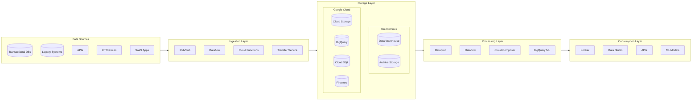
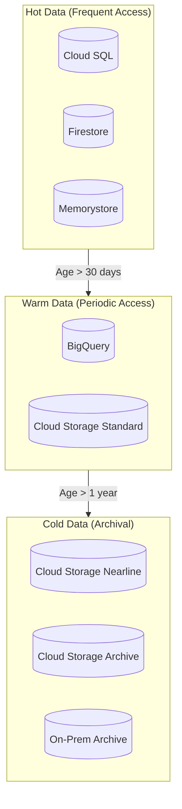
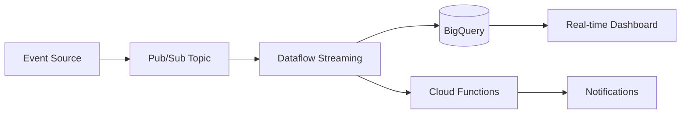
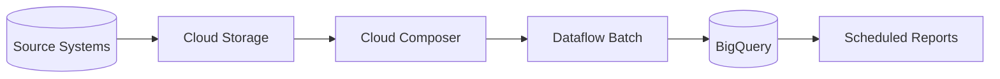
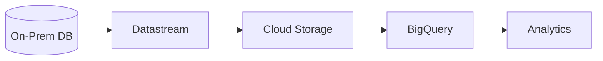
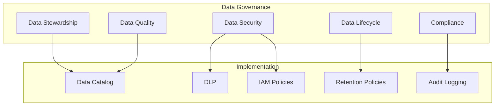
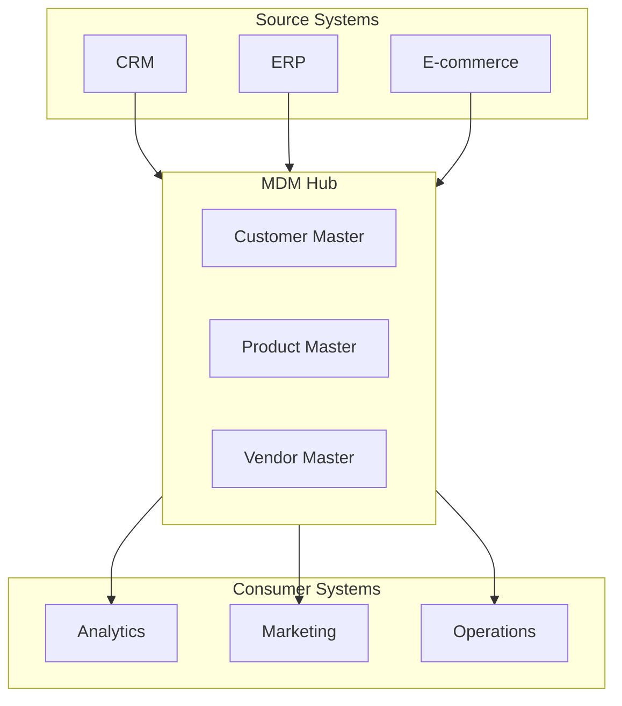

# Data Architecture

## Overview

This document defines the data architecture for the enterprise hybrid cloud environment, covering data sources, storage, processing, and governance.

## Data Architecture Flow

## Data Domains

### Domain Classification

| Domain | Description | Owner | Storage Location |
|--------|-------------|-------|-----------------|
| **Customer** | Customer profiles, preferences, interactions | CRM Team | Cloud SQL, BigQuery |
| **Product** | Product catalog, inventory, pricing | Product Team | Firestore, BigQuery |
| **Transaction** | Orders, payments, invoices | Finance Team | Cloud Spanner, BigQuery |
| **Analytics** | Aggregated metrics, KPIs, reports | Analytics Team | BigQuery |
| **Operational** | Logs, metrics, traces | Platform Team | Cloud Logging, BigQuery |

### Data Classification

| Classification | Description | Storage Requirements | Access Control |
|----------------|-------------|---------------------|----------------|
| **Public** | Publicly available information | Any | Open |
| **Internal** | Internal business information | Encrypted at rest | Role-based |
| **Confidential** | Sensitive business data | Encrypted, audited | Need-to-know |
| **Restricted** | Regulated/PII data | On-prem or VPC-SC | Strict controls |

## Storage Architecture

### Cloud Storage Strategy

### Storage Services Matrix

| Service | Use Case | Performance | Cost |
|---------|----------|-------------|------|
| **Cloud SQL** | Transactional workloads | High | Medium |
| **Cloud Spanner** | Global transactions | Very High | High |
| **BigQuery** | Analytics, Data Warehouse | High | Low-Medium |
| **Cloud Storage** | Object storage, data lake | Medium | Low |
| **Firestore** | Document database | High | Medium |
| **Memorystore** | Caching, sessions | Very High | High |

## Data Flow Patterns

### Real-Time Streaming

### Batch Processing

### Change Data Capture (CDC)

## Data Governance

### Governance Framework

### Data Quality Rules

| Dimension | Description | Implementation |
|-----------|-------------|----------------|
| **Accuracy** | Data correctly represents reality | Validation rules, checksums |
| **Completeness** | All required data is present | Not-null constraints, alerts |
| **Consistency** | Data is consistent across systems | Master data management |
| **Timeliness** | Data is available when needed | SLA monitoring, alerts |
| **Uniqueness** | No unintended duplicates | Deduplication, primary keys |

### Data Catalog

| Attribute | Description |
|-----------|-------------|
| **Dataset Name** | Unique identifier for the dataset |
| **Description** | Business description and purpose |
| **Owner** | Data steward responsible |
| **Classification** | Security classification level |
| **Schema** | Structure and data types |
| **Lineage** | Source systems and transformations |
| **Quality Metrics** | Current quality scores |
| **Access Policy** | Who can access and how |

## Master Data Management

### MDM Architecture

## Compliance & Privacy

### Data Residency

| Data Type | Residency Requirement | Storage Location |
|-----------|----------------------|------------------|
| EU Customer PII | EU only | europe-west1 |
| Financial Data | Country-specific | Regional buckets |
| Analytics Data | No restriction | us-central1 |
| Backup Data | Same as source | Multi-regional |

### Privacy Controls

| Control | Implementation |
|---------|----------------|
| **Data Masking** | DLP API for sensitive fields |
| **Encryption** | CMEK for regulated data |
| **Access Logging** | Cloud Audit Logs |
| **Retention** | Lifecycle policies |
| **Right to Deletion** | Automated workflows |

---

[← Back to Phase C](README.md) | [Next: Application Architecture →](application-architecture.md)
