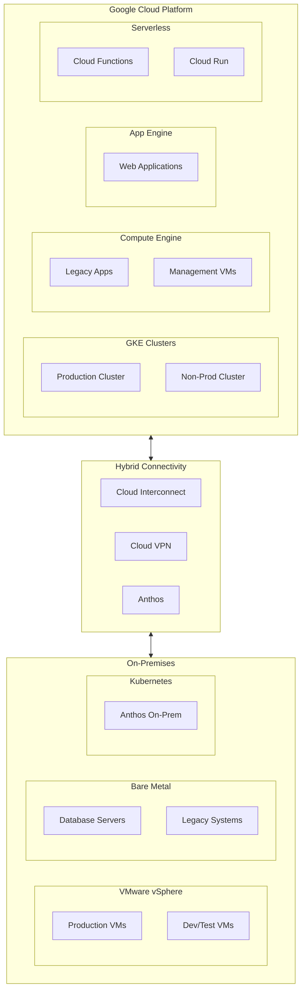
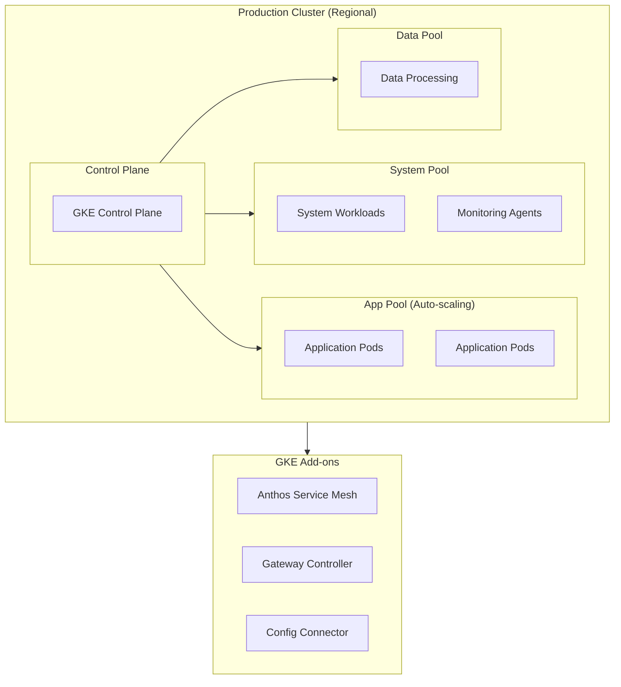
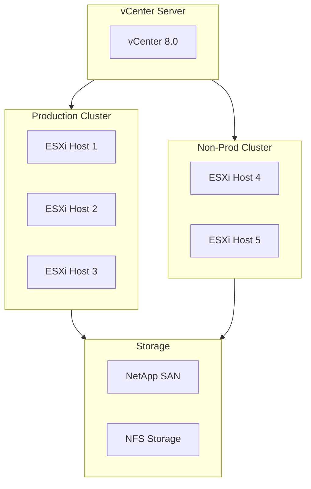
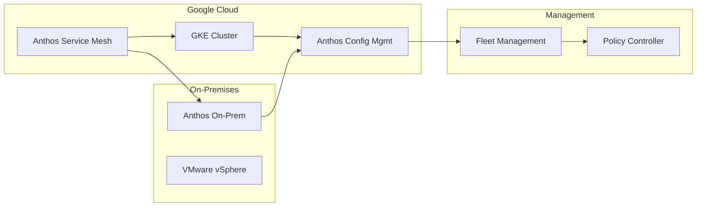
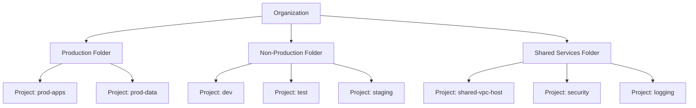
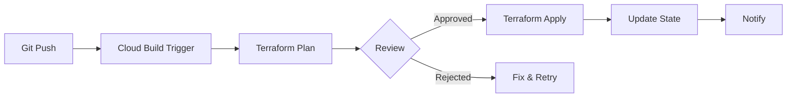

# Infrastructure Architecture

## Overview

This document defines the multi-cloud and on-premises infrastructure architecture for the enterprise hybrid cloud environment.

## Infrastructure Architecture Overview



## GCP Infrastructure

### Compute Services

| Service | Use Case | Configuration | Cost Model |
|---------|----------|---------------|------------|
| **GKE** | Container workloads | Regional clusters, Autopilot | Per node |
| **Compute Engine** | VM workloads | N2/E2 instances, preemptible | Per hour |
| **Cloud Run** | Stateless containers | Auto-scaling, min instances | Per request |
| **App Engine** | Web applications | Standard/Flexible | Per instance hour |
| **Cloud Functions** | Event-driven functions | Gen 2, concurrency | Per invocation |

### GKE Architecture



### GKE Specifications

| Cluster | Environment | Region | Node Pools | Nodes | Machine Type |
|---------|-------------|--------|------------|-------|--------------|
| prod-cluster | Production | us-central1 | 3 | 6-30 | n2-standard-8 |
| nonprod-cluster | Dev/Test | us-central1 | 2 | 2-10 | e2-standard-4 |

### Compute Engine Architecture

| Instance Group | Purpose | Machine Type | Count | Zone Distribution |
|----------------|---------|--------------|-------|-------------------|
| web-servers | Legacy web apps | n2-standard-4 | 4 | Multi-zone |
| management | Bastion, jumpbox | e2-medium | 2 | Single zone |
| database | Legacy databases | n2-highmem-8 | 2 | Multi-zone |

## On-Premises Infrastructure

### VMware Environment



### On-Premises Specifications

| Component | Specification | Purpose |
|-----------|---------------|---------|
| ESXi Hosts | Dell PowerEdge R750, 64 cores, 512GB RAM | Virtualization |
| Storage | NetApp AFF A400, 100TB | Primary storage |
| Backup | NetApp StorageGRID | Backup and archive |
| Network | Cisco Nexus 9000 | Data center switching |

## Hybrid Connectivity

### Anthos Multi-Cloud



### Interconnect Architecture

| Connection | Type | Bandwidth | Redundancy |
|------------|------|-----------|------------|
| Primary | Dedicated Interconnect | 10 Gbps | LACP |
| Secondary | Partner Interconnect | 10 Gbps | Diverse path |
| Backup | Cloud VPN | 3 Gbps | HA VPN |

## Storage Architecture

### Cloud Storage Classes

| Class | Use Case | Availability | Cost |
|-------|----------|--------------|------|
| **Standard** | Frequently accessed | 99.99% | $0.020/GB |
| **Nearline** | Monthly access | 99.9% | $0.010/GB |
| **Coldline** | Quarterly access | 99.9% | $0.004/GB |
| **Archive** | Yearly access | 99.9% | $0.001/GB |

### Persistent Storage

| Type | Use Case | Performance | Redundancy |
|------|----------|-------------|------------|
| **pd-ssd** | Database, high IOPS | 30,000 IOPS | Regional |
| **pd-balanced** | General workloads | 6,000 IOPS | Regional |
| **pd-standard** | Batch, logs | 3,000 IOPS | Zonal |
| **Filestore** | Shared file system | NFS v3 | Regional |

## Resource Management

### Organization Structure



### Quotas and Limits

| Resource | Production | Non-Production | Shared |
|----------|------------|----------------|--------|
| CPUs | 500 | 200 | 50 |
| Memory (GB) | 2,000 | 500 | 100 |
| GPUs | 8 | 2 | 0 |
| IPs | 100 | 50 | 20 |
| Storage (TB) | 100 | 20 | 10 |

## Infrastructure as Code

### Terraform Structure

```
terraform/
├── modules/
│   ├── gke-cluster/
│   ├── vpc-network/
│   ├── compute-instance/
│   └── storage-bucket/
├── environments/
│   ├── production/
│   ├── staging/
│   └── development/
└── shared/
    ├── iam/
    └── networking/
```

### Deployment Pipeline



---

[← Back to Phase D](README.md) | [Next: Network Architecture →](network-architecture.md)
