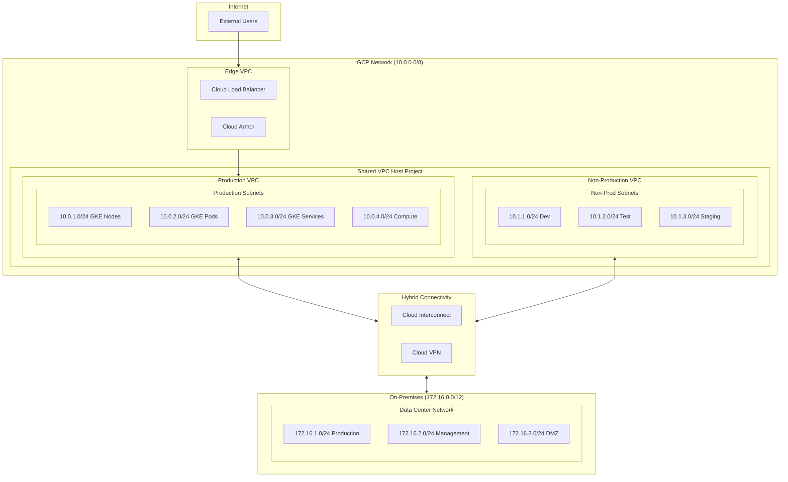
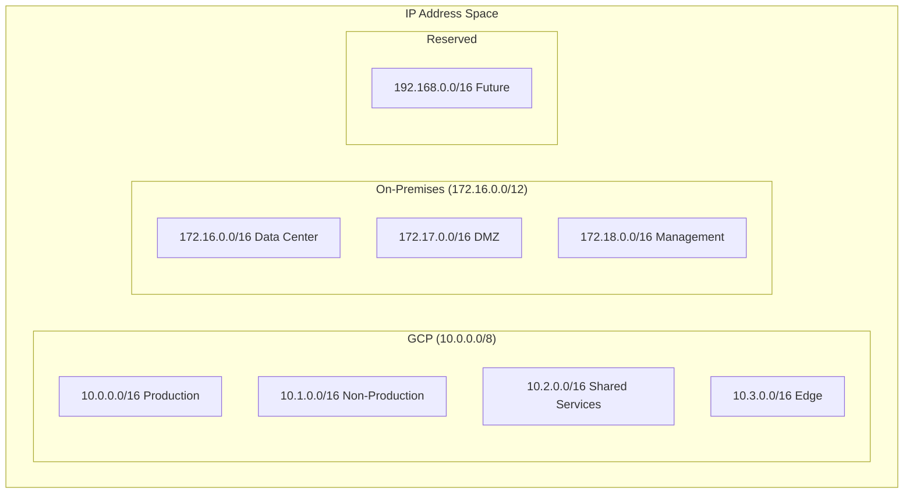
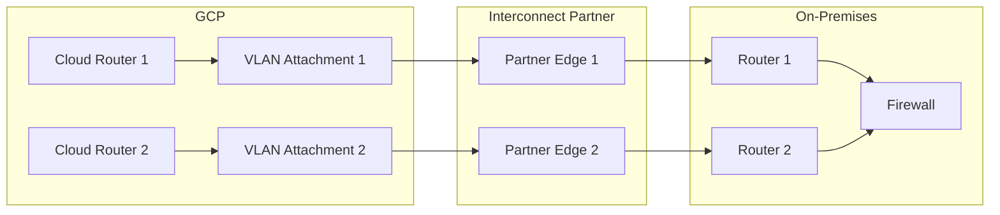
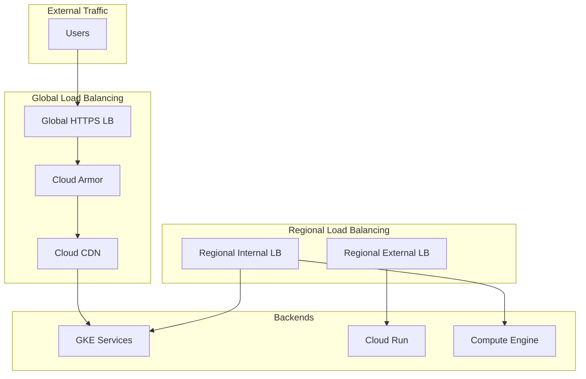
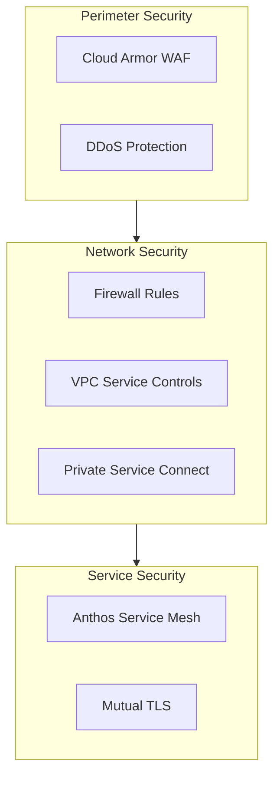
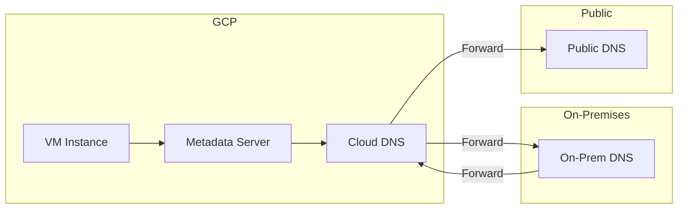
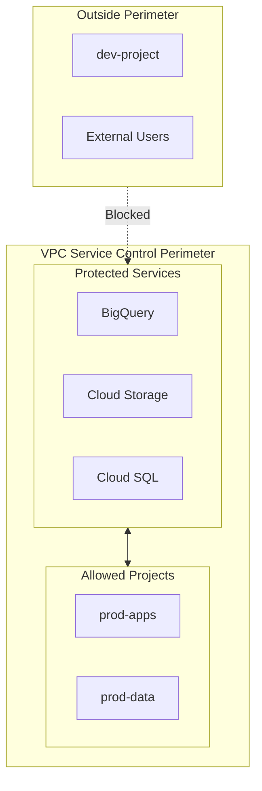

# Network Architecture

## Overview

This document defines the network architecture for the enterprise hybrid cloud environment, including VPC design, connectivity, and traffic management.

## Network Topology

## VPC Architecture

### VPC Design

| VPC | Purpose | CIDR | Region | Peering |
|-----|---------|------|--------|---------|
| **prod-vpc** | Production workloads | 10.0.0.0/16 | us-central1 | Shared VPC |
| **nonprod-vpc** | Dev/Test/Staging | 10.1.0.0/16 | us-central1 | Shared VPC |
| **shared-vpc** | Shared services | 10.2.0.0/16 | us-central1 | Host project |
| **edge-vpc** | External connectivity | 10.3.0.0/16 | Global | - |

### Subnet Design

| Subnet | VPC | CIDR | Purpose | Secondary Ranges |
|--------|-----|------|---------|------------------|
| prod-gke-nodes | prod-vpc | 10.0.1.0/24 | GKE node IPs | - |
| prod-gke-pods | prod-vpc | 10.0.2.0/16 | GKE pod IPs | Secondary |
| prod-gke-svc | prod-vpc | 10.0.3.0/20 | GKE service IPs | Secondary |
| prod-compute | prod-vpc | 10.0.4.0/24 | Compute Engine | - |
| prod-serverless | prod-vpc | 10.0.5.0/24 | Serverless VPC connector | - |

### IP Address Management

## Hybrid Connectivity

### Interconnect Architecture

### Connectivity Options

| Option | Bandwidth | Latency | Use Case | Cost |
|--------|-----------|---------|----------|------|
| **Dedicated Interconnect** | 10-100 Gbps | <5ms | High bandwidth, critical | High |
| **Partner Interconnect** | 50 Mbps - 10 Gbps | <10ms | Medium bandwidth | Medium |
| **Cloud VPN** | Up to 3 Gbps | Variable | Backup, dev/test | Low |
| **Cloud VPN HA** | Up to 3 Gbps | Variable | HA requirements | Low-Medium |

### BGP Configuration

| Peer | ASN | Advertised Routes | Received Routes |
|------|-----|-------------------|-----------------|
| GCP Cloud Router | 16550 | 10.0.0.0/8 | 172.16.0.0/12 |
| On-Prem Router 1 | 65001 | 172.16.0.0/12 | 10.0.0.0/8 |
| On-Prem Router 2 | 65001 | 172.16.0.0/12 | 10.0.0.0/8 |

## Load Balancing

### Load Balancer Architecture

### Load Balancer Types

| Type | Scope | Use Case | Features |
|------|-------|----------|----------|
| **Global HTTPS** | Global | Web applications | SSL, CDN, Armor |
| **Global SSL Proxy** | Global | SSL traffic | SSL offload |
| **Global TCP Proxy** | Global | TCP traffic | Proxy protocol |
| **Regional External** | Regional | Regional apps | Network LB |
| **Regional Internal** | Regional | Internal services | Private IPs |

## Firewall Architecture

### Firewall Rules

| Priority | Name | Direction | Source | Target | Ports | Action |
|----------|------|-----------|--------|--------|-------|--------|
| 1000 | allow-iap | Ingress | 35.235.240.0/20 | All | 22, 3389 | Allow |
| 1100 | allow-health-check | Ingress | Health check ranges | Tagged | 80, 443 | Allow |
| 1200 | allow-internal | Ingress | 10.0.0.0/8 | 10.0.0.0/8 | All | Allow |
| 1300 | allow-onprem | Ingress | 172.16.0.0/12 | 10.0.0.0/8 | Defined | Allow |
| 65534 | deny-all-ingress | Ingress | 0.0.0.0/0 | All | All | Deny |

### Network Security

## DNS Architecture

### Cloud DNS Configuration

| Zone Type | Domain | Purpose |
|-----------|--------|---------|
| **Public** | example.com | Public DNS resolution |
| **Private** | internal.example.com | Internal GCP resolution |
| **Forwarding** | onprem.example.com | On-premises resolution |
| **Peering** | shared.example.com | Cross-project resolution |

### DNS Resolution Flow

## Service Connectivity

### Private Google Access

| Service | Access Method | Endpoint |
|---------|---------------|----------|
| Cloud Storage | Private Google Access | storage.googleapis.com |
| BigQuery | Private Google Access | bigquery.googleapis.com |
| Cloud SQL | Private IP | Private service connection |
| GKE | Private cluster | Private endpoint |

### VPC Service Controls

---

[← Back to Infrastructure](infrastructure.md) | [Next: Security Architecture →](security-architecture.md)
