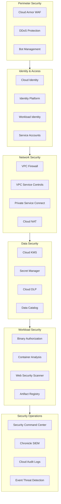
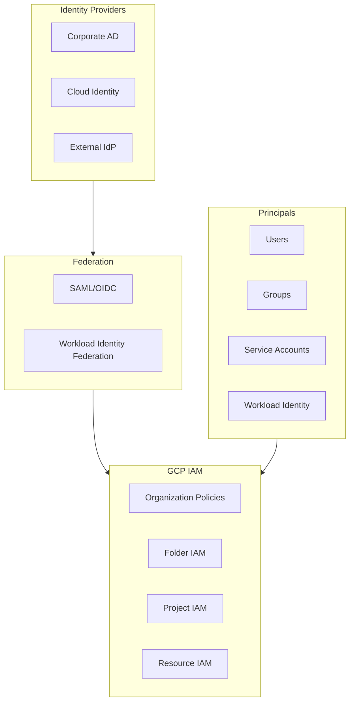
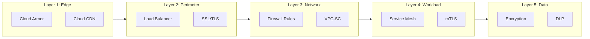
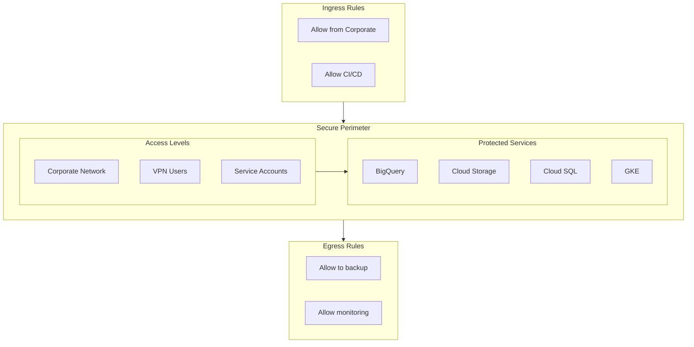
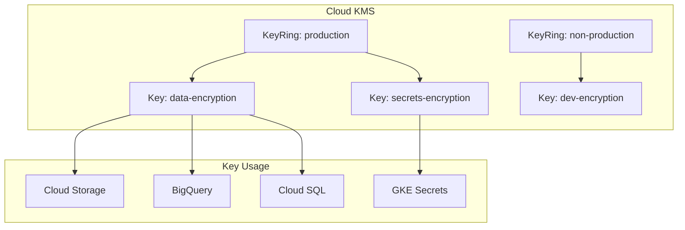
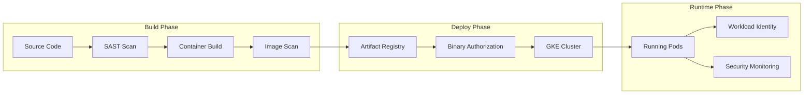
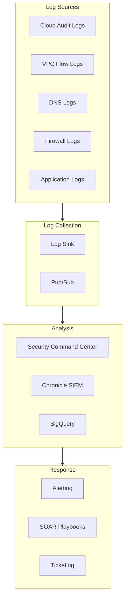
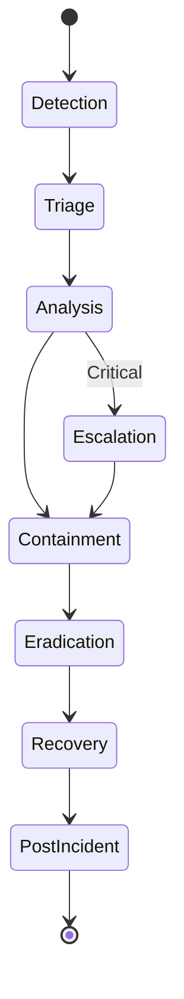

# Security Architecture

## Overview

This document defines the security architecture for the enterprise hybrid cloud environment, covering identity management, network security, data protection, and security operations.

## Security Architecture Layers

## Identity and Access Management

### IAM Architecture

### Role Definitions

| Role | Scope | Permissions | Use Case |
|------|-------|-------------|----------|
| **Organization Admin** | Organization | Full admin | Platform team |
| **Folder Admin** | Folder | Folder management | Environment owners |
| **Project Owner** | Project | Full project access | Project leads |
| **GKE Admin** | Project | GKE cluster admin | Platform team |
| **Developer** | Project | Deploy, view logs | Dev teams |
| **Viewer** | Project | Read-only | Stakeholders |

### Service Account Strategy

| Service Account | Purpose | Key Rotation | Access |
|-----------------|---------|--------------|--------|
| terraform-sa | Infrastructure provisioning | 90 days | Org-level |
| gke-nodes-sa | GKE node identity | N/A (Workload Identity) | Project-level |
| app-sa | Application identity | N/A (Workload Identity) | Resource-level |
| cicd-sa | CI/CD pipeline | 30 days | Project-level |

## Network Security

### Defense in Depth

### Cloud Armor Policies

| Policy | Type | Action | Use Case |
|--------|------|--------|----------|
| rate-limit | Rate limiting | Throttle | DDoS protection |
| geo-block | Geographic | Block | Geo-restriction |
| owasp-crs | WAF | Block/Log | OWASP Top 10 |
| bot-protection | Bot mgmt | Challenge | Bot mitigation |
| custom-rules | L7 | Custom | Application-specific |

### VPC Service Controls

## Data Security

### Encryption Architecture

| Layer | Method | Key Management |
|-------|--------|----------------|
| **At Rest** | AES-256 | CMEK or Google-managed |
| **In Transit** | TLS 1.3 | Managed certificates |
| **In Use** | Confidential Computing | AMD SEV |

### Key Management

### Data Classification

| Classification | Examples | Encryption | Access Control | Retention |
|----------------|----------|------------|----------------|-----------|
| **Public** | Marketing content | Google-managed | Open | Indefinite |
| **Internal** | Business docs | Google-managed | Authenticated | 7 years |
| **Confidential** | Financial data | CMEK | Need-to-know | 7 years |
| **Restricted** | PII, PHI | CMEK + VPC-SC | Strict controls | As required |

## Workload Security

### Container Security

### Binary Authorization

| Attestor | Description | Required |
|----------|-------------|----------|
| vulnerability-scan | No critical CVEs | Yes |
| code-review | PR approved | Yes |
| qa-approval | QA sign-off | Production only |
| security-approval | Security review | Critical systems |

## Security Operations

### Security Monitoring

### Security Command Center

| Finding Type | Severity | Action |
|--------------|----------|--------|
| Public IP exposure | High | Auto-remediate |
| Unencrypted storage | High | Alert + remediate |
| IAM anomaly | Medium | Alert + investigate |
| Vulnerability | Variable | Prioritized patching |
| Compliance violation | Variable | Alert + document |

### Incident Response

## Compliance

### Compliance Frameworks

| Framework | Scope | Status | Review Cycle |
|-----------|-------|--------|--------------|
| SOC 2 Type II | All systems | Compliant | Annual |
| ISO 27001 | All systems | Compliant | Annual |
| GDPR | EU data | Compliant | Ongoing |
| PCI DSS | Payment systems | Level 1 | Quarterly |
| HIPAA | Healthcare data | Compliant | Annual |

### Audit Controls

| Control Area | Implementation | Evidence |
|--------------|----------------|----------|
| Access Control | IAM, VPC-SC | Access logs, IAM policies |
| Encryption | CMEK, TLS | KMS logs, certificates |
| Monitoring | SCC, Chronicle | SIEM dashboards, alerts |
| Change Management | CAB, GitOps | Change tickets, git history |
| Backup | Scheduled snapshots | Backup logs, test restores |

---

[← Back to Network Architecture](network-architecture.md) | [Back to Phase D](README.md)
