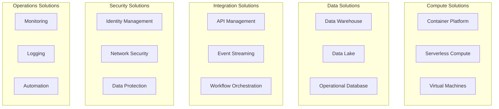

# Phase E: Opportunities & Solutions

## Overview

Phase E identifies the opportunities for transformation and defines solutions that address the architecture gaps identified in earlier phases. This phase produces the transformation roadmap and migration strategy.

## Objectives

- Identify transformation opportunities
- Define solution building blocks
- Create the transformation roadmap
- Define migration strategies for workloads

## Documents in This Phase

| Document | Description |
|----------|-------------|
| [Roadmap](roadmap.md) | Transformation roadmap and timeline |
| [Migration Strategy](migration-strategy.md) | 6Rs migration approach |

## Key Deliverables

1. **Solution Building Blocks** - Reusable architecture components
2. **Transformation Roadmap** - Phased implementation plan
3. **Migration Strategy** - Approach for each workload type
4. **Business Value Assessment** - ROI and benefits analysis

## Solution Categories

| Category | Description | Examples |
|----------|-------------|----------|
| **Compute** | Processing solutions | GKE, Cloud Run, Compute Engine |
| **Data** | Data management solutions | BigQuery, Cloud SQL, Dataflow |
| **Integration** | Connectivity solutions | Pub/Sub, Apigee, Cloud Functions |
| **Security** | Protection solutions | IAM, VPC-SC, Cloud Armor |
| **Operations** | Management solutions | Cloud Monitoring, Cloud Logging |

## Solution Building Blocks

## Related Phases

- **Previous**: [Phase D - Technology Architecture](../phase-d-technology-architecture/README.md)
- **Next**: [Phase F - Migration Planning](../phase-f-migration-planning/README.md)

---

[← Back to Main Documentation](../../README.md)
