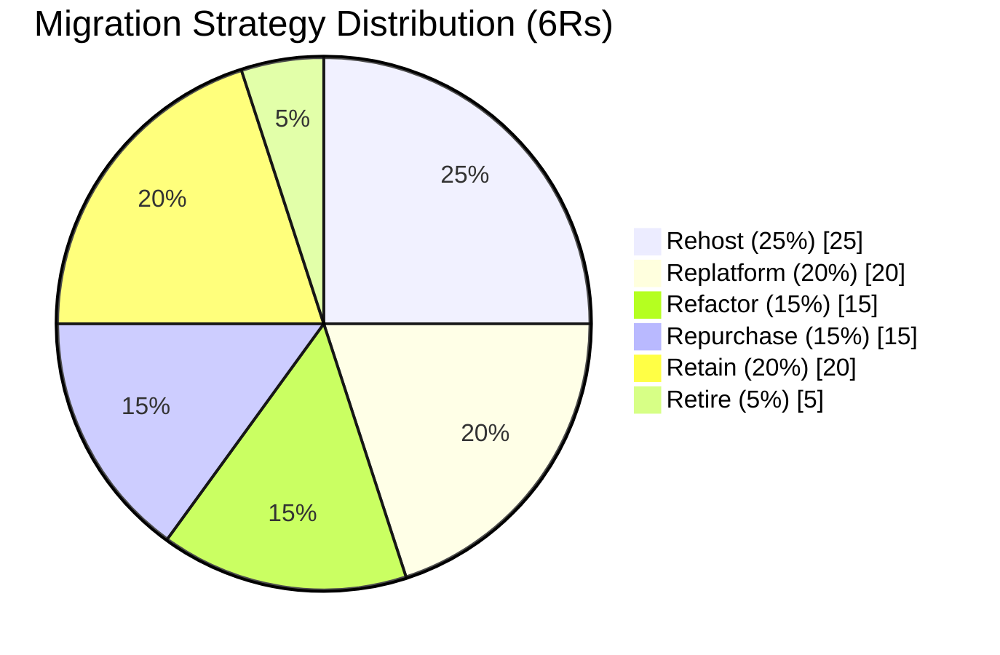
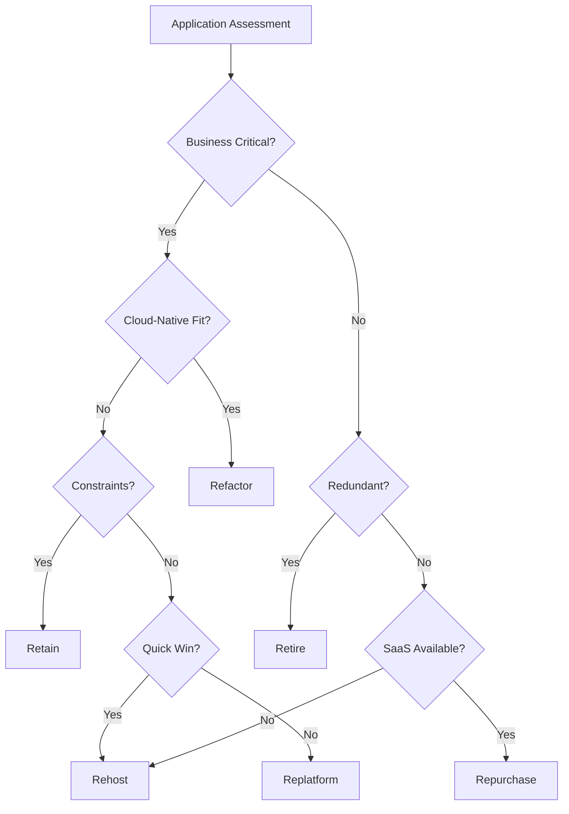
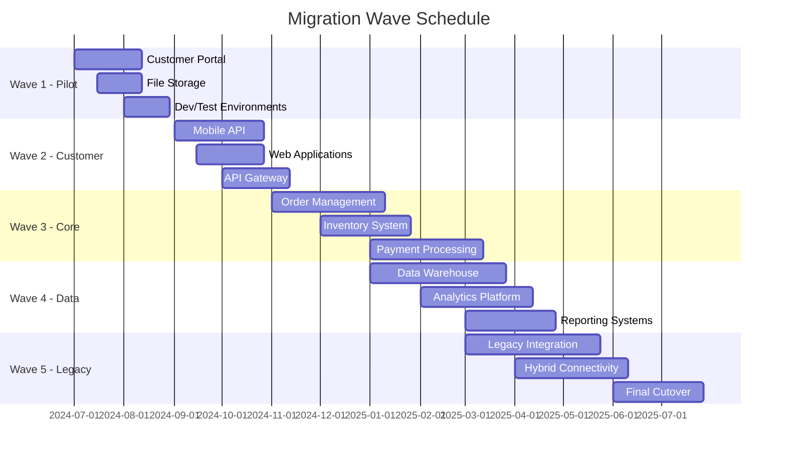
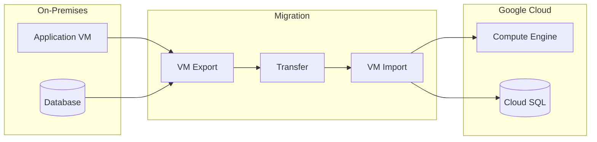
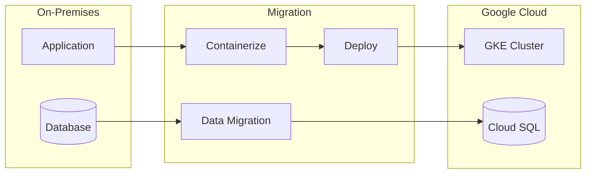
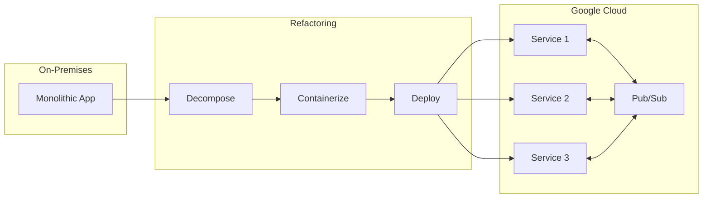
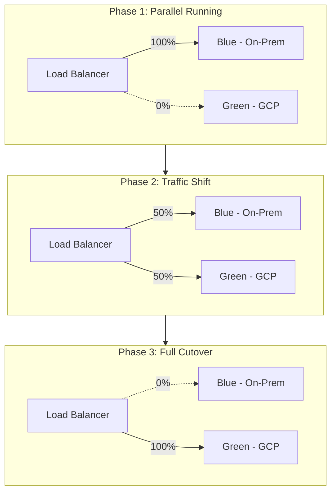

# Migration Strategy

## Overview

This document defines the migration strategy using the 6Rs framework for moving workloads to the hybrid cloud environment.

## 6Rs Migration Distribution

## 6Rs Framework

### Strategy Definitions

| Strategy | Description | Effort | Risk | Best For |
|----------|-------------|--------|------|----------|
| **Rehost** | Lift-and-shift to cloud VMs | Low | Low | Quick wins, stable apps |
| **Replatform** | Lift-and-shift with minor optimization | Medium | Low | Database, middleware |
| **Refactor** | Re-architect for cloud-native | High | Medium | Strategic applications |
| **Repurchase** | Replace with SaaS/COTS | Variable | Low | Commodity functionality |
| **Retain** | Keep on-premises | None | None | Compliance, constraints |
| **Retire** | Decommission | Low | Low | Redundant systems |

### Strategy Selection Matrix

## Workload Assessment

### Assessment Criteria

| Criterion | Weight | Assessment Method |
|-----------|--------|-------------------|
| Business Value | 25% | Business stakeholder input |
| Technical Complexity | 20% | Architecture review |
| Dependencies | 15% | Dependency mapping |
| Security Requirements | 15% | Security assessment |
| Compliance | 15% | Compliance review |
| Cost to Migrate | 10% | Estimation |

### Application Portfolio Mapping

| Application | Current State | Strategy | Target Platform | Priority |
|-------------|--------------|----------|-----------------|----------|
| Customer Portal | On-Prem VMs | Replatform | GKE | High |
| Mobile API | Monolith | Refactor | Cloud Run | High |
| Data Warehouse | On-Prem DB | Replatform | BigQuery | High |
| CRM System | On-Prem | Repurchase | Salesforce | Medium |
| ERP System | On-Prem | Retain | On-Premises | - |
| Legacy Reporting | On-Prem | Retire | - | Low |
| File Server | On-Prem | Rehost | Cloud Storage | Medium |
| Email Gateway | On-Prem | Repurchase | Google Workspace | Medium |

## Migration Waves

### Wave Planning

### Wave Details

#### Wave 1: Pilot (Q3 2024)

**Objective:** Validate migration approach with low-risk applications.

| Application | Strategy | Duration | Success Criteria |
|-------------|----------|----------|------------------|
| Customer Portal | Replatform | 6 weeks | Zero downtime cutover |
| File Storage | Rehost | 4 weeks | Data integrity verified |
| Dev/Test Environments | Rehost | 4 weeks | All tests passing |

#### Wave 2: Customer-Facing (Q3-Q4 2024)

**Objective:** Migrate customer-facing applications for improved experience.

| Application | Strategy | Duration | Success Criteria |
|-------------|----------|----------|------------------|
| Mobile API | Refactor | 8 weeks | Performance improved |
| Web Applications | Replatform | 6 weeks | Feature parity |
| API Gateway | Replatform | 6 weeks | All APIs migrated |

#### Wave 3: Core Systems (Q4 2024 - Q1 2025)

**Objective:** Migrate core business systems.

| Application | Strategy | Duration | Success Criteria |
|-------------|----------|----------|------------------|
| Order Management | Replatform | 10 weeks | Transaction integrity |
| Inventory System | Replatform | 8 weeks | Real-time sync |
| Payment Processing | Replatform | 10 weeks | PCI compliance |

#### Wave 4: Data Platform (Q1-Q2 2025)

**Objective:** Migrate data and analytics workloads.

| Application | Strategy | Duration | Success Criteria |
|-------------|----------|----------|------------------|
| Data Warehouse | Replatform | 12 weeks | Query performance |
| Analytics Platform | Replatform | 10 weeks | Dashboard parity |
| Reporting Systems | Replatform | 8 weeks | Report accuracy |

#### Wave 5: Legacy Integration (Q1-Q3 2025)

**Objective:** Establish long-term hybrid architecture.

| Application | Strategy | Duration | Success Criteria |
|-------------|----------|----------|------------------|
| Legacy Integration | Retain/Hybrid | 12 weeks | Stable connectivity |
| Hybrid Connectivity | Infrastructure | 10 weeks | Redundant links |
| Final Cutover | Transition | 8 weeks | Production stable |

## Migration Patterns

### Rehost Pattern

### Replatform Pattern

### Refactor Pattern

## Cutover Strategy

### Blue-Green Deployment

### Rollback Plan

| Stage | Trigger | Action | RTO |
|-------|---------|--------|-----|
| Pre-cutover | Any blocker | Cancel migration | Immediate |
| During cutover | Critical errors | Revert traffic | < 15 min |
| Post-cutover (< 24h) | Performance issues | Failback to on-prem | < 1 hour |
| Post-cutover (> 24h) | Major issues | Emergency restore | < 4 hours |

## Migration Tools

| Tool | Purpose | Use Case |
|------|---------|----------|
| **Migrate for Compute Engine** | VM migration | Rehost workloads |
| **Database Migration Service** | Database migration | Replatform databases |
| **Transfer Service** | Data transfer | Large data sets |
| **Anthos** | Hybrid management | Unified management |
| **Container Registry** | Image storage | Container migration |

---

[← Back to Roadmap](roadmap.md) | [Back to Phase E](README.md)
