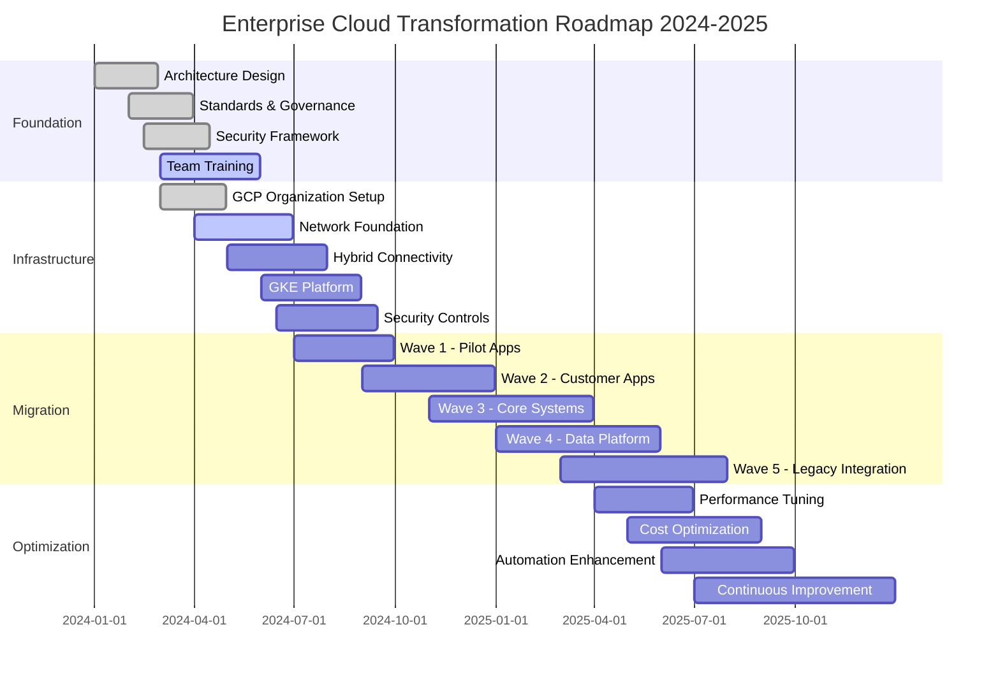
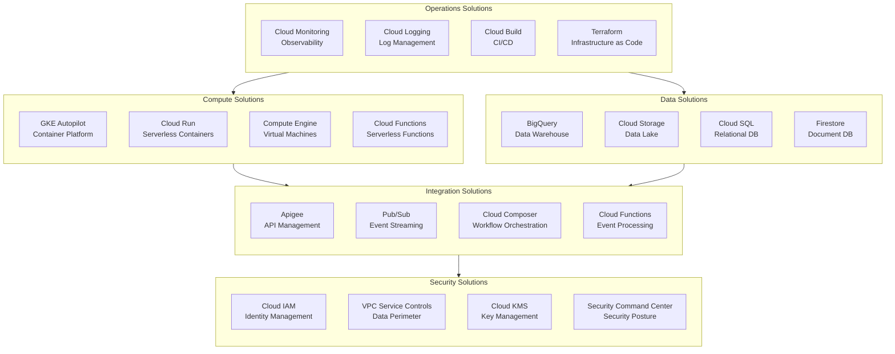

# Transformation Roadmap

## Overview

This document presents the transformation roadmap for the enterprise hybrid cloud initiative, spanning 2024-2025 with distinct phases for foundation, infrastructure, migration, and optimization.

## Solution Roadmap Timeline

## Phase Details

### Phase 1: Foundation (Q1 2024)

**Objective:** Establish the architectural foundation and governance framework.

| Milestone | Duration | Deliverables |
|-----------|----------|--------------|
| Architecture Design | 8 weeks | Target architecture, standards |
| Standards & Governance | 8 weeks | Policies, procedures, templates |
| Security Framework | 8 weeks | Security architecture, controls |
| Team Training | 12 weeks | Trained personnel, certifications |

**Key Activities:**
- Define target architecture patterns
- Establish governance processes
- Create security baseline
- Train teams on GCP technologies

### Phase 2: Infrastructure (Q2-Q3 2024)

**Objective:** Build the foundational infrastructure for workload hosting.

| Milestone | Duration | Deliverables |
|-----------|----------|--------------|
| GCP Organization Setup | 8 weeks | Organization hierarchy, IAM |
| Network Foundation | 12 weeks | VPCs, subnets, firewall rules |
| Hybrid Connectivity | 12 weeks | Interconnect, VPN, DNS |
| GKE Platform | 12 weeks | Production clusters, service mesh |
| Security Controls | 12 weeks | VPC-SC, Cloud Armor, SCC |

**Key Activities:**
- Set up GCP organization and projects
- Implement network architecture
- Establish hybrid connectivity
- Deploy GKE clusters
- Implement security controls

### Phase 3: Migration (Q3 2024 - Q2 2025)

**Objective:** Migrate workloads according to the migration strategy.

| Wave | Scope | Strategy | Duration |
|------|-------|----------|----------|
| Wave 1 | Pilot applications | Rehost/Replatform | 12 weeks |
| Wave 2 | Customer-facing apps | Replatform/Refactor | 16 weeks |
| Wave 3 | Core business systems | Replatform | 20 weeks |
| Wave 4 | Data platform | Replatform | 20 weeks |
| Wave 5 | Legacy integration | Hybrid | 20 weeks |

### Phase 4: Optimization (Q2-Q4 2025)

**Objective:** Optimize the platform for performance, cost, and operations.

| Milestone | Duration | Deliverables |
|-----------|----------|--------------|
| Performance Tuning | 12 weeks | Optimized configurations |
| Cost Optimization | 16 weeks | FinOps practices, savings |
| Automation Enhancement | 16 weeks | Enhanced CI/CD, IaC |
| Continuous Improvement | 24 weeks | Operational excellence |

## Solution Building Blocks

## Investment Summary

### Budget Allocation

| Phase | Budget | Percentage |
|-------|--------|------------|
| Foundation | $1.5M | 15% |
| Infrastructure | $3.0M | 30% |
| Migration | $4.0M | 40% |
| Optimization | $1.5M | 15% |
| **Total** | **$10.0M** | **100%** |

### Resource Requirements

| Role | Foundation | Infrastructure | Migration | Optimization |
|------|------------|----------------|-----------|--------------|
| Cloud Architects | 2 | 3 | 3 | 2 |
| Platform Engineers | 1 | 4 | 4 | 3 |
| Security Engineers | 1 | 2 | 2 | 1 |
| DevOps Engineers | 1 | 3 | 5 | 3 |
| Project Managers | 1 | 2 | 2 | 1 |

## Success Criteria

### Phase Exit Criteria

| Phase | Criteria |
|-------|----------|
| **Foundation** | Architecture approved, governance in place, teams trained |
| **Infrastructure** | All environments operational, connectivity established |
| **Migration** | All wave applications migrated and validated |
| **Optimization** | Performance SLAs met, costs within budget |

### Key Performance Indicators

| KPI | Baseline | Target | Measurement |
|-----|----------|--------|-------------|
| Migration Progress | 0% | 100% | Applications migrated |
| System Availability | 99.5% | 99.9% | Uptime monitoring |
| Deployment Frequency | Monthly | Daily | Deployment count |
| Mean Time to Recovery | 4 hours | 1 hour | Incident metrics |
| Cost per Transaction | $0.10 | $0.06 | Cost analysis |

## Risk Management

| Risk | Probability | Impact | Mitigation |
|------|-------------|--------|------------|
| Skills gap | High | High | Training, partner support |
| Schedule slippage | Medium | High | Agile approach, buffer time |
| Budget overrun | Medium | Medium | Phased funding, controls |
| Technical blockers | Medium | Medium | POCs, architectural spikes |
| Business disruption | Low | High | Blue-green deployments |

---

[← Back to Phase E](README.md) | [Next: Migration Strategy →](migration-strategy.md)
