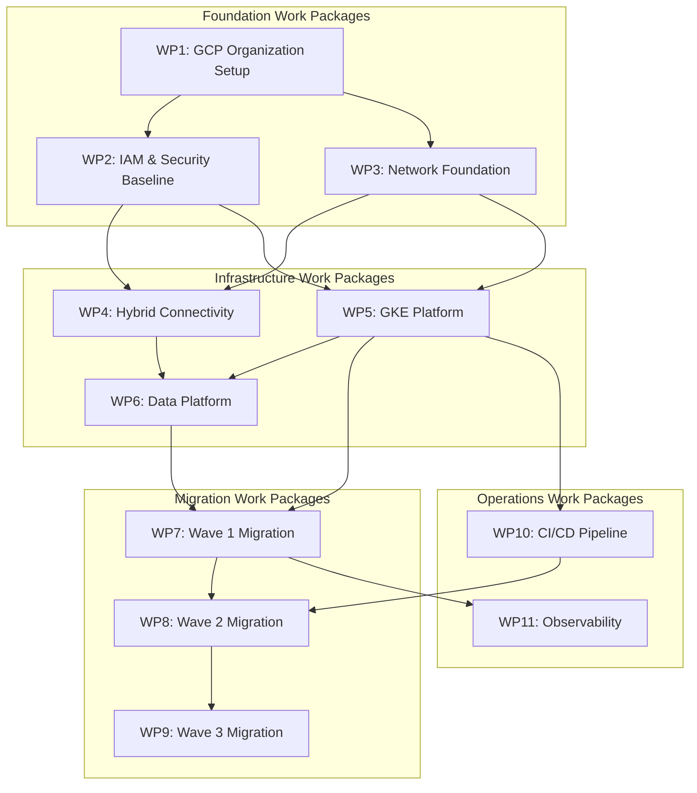
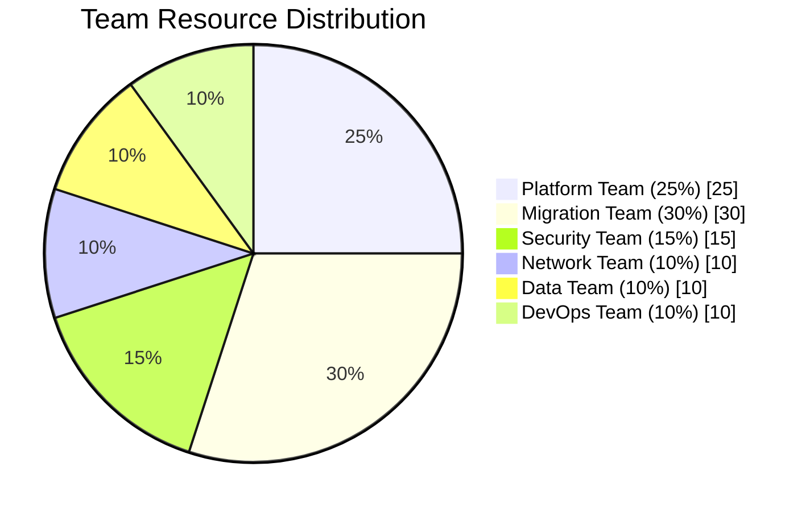

# Work Packages

## Overview

This document defines the work packages for the migration program, including dependencies, resource allocation, and scheduling.

## Work Package Dependencies

## Work Package Definitions

### WP1: GCP Organization Setup

| Attribute | Value |
|-----------|-------|
| **ID** | WP1 |
| **Name** | GCP Organization Setup |
| **Duration** | 4 weeks |
| **Dependencies** | None |
| **Owner** | Platform Team |

**Scope:**
- Create GCP organization
- Set up folder hierarchy
- Create initial projects
- Configure billing accounts
- Establish naming conventions

**Deliverables:**
- [ ] GCP organization created
- [ ] Folder structure implemented
- [ ] Projects created (prod, nonprod, shared)
- [ ] Billing alerts configured
- [ ] Organization policies applied

### WP2: IAM & Security Baseline

| Attribute | Value |
|-----------|-------|
| **ID** | WP2 |
| **Name** | IAM & Security Baseline |
| **Duration** | 4 weeks |
| **Dependencies** | WP1 |
| **Owner** | Security Team |

**Scope:**
- Configure Cloud Identity sync
- Implement IAM policies
- Set up security controls
- Configure audit logging
- Implement VPC Service Controls

**Deliverables:**
- [ ] Cloud Identity configured
- [ ] IAM roles and policies defined
- [ ] Service accounts created
- [ ] Security Command Center enabled
- [ ] Audit logging configured

### WP3: Network Foundation

| Attribute | Value |
|-----------|-------|
| **ID** | WP3 |
| **Name** | Network Foundation |
| **Duration** | 6 weeks |
| **Dependencies** | WP1 |
| **Owner** | Network Team |

**Scope:**
- Create Shared VPC
- Configure subnets
- Implement firewall rules
- Set up Cloud NAT
- Configure Cloud DNS

**Deliverables:**
- [ ] Shared VPC host project configured
- [ ] VPCs and subnets created
- [ ] Firewall rules implemented
- [ ] Cloud NAT configured
- [ ] DNS zones created

### WP4: Hybrid Connectivity

| Attribute | Value |
|-----------|-------|
| **ID** | WP4 |
| **Name** | Hybrid Connectivity |
| **Duration** | 8 weeks |
| **Dependencies** | WP2, WP3 |
| **Owner** | Network Team |

**Scope:**
- Provision Cloud Interconnect
- Configure HA VPN backup
- Set up Cloud Router
- Implement BGP peering
- Test connectivity

**Deliverables:**
- [ ] Dedicated Interconnect provisioned
- [ ] HA VPN configured
- [ ] BGP sessions established
- [ ] Routing validated
- [ ] Connectivity tested

### WP5: GKE Platform

| Attribute | Value |
|-----------|-------|
| **ID** | WP5 |
| **Name** | GKE Platform |
| **Duration** | 8 weeks |
| **Dependencies** | WP2, WP3 |
| **Owner** | Platform Team |

**Scope:**
- Deploy GKE clusters
- Configure Anthos Service Mesh
- Implement network policies
- Set up autoscaling
- Configure Binary Authorization

**Deliverables:**
- [ ] Production GKE cluster deployed
- [ ] Non-production cluster deployed
- [ ] Service mesh configured
- [ ] Network policies implemented
- [ ] Binary Authorization enabled

### WP6: Data Platform

| Attribute | Value |
|-----------|-------|
| **ID** | WP6 |
| **Name** | Data Platform |
| **Duration** | 10 weeks |
| **Dependencies** | WP4, WP5 |
| **Owner** | Data Team |

**Scope:**
- Set up BigQuery datasets
- Configure Cloud SQL instances
- Implement data pipelines
- Configure data governance
- Set up analytics tools

**Deliverables:**
- [ ] BigQuery datasets created
- [ ] Cloud SQL instances deployed
- [ ] Dataflow pipelines configured
- [ ] Data catalog populated
- [ ] Looker dashboards created

### WP7: Wave 1 Migration

| Attribute | Value |
|-----------|-------|
| **ID** | WP7 |
| **Name** | Wave 1 Migration |
| **Duration** | 12 weeks |
| **Dependencies** | WP5, WP6 |
| **Owner** | Migration Team |

**Scope:**
- Migrate pilot applications
- Validate migration approach
- Document lessons learned
- Refine migration runbooks
- Prepare for Wave 2

**Deliverables:**
- [ ] Customer Portal migrated
- [ ] File storage migrated
- [ ] Dev/Test environments migrated
- [ ] Migration runbooks updated
- [ ] Lessons learned documented

### WP8: Wave 2 Migration

| Attribute | Value |
|-----------|-------|
| **ID** | WP8 |
| **Name** | Wave 2 Migration |
| **Duration** | 16 weeks |
| **Dependencies** | WP7, WP10 |
| **Owner** | Migration Team |

**Scope:**
- Migrate customer-facing applications
- Implement API gateway
- Configure auto-scaling
- Optimize performance
- Conduct load testing

**Deliverables:**
- [ ] Mobile API migrated
- [ ] Web applications migrated
- [ ] API Gateway configured
- [ ] Performance validated
- [ ] Load tests passed

### WP9: Wave 3 Migration

| Attribute | Value |
|-----------|-------|
| **ID** | WP9 |
| **Name** | Wave 3 Migration |
| **Duration** | 20 weeks |
| **Dependencies** | WP8 |
| **Owner** | Migration Team |

**Scope:**
- Migrate core business systems
- Implement data synchronization
- Configure disaster recovery
- Validate business processes
- Execute final cutover

**Deliverables:**
- [ ] Order management migrated
- [ ] Inventory system migrated
- [ ] Payment processing migrated
- [ ] DR tested and validated
- [ ] Business validation complete

### WP10: CI/CD Pipeline

| Attribute | Value |
|-----------|-------|
| **ID** | WP10 |
| **Name** | CI/CD Pipeline |
| **Duration** | 6 weeks |
| **Dependencies** | WP5 |
| **Owner** | DevOps Team |

**Scope:**
- Implement Cloud Build pipelines
- Configure Artifact Registry
- Set up deployment automation
- Implement GitOps workflow
- Configure environments

**Deliverables:**
- [ ] Cloud Build pipelines created
- [ ] Artifact Registry configured
- [ ] Deployment automation implemented
- [ ] GitOps workflow established
- [ ] Environments configured

### WP11: Observability

| Attribute | Value |
|-----------|-------|
| **ID** | WP11 |
| **Name** | Observability |
| **Duration** | 6 weeks |
| **Dependencies** | WP7 |
| **Owner** | Operations Team |

**Scope:**
- Configure Cloud Monitoring
- Set up Cloud Logging
- Implement alerting
- Create dashboards
- Document runbooks

**Deliverables:**
- [ ] Monitoring configured
- [ ] Logging aggregated
- [ ] Alerts defined
- [ ] Dashboards created
- [ ] Runbooks documented

## Resource Allocation

### Team Assignments

| Team | Work Packages | FTE |
|------|---------------|-----|
| Platform Team | WP1, WP5 | 4 |
| Security Team | WP2 | 2 |
| Network Team | WP3, WP4 | 2 |
| Data Team | WP6 | 2 |
| Migration Team | WP7, WP8, WP9 | 5 |
| DevOps Team | WP10, WP11 | 2 |

### Resource Calendar

| Work Package | Q1 2024 | Q2 2024 | Q3 2024 | Q4 2024 | Q1 2025 |
|--------------|---------|---------|---------|---------|---------|
| WP1 | ████ | | | | |
| WP2 | ██████ | | | | |
| WP3 | ████████ | ████ | | | |
| WP4 | | ████████ | ████ | | |
| WP5 | | ██████ | ████ | | |
| WP6 | | | ████████ | ████ | |
| WP7 | | | ████████ | ████ | |
| WP8 | | | | ████████ | ████ |
| WP9 | | | | ████████ | ████████ |
| WP10 | | | ████████ | | |
| WP11 | | | | ████████ | |

## Dependency Matrix

| WP | WP1 | WP2 | WP3 | WP4 | WP5 | WP6 | WP7 | WP8 | WP9 | WP10 | WP11 |
|----|-----|-----|-----|-----|-----|-----|-----|-----|-----|------|------|
| WP1 | - | | | | | | | | | | |
| WP2 | ✓ | - | | | | | | | | | |
| WP3 | ✓ | | - | | | | | | | | |
| WP4 | | ✓ | ✓ | - | | | | | | | |
| WP5 | | ✓ | ✓ | | - | | | | | | |
| WP6 | | | | ✓ | ✓ | - | | | | | |
| WP7 | | | | | ✓ | ✓ | - | | | | |
| WP8 | | | | | | | ✓ | - | | ✓ | |
| WP9 | | | | | | | | ✓ | - | | |
| WP10 | | | | | ✓ | | | | | - | |
| WP11 | | | | | | | ✓ | | | | - |

---

[← Back to Phase F](README.md)
