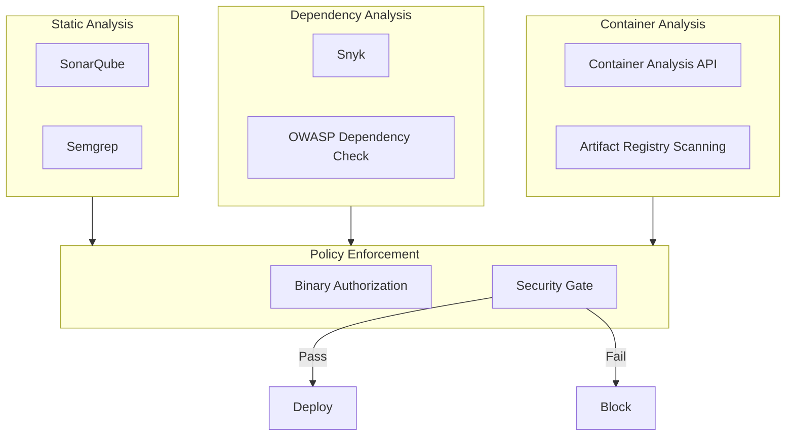
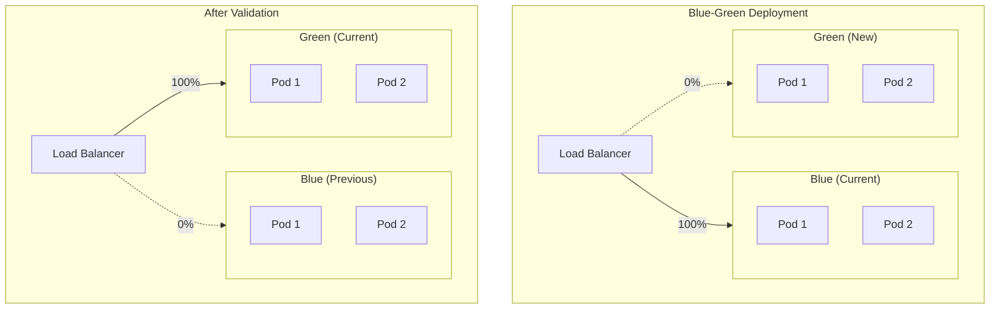
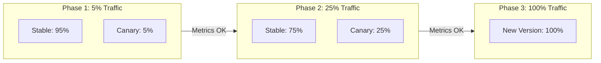
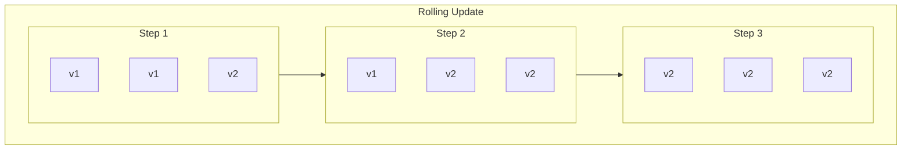
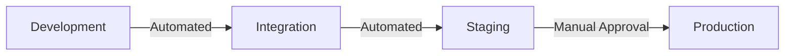
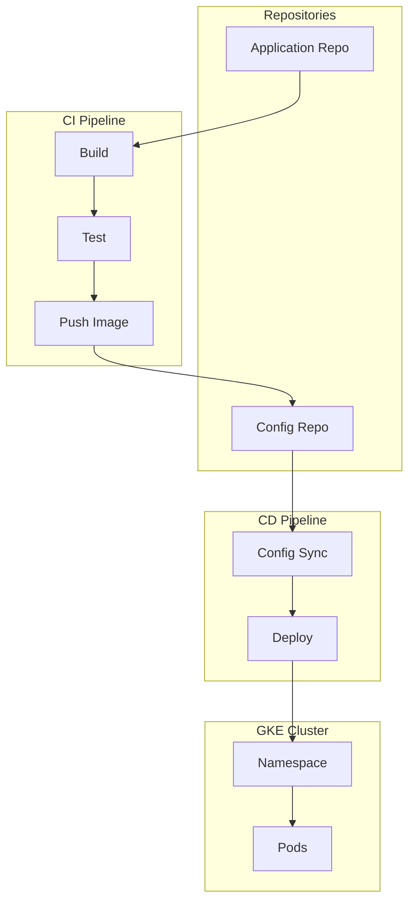
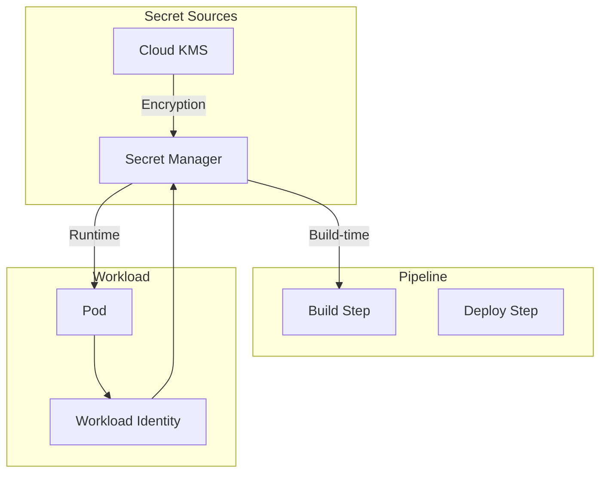

# CI/CD Pipeline Architecture

## Overview

This document defines the CI/CD pipeline architecture for the enterprise hybrid cloud environment, including build, test, security scanning, and deployment processes.

## CI/CD Pipeline Architecture

```mermaid
flowchart LR
    subgraph Development["Development"]
        DEV[Developer]
        IDE[IDE/Local]
        GIT[Git Repository]
    end
    
    subgraph Build["Build & Test"]
        TRIGGER[Cloud Build Trigger]
        BUILD[Build Container]
        UNIT[Unit Tests]
        LINT[Linting]
    end
    
    subgraph Security["Security Scans"]
        SAST[SAST Scan]
        SCA[Dependency Scan]
        IMG[Container Scan]
        SEC_GATE[Security Gate]
    end
    
    subgraph Staging["Staging"]
        STG_DEPLOY[Deploy to Staging]
        INT_TEST[Integration Tests]
        PERF[Performance Tests]
    end
    
    subgraph Approval["Approval"]
        APPROVE{Manual Approval}
    end
    
    subgraph Production["Production"]
        PROD_DEPLOY[Deploy to Production]
        SMOKE[Smoke Tests]
        MONITOR[Monitoring]
    end
    
    DEV --> IDE
    IDE --> GIT
    GIT --> TRIGGER
    TRIGGER --> BUILD
    BUILD --> UNIT
    UNIT --> LINT
    LINT --> SAST
    SAST --> SCA
    SCA --> IMG
    IMG --> SEC_GATE
    SEC_GATE --> STG_DEPLOY
    STG_DEPLOY --> INT_TEST
    INT_TEST --> PERF
    PERF --> APPROVE
    APPROVE -->|Approved| PROD_DEPLOY
    APPROVE -->|Rejected| DEV
    PROD_DEPLOY --> SMOKE
    SMOKE --> MONITOR
```



## Pipeline Components

### Source Control

| Component | Technology | Purpose |
|-----------|------------|---------|
| Repository | GitHub / Cloud Source Repositories | Code storage |
| Branching | GitFlow | Branch strategy |
| Protection | Branch rules | Enforce reviews |
| Triggers | Cloud Build Triggers | Automated builds |

### Build Stage

```yaml
# cloudbuild.yaml example
steps:
  # Build container image
  - name: 'gcr.io/cloud-builders/docker'
    args: ['build', '-t', 'gcr.io/$PROJECT_ID/$_SERVICE_NAME:$COMMIT_SHA', '.']
  
  # Run unit tests
  - name: 'gcr.io/$PROJECT_ID/$_SERVICE_NAME:$COMMIT_SHA'
    entrypoint: 'sh'
    args: ['-c', 'npm test']
  
  # Run linting
  - name: 'gcr.io/$PROJECT_ID/$_SERVICE_NAME:$COMMIT_SHA'
    entrypoint: 'sh'
    args: ['-c', 'npm run lint']
```

### Security Scanning



### Security Gates

| Gate | Criteria | Action on Failure |
|------|----------|-------------------|
| SAST | No critical/high findings | Block deployment |
| SCA | No critical CVEs | Block deployment |
| Container Scan | No critical vulnerabilities | Block deployment |
| Binary Authorization | Attestations present | Block deployment |
| Secret Detection | No secrets in code | Block merge |

## Deployment Strategies

### Blue-Green Deployment



### Canary Deployment



### Rolling Update



## Environment Management

### Environment Configuration

| Environment | Purpose | Deployment | Approval |
|-------------|---------|------------|----------|
| **Development** | Developer testing | Automatic | None |
| **Integration** | Integration testing | Automatic | None |
| **Staging** | Pre-production validation | Automatic | None |
| **Production** | Live traffic | Manual | Required |

### Environment Promotion



## GitOps Workflow

### Configuration Management



### Anthos Config Management

```yaml
# config-sync configuration
apiVersion: configsync.gke.io/v1
kind: ConfigSync
metadata:
  name: config-management
spec:
  sourceType: git
  git:
    repo: https://github.com/org/config-repo
    branch: main
    dir: environments/production
    auth: gcpserviceaccount
  sourceFormat: unstructured
  policyDir: policies
```

## Pipeline Metrics

### Performance Metrics

| Metric | Target | Current | Trend |
|--------|--------|---------|-------|
| Build Time | < 10 min | 8 min | ↓ |
| Test Time | < 15 min | 12 min | ↓ |
| Deploy Time | < 5 min | 4 min | → |
| Lead Time | < 1 day | 4 hours | ↓ |
| Deployment Frequency | Daily | 2/day | ↑ |

### Quality Metrics

| Metric | Target | Current | Trend |
|--------|--------|---------|-------|
| Deployment Success Rate | > 99% | 98.5% | ↑ |
| Rollback Rate | < 2% | 1.5% | ↓ |
| Change Failure Rate | < 5% | 3% | ↓ |
| MTTR | < 1 hour | 45 min | ↓ |

## Pipeline Security

### Secret Management



### Access Control

| Role | Repository | Build | Deploy Dev | Deploy Prod |
|------|------------|-------|------------|-------------|
| Developer | Read/Write | View | Execute | Request |
| Lead Developer | Read/Write | Execute | Execute | Approve |
| Platform Team | Read/Write | Admin | Admin | Execute |
| Security | Read | View | View | Approve |

---

[← Back to Governance Structure](governance-structure.md) | [Back to Phase G](README.md)
