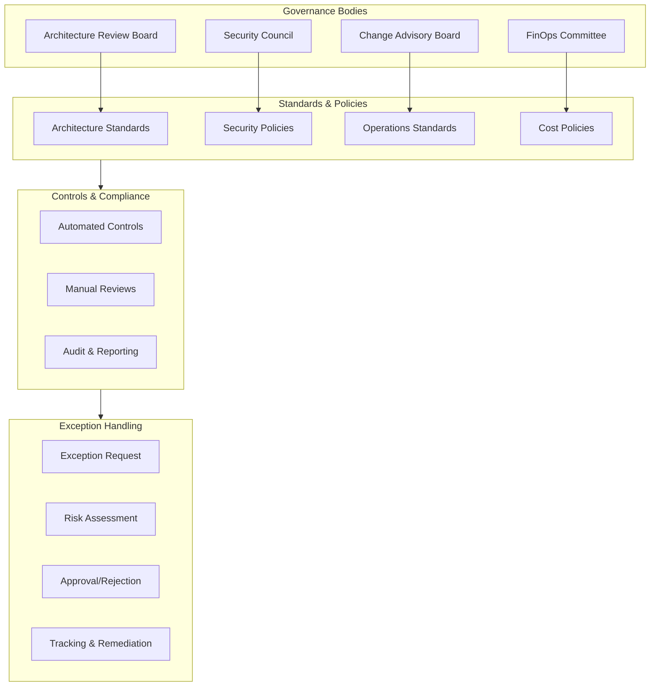
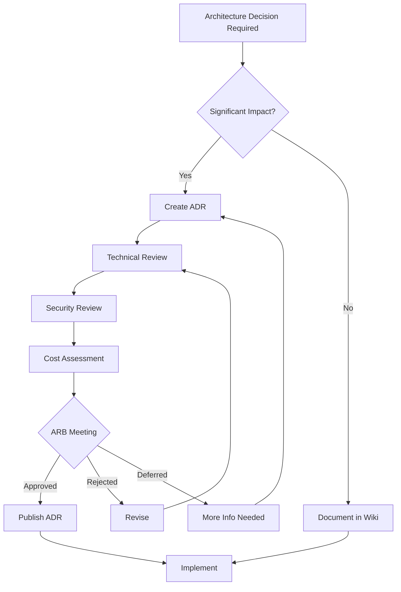
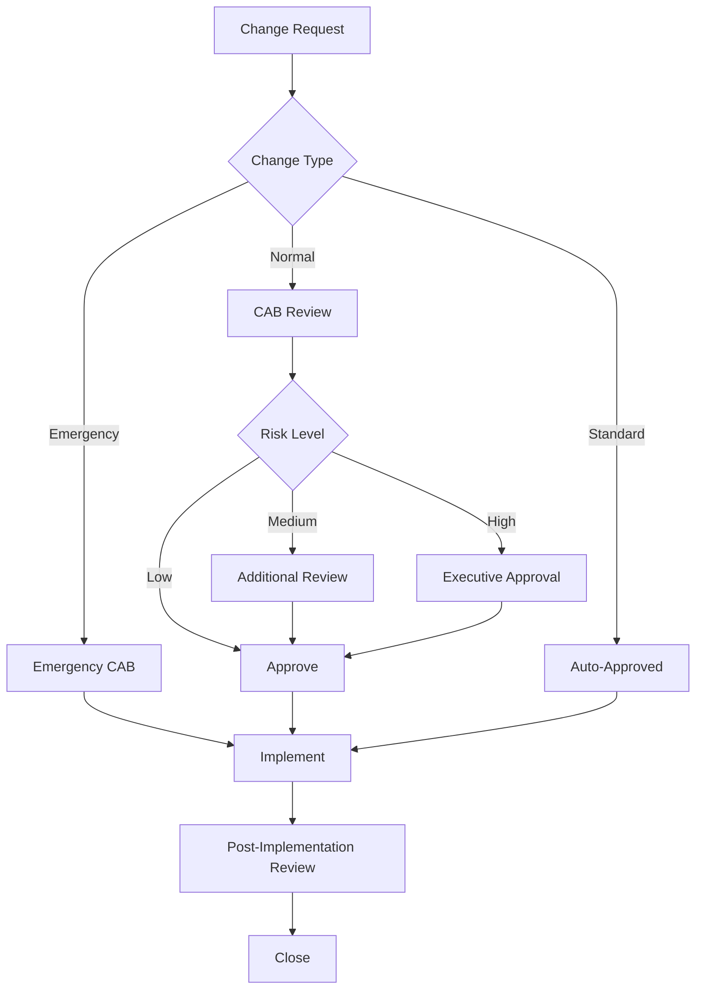
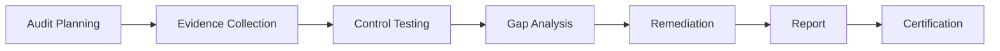
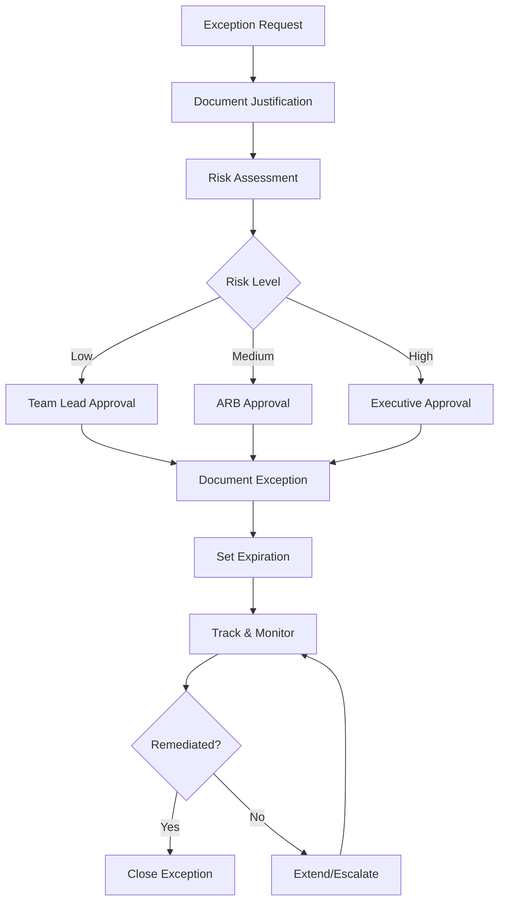

# Governance Structure

## Overview

This document defines the architecture governance structure, including the Architecture Review Board (ARB), Change Advisory Board (CAB), policies, and exception handling processes.

## Architecture Governance Structure

## Governance Bodies

### Architecture Review Board (ARB)

**Purpose:** Ensure architectural consistency and quality across all initiatives.

| Attribute | Description |
|-----------|-------------|
| **Chair** | Chief Architect |
| **Members** | Enterprise Architects, Security Architect, Platform Lead |
| **Frequency** | Bi-weekly |
| **Quorum** | 4 members |

**Responsibilities:**
- Review and approve architecture decisions
- Maintain architecture standards
- Evaluate new technologies
- Resolve architectural conflicts
- Grant architecture exceptions

**Review Criteria:**
- Alignment with target architecture
- Security and compliance
- Cost implications
- Operational impact
- Technical debt considerations

### Change Advisory Board (CAB)

**Purpose:** Assess and authorize changes to production systems.

| Attribute | Description |
|-----------|-------------|
| **Chair** | IT Operations Manager |
| **Members** | Technical Leads, Security, Operations, Business Representatives |
| **Frequency** | Weekly |
| **Quorum** | 5 members |

**Responsibilities:**
- Review change requests
- Assess change risk
- Schedule change windows
- Review change outcomes
- Manage emergency changes

### Security Council

**Purpose:** Govern security policies and risk management.

| Attribute | Description |
|-----------|-------------|
| **Chair** | CISO |
| **Members** | Security Architects, Compliance Officer, Legal |
| **Frequency** | Monthly |
| **Quorum** | 3 members |

**Responsibilities:**
- Set security policies
- Review security exceptions
- Assess security risks
- Approve security tools
- Review security incidents

### FinOps Committee

**Purpose:** Govern cloud costs and optimize spending.

| Attribute | Description |
|-----------|-------------|
| **Chair** | Cloud FinOps Lead |
| **Members** | Finance, Platform Team, Business Units |
| **Frequency** | Monthly |
| **Quorum** | 3 members |

**Responsibilities:**
- Review cloud spending
- Set budget allocations
- Approve cost exceptions
- Drive optimization initiatives
- Report to leadership

## Governance Processes

### Architecture Decision Process

### Change Management Process

## Architecture Standards

### Technology Standards

| Category | Standard | Rationale |
|----------|----------|-----------|
| **Container Runtime** | containerd | GKE default, security |
| **Service Mesh** | Anthos Service Mesh | GCP native, mTLS |
| **API Gateway** | Apigee | Enterprise features |
| **Database** | Cloud SQL (PostgreSQL) | Managed, GCP native |
| **Message Queue** | Pub/Sub | Serverless, scalable |
| **Container Registry** | Artifact Registry | GCP native, scanning |
| **IaC** | Terraform | Multi-cloud, declarative |
| **CI/CD** | Cloud Build | GCP native integration |

### Coding Standards

| Language | Standard | Linting |
|----------|----------|---------|
| **Go** | Effective Go | golangci-lint |
| **Python** | PEP 8 | pylint, black |
| **TypeScript** | Google TypeScript Style | ESLint |
| **Terraform** | terraform fmt | tflint |
| **Kubernetes** | Kubernetes Best Practices | kube-linter |

### Security Standards

| Area | Standard | Enforcement |
|------|----------|-------------|
| **Container Images** | Distroless base | Binary Authorization |
| **Secrets** | Secret Manager | Policy |
| **Network** | VPC Service Controls | Automated |
| **IAM** | Least privilege | IAM Recommender |
| **Encryption** | CMEK for sensitive data | Policy |

## Compliance Framework

### Compliance Requirements

| Framework | Scope | Audit Frequency |
|-----------|-------|-----------------|
| SOC 2 Type II | All systems | Annual |
| ISO 27001 | All systems | Annual |
| PCI DSS | Payment systems | Quarterly |
| GDPR | EU customer data | Ongoing |
| HIPAA | Healthcare data | Annual |

### Audit Process

## Exception Handling

### Exception Process

### Exception Categories

| Category | Approval Level | Max Duration | Review Frequency |
|----------|---------------|--------------|------------------|
| **Technical Debt** | ARB | 6 months | Quarterly |
| **Security** | Security Council | 3 months | Monthly |
| **Compliance** | Executive | 1 month | Weekly |
| **Cost** | FinOps | 3 months | Monthly |

## Metrics and Reporting

### Governance Metrics

| Metric | Target | Current | Trend |
|--------|--------|---------|-------|
| ARB Decision Time | < 2 weeks | 10 days | ↓ |
| Change Success Rate | > 95% | 93% | ↑ |
| Exception Count | < 10 active | 8 | → |
| Compliance Score | 100% | 98% | ↑ |
| Policy Violations | 0 critical | 0 | → |

### Reporting Schedule

| Report | Audience | Frequency |
|--------|----------|-----------|
| Architecture Health | ARB | Bi-weekly |
| Change Summary | CAB | Weekly |
| Security Posture | Security Council | Monthly |
| Cost Analysis | FinOps | Monthly |
| Executive Dashboard | Leadership | Monthly |

---

[← Back to Phase G](README.md) | [Next: CI/CD Pipeline →](cicd-pipeline.md)
