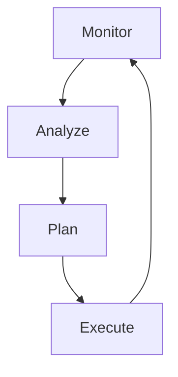

# Phase H: Architecture Change Management

## Overview

Phase H establishes the process for managing architecture changes over time, ensuring continuous improvement and adaptation to evolving business needs.

## Objectives

- Define change management processes
- Establish continuous improvement cycles
- Create feedback mechanisms
- Ensure architecture remains aligned with business goals

## Documents in This Phase

| Document | Description |
|----------|-------------|
| [Change Process](change-process.md) | Change management workflow and states |

## Key Deliverables

1. **Change Management Process** - Request, review, and implementation workflow
2. **Continuous Improvement Framework** - Feedback loops and improvement cycles
3. **Architecture Evolution Strategy** - Long-term architecture direction
4. **Performance Monitoring** - KPIs and metrics tracking

## Change Categories

| Category | Description | Approval Level |
|----------|-------------|----------------|
| **Strategic** | Fundamental architecture changes | Executive + ARB |
| **Significant** | Major component changes | ARB |
| **Standard** | Routine changes | Team Lead |
| **Minor** | Documentation updates | Self-approved |

## Continuous Improvement

The architecture change management follows a continuous improvement cycle:

## Related Phases

- **Previous**: [Phase G - Implementation Governance](../phase-g-implementation-governance/README.md)
- **Returns to**: [Phase A - Architecture Vision](../phase-a-architecture-vision/README.md)

---

[← Back to Main Documentation](../../README.md)
