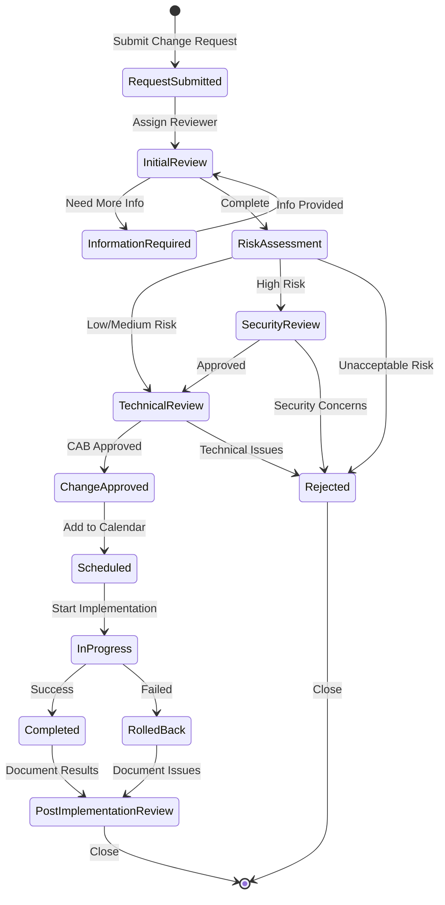
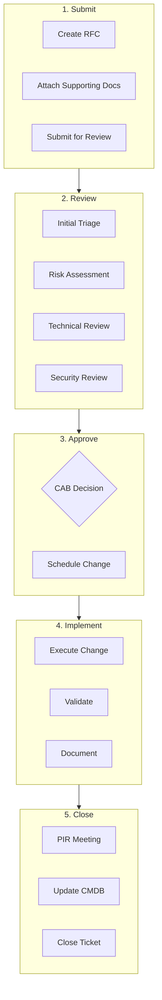
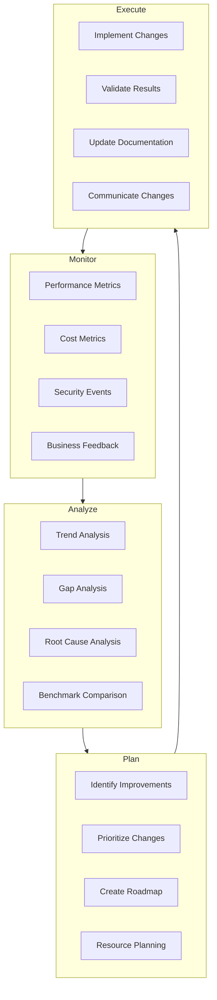
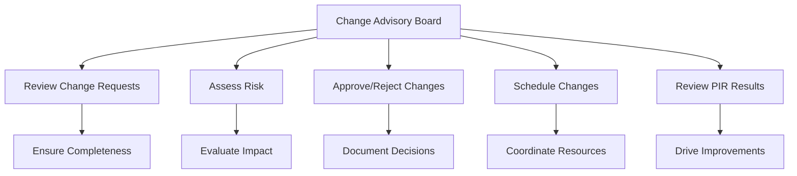
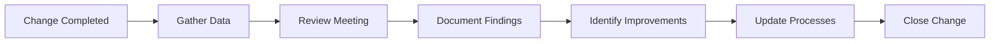
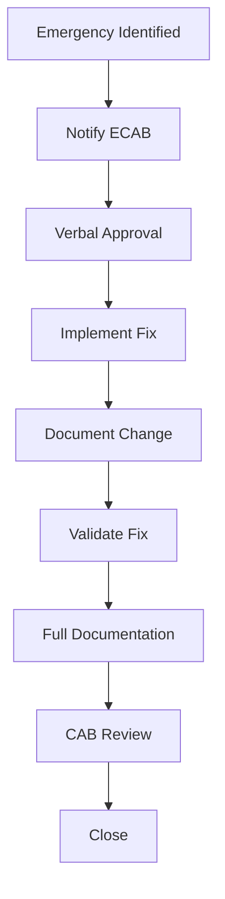

# Change Management Process

## Overview

This document defines the change management workflow for architecture changes, including the state diagram and process steps.

## Change Management State Diagram

## Change Request Process

### Process Overview

### Change Types

| Type | Description | Approval | Lead Time |
|------|-------------|----------|-----------|
| **Standard** | Pre-approved, low risk | Auto | Same day |
| **Normal** | Routine changes | CAB | 5 days |
| **Major** | Significant impact | CAB + Exec | 10 days |
| **Emergency** | Critical fixes | ECAB | Immediate |

### Risk Assessment Matrix

| Probability | Low Impact | Medium Impact | High Impact |
|-------------|------------|---------------|-------------|
| **High** | Medium | High | Critical |
| **Medium** | Low | Medium | High |
| **Low** | Low | Low | Medium |

## Continuous Architecture Evolution

## Change Request Template

### Request Information

| Field | Description |
|-------|-------------|
| **Request ID** | Auto-generated unique identifier |
| **Requester** | Name and contact information |
| **Date Submitted** | Submission date |
| **Change Type** | Standard/Normal/Major/Emergency |
| **Category** | Infrastructure/Application/Security/Network |

### Change Details

| Field | Description |
|-------|-------------|
| **Title** | Brief description of the change |
| **Description** | Detailed description of what will change |
| **Justification** | Business reason for the change |
| **Impact** | Systems and users affected |
| **Dependencies** | Related changes or systems |

### Implementation Plan

| Field | Description |
|-------|-------------|
| **Planned Start** | Scheduled start date/time |
| **Planned End** | Scheduled end date/time |
| **Implementation Steps** | Detailed step-by-step procedure |
| **Rollback Plan** | Steps to revert the change |
| **Testing Plan** | Validation steps |

### Risk Assessment

| Field | Description |
|-------|-------------|
| **Risk Level** | Low/Medium/High/Critical |
| **Potential Impact** | What could go wrong |
| **Mitigation** | How risks will be managed |
| **Communication Plan** | Who needs to be notified |

## Change Advisory Board

### CAB Responsibilities

### CAB Meeting Agenda

| Time | Topic | Owner |
|------|-------|-------|
| 0:00 | Review of Failed Changes | CAB Chair |
| 0:10 | Review of PIRs | Change Owners |
| 0:20 | Emergency Change Review | CAB Chair |
| 0:30 | Standard Change Updates | Change Manager |
| 0:40 | Normal Change Review | Change Owners |
| 0:55 | Major Change Discussion | Stakeholders |
| 1:15 | Change Calendar Review | Change Manager |
| 1:25 | Action Items & Close | CAB Chair |

## Post-Implementation Review

### PIR Process

### PIR Questions

1. Was the change successful?
2. Were there any unexpected issues?
3. Was the rollback plan needed?
4. Was the change completed on schedule?
5. What lessons were learned?
6. What improvements can be made?

## Emergency Change Process

### Emergency Change Flow

### ECAB Composition

| Role | Responsibility |
|------|---------------|
| IT Operations Manager | Chair, final approval |
| On-Call Engineer | Technical assessment |
| Security On-Call | Security assessment |
| Business Representative | Business impact assessment |

## Metrics and KPIs

### Change Management Metrics

| Metric | Target | Current |
|--------|--------|---------|
| Change Success Rate | > 95% | 94% |
| Emergency Changes | < 10% | 8% |
| Changes with PIR | 100% | 100% |
| Average Lead Time | 5 days | 6 days |
| Rollback Rate | < 5% | 3% |

### Continuous Improvement Metrics

| Metric | Target | Current |
|--------|--------|---------|
| Process Improvements/Quarter | > 2 | 3 |
| Recurring Issues | 0 | 1 |
| Customer Satisfaction | > 4.0 | 4.2 |
| Documentation Currency | 100% | 95% |

---

[← Back to Phase H](README.md)
